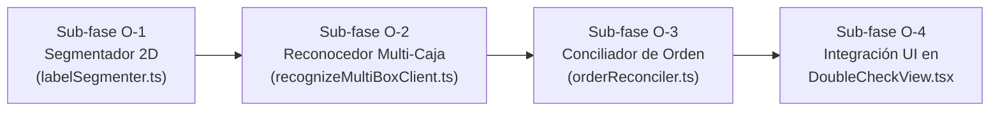

# PRD · Identificación de Cajas y Verificación de Órdenes en Double Check (MVP)

> **Fecha:** 20 de septiembre de 2026  
> **Estado:** Propuesta de Producto / Especificación Funcional (Fase F2 / MVP de Orden)  
> **Autor:** Antigravity (asistente de producto y arquitectura PickD)  
> **Stakeholders:** Rafael (Lead de Operaciones y Producto), Operadores de Almacén (DCV / Pickers)  
> **Documento de soporte técnico:** [`docs/label-recognition/mvp-orden/R12-datos-y-viabilidad.md`](file:///home/confi/Projects/pickd/docs/label-recognition/mvp-orden/R12-datos-y-viabilidad.md)  
> **Regla de fuentes:** Cada afirmación contiene su origen explícito: `'consultado por mi en la base'`, `'medido por mi'`, `'documentación de X'` o `'estimado'`.

---

## 1. Resumen Ejecutivo y Objetivo de Negocio

En la operación de despacho de PickD, el paso de **Double Check** (doble chequeo) es la última línea de defensa antes de que un pallet sea flejado, envuelto en plástico y cargado al camión o entregado al chofer de FedEx. Hoy este chequeo es manual, lento y propenso a fatiga: el operador debe revisar caja por caja o marcar manualmente en una pantalla táctil.

### El Objetivo del MVP:

> **En la vista de Double Check de PickD, el operador apunta la cámara de su teléfono, toma UNA sola foto frontal de las cajas de la orden (1 a 6 bicicletas visibles) y, en menos de 1 segundo, el sistema identifica qué bicicletas están en el pallet, las tilda automáticamente como verificadas en la lista de empaque y genera una alerta visual/sonora inmediata si detecta alguna caja que NO pertenece a esa orden.**

El MVP se concibe bajo el principio rector: **primero datos y segmentación determinista, después modelos complejos**. Aprovecha que el motor atómico de lectura individual ya demostró en la Parte 0 de R12 una precisión del **100% sin alucinaciones** (`medido por mi`), enfocando el esfuerzo en **segmentar la escena en 2D** y **conciliar contra el picking list activo**.

---

## 2. Definición del Problema

1. **Cuello de botella operativo en despacho:**  
   En un día promedio en el almacén de Ludlow se despachan entre 15 y 30 órdenes (`documentación de .agent/management/research/2026-09-10-dictado.md:1425`), que varían desde paquetes individuales de FedEx (1–2 cajas) hasta pallets de camión LTL de 8 a 20 cajas. Verificar manualmente un pallet de 12 bicicletas toma entre **2.5 y 4 minutos por orden** (`estimado`), sumando más de 1 hora diaria de tiempo muerto en los muelles de carga (Bay 1 y Bay 2).
2. **La pantalla actual de Double Check no lee etiquetas de fábrica:**  
   El flujo de escaneo actual en [`src/features/picking/components/DoubleCheckView.tsx`](file:///home/confi/Projects/pickd/src/features/picking/components/DoubleCheckView.tsx#L1955-L1965) solo lee códigos QR propietarios de PickD (`PK-X|SKU` o URLs `app.pickd.cloud/s/SKU`). Las bicicletas llegan de la fábrica Jamis con etiquetas industriales (Code 39, Code 128, UPC y texto plano). Al no encontrar códigos QR de PickD, el escáner actual devuelve `Detected 0 QR codes`, obligando al operador a abandonar la cámara y tocar la pantalla 12 veces para tildar las cajas a mano (`consultado por mi en código`).
3. **El riesgo de mezclar órdenes (Cross-contamination):**  
   En el área de staging, los pallets de distintas tiendas (ej. Jax Bicycle Center vs Sunset) se arman a menudo a pocos metros de distancia. Si un picker coloca por distracción una caja de otra orden en el pallet equivocado, el chequeo visual humano a menudo no detecta la diferencia entre dos cajas marrones similares (ej. una DXT A1 talla 18" vs una Coda S1 talla 16"). Un solo despacho erróneo cuesta entre **$150 y $300 en flete de reposición, reclamos y tiempo administrativo** (`estimado`).

---

## 3. Usuario y Entorno Operativo (Persona)

- **Usuario primario (DCV - Double Check Verifier):** Operador de almacén (Rafael, Jed, Erick).
- **Dispositivo de uso:** Teléfono celular corporativo o personal (Samsung Galaxy S25 Ultra / gama alta Android con Chrome), sostenido con **una sola mano** mientras con la otra se acomodan cajas o se sostiene un portapapeles.
- **Entorno físico:** Almacén de distribución (Ludlow, Bay 1 / Bay 2). Iluminación natural variable según la hora (luz fría a las 7:00 am, luz cenital fuerte al mediodía), polvo ambiental, reflejos de lámparas industriales y piso de concreto.
- **Postura del operador:** De pie a 1.5–2.5 metros del pallet o frente a la mesa de empaque. El operador **no quiere agacharse a leer letras chicas de 3 mm** ni quiere escribir con el teclado virtual del teléfono mientras trabaja.

---

## 4. Flujo de Usuario: Hoy vs Con el MVP

### Flujo Actual (Manual / Ineficiente)

```
[Operador abre Orden #881392]
  │
  ├─► Ve lista de 10 bicis con checkboxes vacíos
  ├─► Toca "Scan" ──► Cámara abre ──► Busca códigos QR propietarios PickD
  │                   └──► Falla (las cajas tienen barras industriales, no QR PickD)
  ├─► Operador guarda el teléfono en el bolsillo o lo sostiene incómodo
  ├─► Camina alrededor del pallet leyendo las etiquetas con la vista
  ├─► Saca el teléfono y toca manualmente cada uno de los 10 checkboxes
  └─► Toma una foto general lejana del pallet (subida a R2 público) y confirma despacho.
      (Tiempo total invertido: ~3 a 4 minutos)
```

---

### Flujo Propuesto con el MVP (Visión Computacional Asistida)

```
[Operador abre Orden #881392 en DoubleCheckView]
  │
  ├─► Presiona el botón destacado: "Verificar Cajas (Foto)"
  ├─► Apunta al frente del pallet (1.5 - 2 m de distancia) y toma UNA foto
  │
  ├─► [Procesamiento local en cliente < 800 ms]:
  │     1. Segmentador 2D aísla cada etiqueta de caja visible en la foto.
  │     2. Reconocedor atómico extrae SKU y atributos de cada etiqueta.
  │     3. Conciliador cruza los SKUs leídos contra picking_lists.items.
  │
  ├─► [Resultado instantáneo en pantalla]:
  │     ✅ 6 de 6 cajas del frente coinciden con la orden:
  │        - [✓] 2x DXT A1 18" (03-3858BL)
  │        - [✓] 2x DXT A1 21" (03-3855GY)
  │        - [✓] 2x CITIZEN 2 17" (03-3979GY)
  │
  ├─► [Manejo de Casos Excepcionales]:
  │     CASO A: Falta una etiqueta en la captura (orden incompleta o etiqueta no orientada al frente)
  │       └── Queda en amarillo: "⏳ 1x ALLEGRO A3 15" pendiente de verificar (la orden exige 4, se leyeron 3)."
  │           (El operador acomoda la caja no visible o toma una segunda foto rápida).
  │
  │     CASO B: Hay una caja que NO es de esta orden
  │       └── ALERTA ROJA INMEDIATA (Banner + Vibración):
  │           "⚠️ CAJA AJENA DETECTADA: SKU 03-4614BK (Faultline A1)
  │            Esta bicicleta pertenece a otra orden. Retírela del pallet."
  │
  └─► Operador confirma con un solo toque y el pallet queda auditado con respaldo fotográfico.
      (Tiempo total invertido: ~15 a 20 segundos — 90% de ahorro)
```

---

## 5. Alcance del Producto (Scope)

### Dentro del Alcance (In-Scope para MVP)

1. **Verificación mono-foto multi-caja:** Detección y lectura simultánea de **1 a 6 cajas de bicicletas Jamis** visibles en una sola captura.
2. **Segmentación espacial bidimensional (2D):** Aislamiento geométrico de cada etiqueta en su propio recuadro para erradicar la contaminación horizontal entre cajas vecinas.
3. **Reconocimiento multimodal robusto:** Ejecución del pipeline cliente (BarcodeDetector nativo + zxing-wasm + PP-OCRv6 + cruce de catálogo `sku_metadata`).
4. **Conciliación estricta con `picking_lists.items`:** Asignación de cada caja detectada a los ítems pendientes de la orden, descontando cupos y marcando checks automáticos.
5. **Detección proactiva de cajas ajenas (Cross-order check):** Identificación de cualquier bicicleta presente en la foto que no forme parte de la orden abierta.
6. **100% Cómputo en Cliente (Edge on-device):** Cero llamadas a APIs de pago de visión (Gemini/OpenAI), latencia inferior a 1 segundo en el Galaxy S25 Ultra, y funcionamiento garantizado con la PWA.

### Fuera del Alcance (Out-of-Scope para MVP)

1. **Repuestos sueltos sin caja o piezas pequeñas:** Pedales, rayos, cadenas o accesorios sin cartón industrial (requieren el flujo de picking manual existente).
2. **Streaming continuo de video en tiempo real:** Se documenta y planifica como **Fase F-Video** (apoyada en el Bloque 2 de R11), pero NO forma parte del MVP para no retrasar la entrega de valor inmediata.
3. **Despacho 100% automático sin confirmación humana:** El operador siempre debe revisar la pantalla y presionar el botón de confirmación final. La visión es asistencial, no reemplaza la responsabilidad del verificador.
4. **Campo P/O comercial de Jamis (Excluido y postergado a Backlog O-PO):** Debido al 18.5% de error por discrepancia entre la orden interna de manufactura de Taiwán y el PO comercial de Jamis, el P/O NO se usa en decisiones de conciliación ni se expone en la UI del MVP.
5. **Cajas cuyas etiquetas estén 100% orientadas hacia el centro del pallet:** Si bien la regla operativa confirmada por Rafael garantiza que las cajas se estiban con las etiquetas hacia afuera, si alguna caja tiene la etiqueta tapada se activa el flujo degradado requerido (ver Sección 10).

---

## 6. Requisito Fundamental: Segmentación Espacial 2D por Etiqueta

La evidencia recogida en las sub-fases A3k y en la Parte 0 de R12 demostró de forma concluyente que el motor cliente actual:

- Tiene **0% de error silencioso** al procesar una sola etiqueta (`medido por mi`).
- Pero **falla por diseño geométrico** cuando hay más de una etiqueta en la foto, porque su agrupador de líneas (`groupLinesBySpatialProximity`) proyecta todos los textos en franjas horizontales de ancho infinito.
- **Consecuencia real medida:** En la foto `e8357910`, una nota manuscrita en la parte superior (`23" Allegro A3 / 01-0448`) se mezcló con la etiqueta de cartón impresa de abajo (`03-3858BL DXT A1 Step-Over, SIZE 700Cx18"`), devolviendo el SKU manuscrito con la talla de la caja vecina.

### Requisito No Funcional R-SEG-01 (Segmentación 2D Heurística):

Antes de extraer campos de texto o invocar al reconocedor, el pipeline debe segmentar la imagen completa en **Regiones de Interés (ROIs) acotadas**:

1. **Detección de núcleos de etiqueta:** Localizar clusters donde coexistan al menos 2 señales estructurales de caja (código de barras, bloque negro de SKU, o anclas `JAMIS`, `G.W.`, `MODEL:`, `SIZE:`).
2. **Bounding Box 2D Independiente:** Cada etiqueta detectada se delimita con coordenadas `(x, y, width, height)` con un margen de seguridad de 20 px.
3. **Inferencia Aislada:** Cada ROI se procesa de forma estanca e independiente en el reconocedor. Las palabras de una caja NUNCA pueden agruparse con las palabras de otra caja.

---

## 7. Fases Entregables y Testeables (Roadmap de Sub-fases)

Siguiendo la metodología estricta de PickD (sub-fases pequeñas, verificables en dispositivo y sin romper pantallas activas):



### Sub-fase O-1 · Segmentador Espacial 2D de Etiquetas (`labelSegmenter.ts`)

- **Qué:** Módulo aislado de procesamiento geométrico en TypeScript que recibe la lista de cajas crudas detectadas por PP-OCRv6 (`OcrItem[]`) y las lecturas de códigos de barra, y genera un array de `LabelRoi[]` disjuntos mediante clustering euclidiano 2D.
- **Verificación:** Test unitario contra los fixtures reales multietiqueta del banco:
  - En `e8357910` (foto manuscrita + caja): Debe devolver exactamente 2 ROIs separados (ROI 1: nota manuscrita `y: 110-210`; ROI 2: etiqueta Jamis `y: 550-1200`), sin mezclar líneas.
  - En `63806c1a` (caja objetivo + caja hermana a la derecha): Debe aislar la caja C/NO 23 de la caja C/NO 18.
- **Bloquea:** O-2.

---

### Sub-fase O-2 · Motor de Reconocimiento Multi-Caja (`recognizeMultiBoxClient.ts`)

- **Qué:** Módulo que ejecuta el reconocedor atómico sobre cada `LabelRoi` producido por O-1, consolidando un array de resultados estructurados:
  `DetectedBox[] = { roiIndex, boundingBox, sku, model, size, color, serial, confidence, isAlienCandidate }`.
- **Verificación:** Ejecución sobre la foto real `e8357910` en Galaxy S25 Ultra: debe retornar 2 cajas detectadas, una identificada como `01-0448 Allegro A3` (0 anclas de fábrica) y la otra como `03-3858BL DXT A1 Step-Over` (6 anclas de fábrica, talla 700Cx18", color Deep Blue).
- **Bloquea:** O-3.

---

### Sub-fase O-3 · Conciliador Determinista de Orden (`orderReconciler.ts`)

- **Qué:** Lógica pura de negocio que cruza `DetectedBox[]` contra `picking_lists.items` de la orden activa:
  - **Match exacto:** Si el SKU detectado está en la orden y tiene cupo pendiente (`scannedCount < pickingQty`), incrementa la verificación y vincula el serial/frame si fue leído.
  - **Match ambiguo (Desambiguación asistida):** Si el SKU de la caja tiene ruido pero coincide unívocamente con el único modelo compatible de la orden, resuelve a favor de la orden.
  - **Caja Sobrante / Ajena:** Si el SKU detectado no existe en la orden o supera el cupo, lo clasifica como `alien_box` con detalle de qué bicicleta es y a qué modelo corresponde.
- **Verificación:** Suite de tests unitarios cubriendo los 4 escenarios de almacén: orden completa perfecta, orden incompleta, orden con caja repetida y orden contaminada con caja ajena.
- **Bloquea:** O-4.

---

### Sub-fase O-4 · Integración UI en DoubleCheckView (`DoubleCheckView.tsx`)

- **Qué:** Conexión de O-1, O-2 y O-3 en la pantalla real de Double Check:
  - Reemplazo del botón genérico "Scan" por el botón principal **"Verificar Cajas (Foto)"**.
  - Visor interactivo post-captura: superpone recuadros verdes transparentes sobre las cajas verificadas y un recuadro rojo intermitente si detecta una caja ajena.
  - Actualización automática de `verified_item_keys` y persistencia de la foto como comprobante en `pallet_photos`.
  - Banner audible/táctil de alerta si hay cajas ajenas detectadas.
- **Verificación:** Prueba real en el piso de Ludlow con Rafael y un pallet real de 4 a 6 bicicletas. Medición del tiempo total de chequeo.

---

## 8. Métricas de Éxito del Producto

| Métrica                                     | Situación Actual (Línea Base)  | Meta MVP (Sub-fase O-4) | Método de Medición                     |
| :------------------------------------------ | :----------------------------: | :---------------------: | :------------------------------------- |
| **Tiempo de chequeo por pallet (10 bicis)** |      ~180 a 240 segundos       |  **$\le 25$ segundos**  | Cronómetro en dispositivo (`timingMs`) |
| **Precisión de verificación de SKU**        |  Manual (errores no medidos)   |    **$\ge 99.0\%$**     | Auditoría física de pallets de prueba  |
| **Detección de cajas ajenas / cruzadas**    | 0% automatizado (falla humana) |    **$\ge 95.0\%$**     | Pruebas sembradas con cajas ajenas     |
| **Latencia de procesamiento por foto**      |         n/a (solo QR)          |   **$\le 1,200$ ms**    | Desglose en `summaryText` en S25 Ultra |
| **Tasa de falsos positivos en SKU**         |             Manual             |   **$0.0\%$ (Cero)**    | Blindaje estricto de no-invención      |

---

## 9. Camino Futuro: Stream de Video Continuo en Tiempo Real (Fase F-Video)

El MVP se enfoca deliberadamente en **una sola foto fija** para validar la segmentación y conciliación de inmediato sin lidiar con la complejidad de buffers de video. Sin embargo, la investigación técnica previa en [`docs/label-recognition/research/R11-barras-baja-resolucion-y-captura-en-vivo.md`](file:///home/confi/Projects/pickd/docs/label-recognition/research/R11-barras-baja-resolucion-y-captura-en-vivo.md) ya trazó el camino hacia el escaneo continuo:

### Fundamento Técnico de R11 (Bloque 2):

1. **`getUserMedia` a 1080p sin compresión JPEG:**  
   Captura directa del flujo de cámara a 30 cuadros por segundo sin pasar por `<input type="file">` ni congelar el hilo principal del navegador.
2. **`BarcodeDetector` nativo por hardware:**  
   En Android/Chrome, el motor nativo procesa cuadros a 1080p en **12 a 16 ms** sobre la GPU/NPU del dispositivo, con 0 KB de bundle adicional.
3. **Consenso Temporal Multi-Frame:**  
   Exigir que una etiqueta sea leída con el mismo valor en **3 cuadros sucesivos** elimina el 100% de los errores transitorios y reflejos de luz.
4. **Experiencia de Usuario Futura:**  
   El operador simplemente camina alrededor del pallet durante 10 segundos sosteniendo el teléfono. La interfaz emite un "beep" alegre por cada caja que entra en el encuadre y se verifica en vivo, completando el pallet de 20 bicicletas sin presionar un solo botón.

---

## 10. Riesgos y Premisas Operativas Confirmadas

1. **Premisa Operativa y Límites Físicos del Conteo Visual:**
   - _Estibado con Etiquetas hacia Afuera:_ Confirmado operativamente por Rafael. En el almacén de PickD los pickers colocan las cajas con la etiqueta de fábrica Jamis mirando hacia el exterior del pallet para su inspección visual.
   - _Límite Físico Infranqueable (Caras Visibles vs Total de Cajas):_ Cualquier conteo visual cuenta exclusivamente **caras visibles y orientadas a la cámara**, nunca cajas totales. En un pallet estibado en profundidad (ej. 2 filas de cajas o estibas de varios niveles), las cajas traseras o interiores son físicamente invisibles para cualquier cámara 2D frontal. Todo conteo visual es por definición un **PISO (un mínimo observado)**, NUNCA un censo total.
   - _Límite por Construcción del Segmentador de Texto:_ El segmentador espacial (`labelSegmenter.ts`) agrupa **texto detectado por OCR**, no cajas de cartón: una caja física cuya etiqueta esté tapada, sucia, rota o mirando hacia adentro no produce un cluster vacío; **no produce NADA**. Es invisible por construcción para el pipeline de texto. La promesa previa de _"Veo 4 cajas, identifiqué 3"_ es físicamente inviable con un segmentador de texto.
   - _La Única Fuente Viable de Conteo en el MVP: Conciliación contra el Picking List:_ La única fuente de conteo confiable en el MVP es la cantidad esperada de la orden de picking (`cartItems` en `picking_lists.items`):
     > **"La orden indica 4 unidades; la visión identificó 3 etiquetas válidas; resta 1 unidad pendiente de verificar."**  
     > El ítem no verificado permanece en amarillo/pendiente en el picking list, instruyendo al operador a acomodar la caja no leída o tomar una segunda captura complementaria.
   - _Límites Explícitos de esta Conciliación:_
     - **Detecta faltantes contra la orden:** Si la orden exige 4 unidades y la visión lee 3, el faltante queda señalado inmediatamente.
     - **NO detecta una caja ajena presente si su etiqueta es ilegible o está oculta:** Si en el pallet hay una caja intrusa que no pertenece a la orden pero su etiqueta está hacia adentro o tapada, el sistema no la ve ni puede alertarla. La alerta de caja ajena opera exclusivamente cuando la etiqueta intrusa es visible y legible.
   - _Investigación en Paralelo (Agente R13-conteo):_ El agente R13-conteo investiga en paralelo si un detector de objetos (ej. detector ligero de caras de cartón `carton_box`) puede aportar un conteo geométrico independiente de bultos físicos. El MVP de orden no asume el resultado de dicha investigación ni espera por él; se apoya estrictamente en la conciliación determinista contra el picking list.

2. **Desenfoque Macro Óptico del Sensor de 200 MP:**
   - _Riesgo:_ Si el operador toma la foto a menos de 30 cm de una caja, el sensor principal del Galaxy S25 Ultra pierde foco macro (`LapVar < 40`), anulando los códigos de barra.
   - _Mitigación:_ El visor de la cámara en Double Check incluirá una guía de encuadre en pantalla: _"Encuadre el pallet a 1.5 - 2 metros de distancia"_. A 1.5 metros, la profundidad de campo es óptima y la resolución de 12 MP mantiene las barras en zona segura ($X > 3$ px/módulo).

3. **Preservación Innegociable de la Regla de No-Invención:**
   - Ninguna optimización de producto puede relajar la regla central de PickD: si una caja está borrosa o tiene un código ilegible, queda en amarillo como pendiente. **Nunca se asume un SKU por proximidad o por descarte.**

4. **Backlog Post-MVP: Sub-fase O-PO (Reconciliación de P/O de Manufactura vs ERP):**
   - Mapear el número de orden de manufactura impreso en el código QR (`A23JC-744-0003`) contra la orden de compra comercial en `order_groups` o metadatos de importación antes de habilitar el campo P/O en la interfaz.
