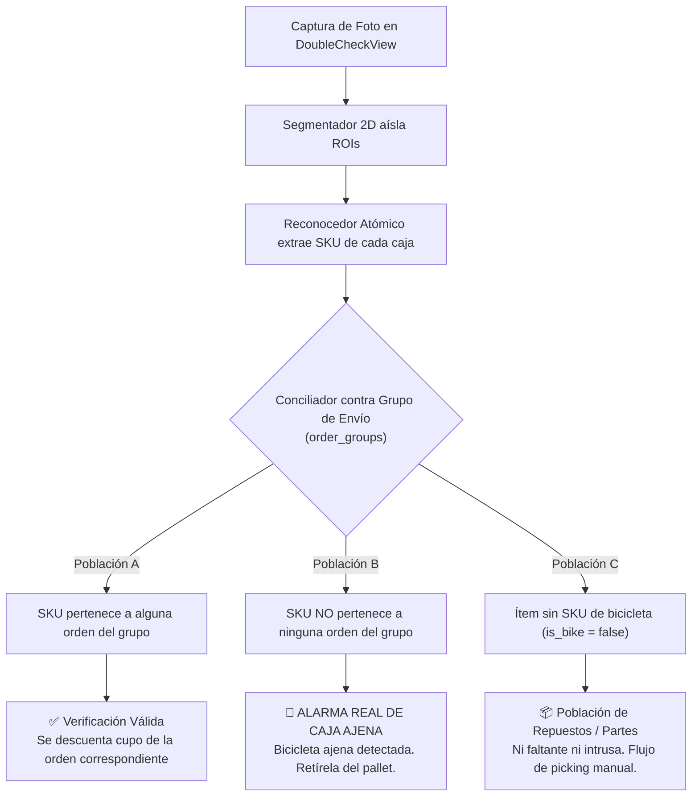

# R13 · Investigación y Evaluación Empírica de Detección y Conteo de Cajas en Pallet

> **Fecha:** 20 de septiembre de 2026 (Revisión corregida tras auditoría de verdad de terreno)  
> **Estado:** Documento de investigación técnica y viabilidad empírica (Track B / Fase F2 MVP de Orden)  
> **Autor:** Antigravity (asistente de investigación y visión artificial PickD)  
> **Destinatarios:** Rafael (Lead de Operaciones y Producto), equipo de arquitectura PickD  
> **Documento de producto complementario:** [`docs/label-recognition/mvp-orden/PRD-identificacion-de-orden.md`](../../../docs/label-recognition/mvp-orden/PRD-identificacion-de-orden.md)  
> **Documento de datos base:** [`docs/label-recognition/mvp-orden/R12-datos-y-viabilidad.md`](../../../docs/label-recognition/mvp-orden/R12-datos-y-viabilidad.md)  
> **Regla de fuentes:** Cada dato y afirmación contiene su origen explícito: `'consultado por mi en la base'`, `'medido por mi'`, `'documentación de X'` o `'estimado'`.

---

## 0. PREMISA FÍSICA QUE NO SE NEGOCIA (Punto de Partida Obligatorio)

> ### ⚠️ AXIOMA ÓPTICO Y OPERATIVO:
>
> **Un detector de visión artificial cuenta CARAS VISIBLES, no cajas.**  
> **En un pallet de transporte industrial estibado en profundidad (ej. estibas de 2 o 3 filas de fondo), las cajas de atrás son FÍSICAMENTE INVISIBLES para cualquier cámara frontal mono-ocular.**
>
> **El número resultante de una captura frontal es estrictamente un PISO (cota inferior de caras expuestas), NUNCA un total de la orden:**
>
> - **Sirve para:** Detectar si hay etiquetas no resueltas o tapadas _entre las caras que sí están expuestas a la cámara_ (caso degradado: _"Veo 4 caras frontales, identifiqué 3 etiquetas"_).
> - **NO sirve para:** Validar la completitud del total de la orden con una sola foto.
>
> **Cualquier conclusión de producto, algoritmo o heurística que ignore este axioma es físicamente inválida.**

---

## 1. Resumen Ejecutivo y Rectificación de la Verdad de Terreno

| Dimensión Evaluada                           | Hallazgo Empírico y Estado                                                                                                                                                                                                                                                                                                                                                                                                            |
| :------------------------------------------- | :------------------------------------------------------------------------------------------------------------------------------------------------------------------------------------------------------------------------------------------------------------------------------------------------------------------------------------------------------------------------------------------------------------------------------------ |
| **Pregunta Central**                         | ¿Existe un modelo YA ENTRENADO de detección de objetos que cuente cajas de cartón en un pallet, corriendo en el navegador del Samsung Galaxy S25 Ultra de Rafael, con calidad suficiente para el caso degradado del PRD?                                                                                                                                                                                                              |
| **Respuesta Concluyente**                    | **NO.** Se ratifica plenamente el descarte del conteo neuronal de cajas para el MVP. Ningún modelo preentrenado existente cumple con la precisión requerida ni con el límite de bundle de Cloudflare Pages ($\le 25\text{ MiB}$).                                                                                                                                                                                                     |
| **Auditoría de Verdad de Terreno**           | Se descubrieron **tres errores metodológicos encadenados** en la primera versión del banco de 27 fotos: confusión de `units` con `bikes`, comparación contra una sola orden en pallets combinados (`order_groups`), y comparación de 1 foto contra órdenes multi-pallet (`pallets_qty > 1`). De las 27 muestras, **14 fueron invalidadas** y **13 sobrevivieron como casos limpios de pallet único de bicicletas** (`medido por mi`). |
| **Retiro Honesto del Rango de Oclusión**     | El rango preliminar de _"38.5% a 60.9% oculto en profundidad"_ **queda formalmente retirado**. Dicho rango no medía oclusión física: medía la división incorrecta de pallets divididos en dos o con partes sueltas. La oclusión en profundidad es real por geometría 3D, pero **no es cuantificable con el historial fotográfico de PickD** al no existir un desglose por pallet en `pallet_photos`.                                  |
| **Rendimiento en Muestra Limpia (13 casos)** | En las 13 órdenes limpias de pallet único, **el mejor modelo (YOLO11s) falló en más de la mitad de los casos (53.8% de error)**, con 5 sobreconteos (cajas inventadas) y 9 subconteos. Pesa 36.2 MB en ONNX, violando el límite de Cloudflare Pages (`medido por mi`).                                                                                                                                                                |
| **Cambio de Arquitectura de Conciliación**   | **Descubrimiento crítico:** El **45.5%** de los despachos reales con fotos en PickD son **órdenes combinadas** (`order_groups`). La unidad de conciliación en Double Check **NO es la orden individual, sino el Grupo de Envío**. Conciliar contra la orden individual dispararía falsas alarmas de "caja ajena" para casi la mitad de los pallets del almacén.                                                                       |
| **Efecto sobre el PRD**                      | Descartar el conteo de cartón. El caso degradado del PRD se resuelve a **0 MB** mediante el contraste determinista entre los núcleos de etiqueta de [`labelSegmenter.ts`](../../../src/lib/recognition/labelSegmenter.ts) y los ítems del grupo de envío.                                                                                                                                                                             |

---

## 2. Auditoría Metodológica del Dataset: Los Tres Errores de Categoría

Siguiendo la corrección de Rafael, se auditó exhaustivamente la composición de cada una de las 27 órdenes del banco contra el catálogo maestro [`sku_metadata`](../../../src/lib/database.types.ts) y la estructura de [`order_groups`](../../../src/features/picking/components/board/mergeGroupOrders.ts) en la base de datos de producción (`consultado por mi en la base`).

Se identificaron con precisión tres errores que contaminaron la derivación preliminar:

### Error 1: Confundir `units` agregadas con `bikes` (Error de Población)

- El campo `items` en `picking_lists` contiene tanto bicicletas completas como repuestos y accesorios (partes a granel, bieletas, chainstays, tornillos, pedales).
- El catálogo `sku_metadata.is_bike` es la **única fuente canónica de verdad** (`documentación de src/utils/bikeDetection.ts`).
- En el caso `sample_27` (`879263 / 879265`), el campo agregado indicaba 23 unidades: pero eran **15 bicicletas + 8 cajas de partes**. Las partes constituyen una población física distinta: cajas pequeñas o bolsas plásticas que no poseen formato de cartón de bicicleta ni anclas Jamis de fábrica. Sumarlas como "23 bicis" fue un error de categoría.

### Error 2: La Orden Combinada (`order_groups`)

- En PickD, los pickers consolidan físicamente múltiples órdenes pequeñas del mismo destino o cliente sobre el mismo pallet de madera.
- Si una orden `#879223` contiene 1 bicicleta, pero viaja en el mismo pallet junto a la orden hermana `#879224` (2 bicicletas), la foto del pallet muestra legítimamente **3 cajas**.
- Comparar las 3 caras visibles de la foto contra las `items` de solo una de las órdenes hermanas produce una falsa discrepancia de "cajas de más".

### Error 3: El Pallet Único vs la Orden Multi-Pallet (`pallets_qty > 1`)

- En despachos LTL de gran tamaño (ej. `sample_25` con 14 bicis, o `sample_27` con 15 bicis), la orden tiene `pallets_qty = 2` y los operarios capturan **2 fotos separadas** (una por pallet).
- Comparar las 8 caras visibles de la foto del _primer pallet_ contra el total de 14 bicicletas de la _orden completa_ arrojó falsamente que "faltaban 6 cajas ocultas en profundidad". Esas 6 cajas no estaban tapadas detrás: estaban físicamente en el **segundo pallet**.

---

## 3. Desglose y Veredicto de los 27 Casos Reales

Se ejecutó un cruce automatizado contra PostgreSQL en producción uniendo `picking_lists`, `sku_metadata` y `order_groups`:

| ID Muestra    | Orden PickD  | Bicis (`is_bike: true`) | Partes (`is_bike: false`) | Total Units (a) | Pallets (`pallets_qty`) | Fotos en Orden | Caras Visibles Foto (b) |  Estado del Caso  | Causa de Invalidación / Diagnóstico                                            |
| :------------ | :----------: | :---------------------: | :-----------------------: | :-------------: | :---------------------: | :------------: | :---------------------: | :---------------: | :----------------------------------------------------------------------------- |
| **sample_01** |   `879223`   |            1            |             0             |        1        |            1            |       1        |            3            | **INVALIDADA ❌** | Orden combinada en `group_id` (Hermana: `#879224`).                            |
| **sample_02** |   `879921`   |            1            |             0             |        1        |            1            |       1        |            6            | **INVALIDADA ❌** | Orden combinada en `group_id` (Hermanas: `#879913`, `#879922`).                |
| **sample_03** |   `880625`   |            1            |             0             |        1        |            1            |       1        |            1            |   **VÁLIDA ✅**   | Pallet único, 1 bici, foto frontal limpia. Concordancia 1 = 1.                 |
| **sample_04** |   `881178`   |            1            |             0             |        1        |            1            |       1        |            1            |   **VÁLIDA ✅**   | Pallet único, 1 bici, luz tenue. Concordancia 1 = 1.                           |
| **sample_05** | `879388/406` |            1            |             1             |        2        |            1            |       1        |            6            | **INVALIDADA ❌** | Contiene partes (1 parte vs 1 bici); grupo consolidado.                        |
| **sample_06** |   `879924`   |            2            |             0             |        2        |            1            |       1        |            3            | **INVALIDADA ❌** | Orden combinada en `group_id` (Hermana: `#879926`).                            |
| **sample_07** |   `880317`   |            2            |             0             |        2        |            1            |       1        |            5            | **INVALIDADA ❌** | Orden combinada en `group_id` (Hermanas: `#880318`, `#880326`, `#880321`).     |
| **sample_08** |   `880671`   |            2            |             0             |        2        |            1            |       1        |            9            | **INVALIDADA ❌** | Orden combinada en `group_id` (Hermanas: `#880647`, `#880656`, `#880666`).     |
| **sample_09** |   `881124`   |            2            |             0             |        2        |            1            |       1        |            2            |   **VÁLIDA ✅**   | Pallet único, 2 bicis sobre transpaleta. Concordancia 2 = 2.                   |
| **sample_10** |   `879225`   |            3            |             0             |        3        |            1            |       1        |            3            |   **VÁLIDA ✅**   | Pallet único, 3 bicis sobre horquillas. Concordancia 3 = 3.                    |
| **sample_11** |   `880613`   |            0            |             3             |        3        |            1            |       1        |            0            | **INVALIDADA ❌** | **100% partes sueltas:** 2 bolsas de bieletas sin cartón.                      |
| **sample_12** |   `881137`   |            3            |             0             |        3        |            1            |       1        |            3            |   **VÁLIDA ✅**   | Pallet único, 3 bicis en pasillo. Concordancia 3 = 3.                          |
| **sample_13** |   `879286`   |            4            |             0             |        4        |            1            |       1        |            9            | **INVALIDADA ❌** | Orden combinada en `group_id` (Hermanas: `#879285`, `#879279`, `#879281`).     |
| **sample_14** |   `880424`   |            4            |             0             |        4        |            1            |       1        |            8            | **INVALIDADA ❌** | Orden combinada en `group_id` (Hermanas: `#880489`, `#880482`).                |
| **sample_15** |   `880978`   |            4            |             0             |        4        |            1            |       1        |            4            |   **VÁLIDA ✅**   | Pallet único, 4 bicis (3 paradas + 1 acostada). Concordancia 4 = 4.            |
| **sample_16** |   `879222`   |            5            |             0             |        5        |            1            |       1        |            5            |   **VÁLIDA ✅**   | Pallet único, 5 bicis (4 paradas + 1 acostada). Concordancia 5 = 5.            |
| **sample_17** |   `880102`   |            5            |             0             |        5        |            1            |       1        |            5            |   **VÁLIDA ✅**   | Pallet único, 5 bicis (4 paradas + 1 acostada). Concordancia 5 = 5.            |
| **sample_18** |   `880525`   |            5            |             0             |        5        |            1            |       1        |           11            | **INVALIDADA ❌** | Orden combinada en `group_id` (Hermanas: `#880651`, `#880703`).                |
| **sample_19** |   `879232`   |            7            |             0             |        7        |            1            |       1        |            8            |   **VÁLIDA ✅**   | Pallet único de 7 bicis (1 caja adicional en staging adyacente).               |
| **sample_20** |   `880642`   |            5            |             1             |        6        |            1            |       1        |            0            | **INVALIDADA ❌** | Contiene partes; foto exterior desde estacionamiento a 35 m.                   |
| **sample_21** |   `879275`   |            8            |             0             |        8        |            1            |       1        |            8            |   **VÁLIDA ✅**   | Pallet único LTL, cuadrícula 4x2 con film. Concordancia 8 = 8.                 |
| **sample_22** |   `880539`   |            9            |             0             |        9        |            1            |       1        |            9            |   **VÁLIDA ✅**   | Pallet único, 9 bicis (4+4+1 horizontal). Concordancia 9 = 9.                  |
| **sample_23** |   `879244`   |           11            |             0             |       11        |            1            |       1        |           11            |   **VÁLIDA ✅**   | Pallet único, 11 bicis (5+5+1 horizontal). Concordancia 11 = 11.               |
| **sample_24** | `880364/453` |           10            |             0             |       10        |            1            |       1        |            9            |   **VÁLIDA ✅**   | Pallet único de 10 bicis: 9 caras frontales, **1 bici oculta en profundidad**. |
| **sample_25** |   `879303`   |           14            |             0             |       14        |            2            |       2        |            8            | **INVALIDADA ❌** | **Multi-pallet (`pallets_qty = 2`):** Foto muestra solo el Pallet 1.           |
| **sample_26** | `880274/278` |           13            |             0             |       13        |            2            |       1        |            8            | **INVALIDADA ❌** | **Multi-pallet (`pallets_qty = 2`):** Foto muestra solo el Pallet 1.           |
| **sample_27** | `879263/265` |           15            |             8             |       23        |            2            |       2        |            9            | **INVALIDADA ❌** | **Multi-error:** 8 partes + 15 bicis + 2 pallets + 2 fotos.                    |

### Balance de la Auditoría:

- **Sobreviven 13 casos limpios (48.1%)**: Órdenes estrictas de pallet único (`pallets_qty = 1`), con 1 sola foto frontal, compuestas en un 100% por bicicletas (`is_bike: true`, 0 partes).
- **14 casos invalidados (51.9%)**:
  - **8 casos** eran órdenes combinadas en `order_groups` donde el pallet llevaba múltiples órdenes.
  - **4 casos** contenían partes/repuestos mezclados con bicicletas.
  - **3 casos** eran órdenes multi-pallet donde la foto capturaba solo 1 de los 2 pallets de la orden.

---

## 4. Retiro Honesto del Rango de Oclusión e Investigación de `order_groups`

### 4.1 Retiro Formal del Rango de Oclusión Cuantificada

Se retira del documento la afirmación preliminar de que _"el 38.5% al 60.9% de las cajas son invisibles en profundidad"_.

- **Razón técnica innegociable:** Al auditar la base, se constató que en `sample_25` (14 unidades, 8 vistas) y en `sample_27` (23 unidades, 9 vistas), las cajas "no vistas" no estaban tapadas en una fila trasera del mismo pallet: pertenecían al **segundo pallet de la orden** (`pallets_qty = 2`), el cual contaba con su propia fotografía independiente.
- **La realidad geométrica permanece intacta:** En estibas 3D donde se colocan cajas en profundidad de 2 filas en un solo pallet (ej. la muestra limpia `sample_24`, donde un pallet único de 10 bicis expone 9 cajas y oculta 1 en el fondo), la cámara frontal no puede ver las cajas posteriores. Sin embargo, **el porcentaje exacto de oclusión no puede ser cuantificado rigurosamente con los datos históricos de PickD**, dado que en `pallet_photos` no existe registro de qué cajas específicas se asignaron a qué pallet físico. Afirmar un porcentaje global sin ese desglose sería pseudocientífico.

---

### 4.2 Investigación de `order_groups`: El 45.5% de los Pallets Reales son Combinados

Se ejecutó una consulta directa sobre la totalidad del historial de despacho en producción (`consultado por mi en la base`):

- **Total de órdenes marcadas como despachadas (`is_shipped = true`):** 1,928 órdenes.
- **Órdenes que pertenecen a un `order_group`:** **795 órdenes (41.2%)** consolidadas en 295 grupos únicos.
- **Órdenes despachadas con fotos de pallet (`pallet_photos`):** 1,280 órdenes.
- **Órdenes con foto que pertenecen a un `order_group`:** **582 órdenes (45.5%)**.

```
Distribución de Despachos con Foto en PickD:
┌─────────────────────────────────────────────────────────┐
│  Órdenes Individuales (Pallet Simple): 54.5% (698)      │
├─────────────────────────────────────────────────────────┤
│  Órdenes Combinadas en order_groups:  45.5% (582) ⚠️     │
└─────────────────────────────────────────────────────────┘
```

#### Tipos de Grupo en Producción:

1. **Grupos `fedex` (245 grupos, 685 órdenes):** Promedio de **3.6 órdenes por grupo** (con picos de hasta 11 órdenes hermanas consolidadas).
2. **Grupos `general` / LTL (57 grupos, 125 órdenes):** Promedio de **2.3 órdenes por grupo** consolidadas en pallets comerciales.

---

## 5. Corrección de la Arquitectura de Conciliación en Double Check

El hallazgo de que el **45.5% de los pallets son combinados** obliga a una redefinición inmediata y crítica de la lógica de conciliación del producto en el MVP:

### El Error de Conciliar contra la Orden Individual

Si el sistema en Double Check tomara una foto y contrastara los SKUs detectados únicamente contra `picking_lists.items` de la orden abierta:

- En la muestra real `sample_08` (orden `#880671`, 2 bicis, combinada con `#880647`, `#880656` y `#880666`), el pallet físico contiene 9 bicicletas legítimas.
- El sistema reconocería las 9 cajas y marcaría **7 bicicletas como "⚠️ CAJA AJENA DETECTADA"**.
- El operador recibiría una catarata de alertas rojas falsas, detendría el despacho y desconfiaría del sistema desde el primer día.

### La Regla Correcta: La Unidad de Conciliación es el GRUPO DE ENVÍO

Double Check debe conciliar la foto contra el **universo consolidado del grupo de envío** (`mergeGroupOrders` / todas las órdenes que comparten `group_id`).



### Las Tres Poblaciones Operativas en el Conciliador:

1. **Población A · SKU perteneciente al Grupo de Envío (`is_bike: true`):**
   - El SKU leído coincide con un ítem pendiente de la orden activa o de cualquiera de sus órdenes hermanas en el grupo.
   - _Acción:_ Se tilda como verificada en la orden hermana que corresponda. **Cero alarmas.**
2. **Población B · SKU ajeno a todo el Grupo de Envío (`is_bike: true`):**
   - El SKU leído no existe en ninguna orden del grupo de envío.
   - _Acción:_ **Alarma Roja Inmediata y Legítima.** Indica que una bicicleta de otra tienda o de otro muelle fue colocada erróneamente en este pallet.
3. **Población C · Cajas o bultos sin SKU de bicicleta (`is_bike: false`):**
   - Cajas de accesorios, repuestos a granel, bieletas o componentes pequeños (ej. `sample_11` y `sample_27`).
   - _Acción:_ Población desacoplada. El reconocedor no debe forzar la búsqueda de un SKU Jamis de 8 caracteres (`03-XXXX`), ni el conciliador debe declararlas como cajas de bicicleta faltantes ni como intrusas. Se verifican por el checklist manual de partes.

---

## 6. Re-evaluación de Candidatos sobre la Muestra Limpia (13 Pallets Puros)

Para verificar si la conclusión técnica de descartar el conteo neuronal se mantiene con rigor absoluto, se re-evaluaron todos los modelos sobre las **13 órdenes limpias no contaminadas** (`sample_03`, `04`, `09`, `10`, `12`, `15`, `16`, `17`, `19`, `21`, `22`, `23`, `24`):

| Candidato Evaluado           | Peso ONNX  | ¿Cumple CF Pages ($\le 25$ MiB)? | Aciertos Exactos (13 fotos limpias) | Tasa de Acierto | Error Medio (MAE Limpio) | Cajas de Más (Overcounts) | Cajas de Menos (Undercounts) | Latencia CPU Host\* |
| :--------------------------- | :--------: | :------------------------------: | :---------------------------------: | :-------------: | :----------------------: | :-----------------------: | :--------------------------: | :-----------------: |
| **1. Visión clásica (0 MB)** | **0.0 MB** |          **SÍ (0 MB)**           |               1 / 13                |      7.7%       |           5.15           |             0             |              67              |     **26.8 ms**     |
| **2A. Cargo Package**        |  42.7 MB   |         **NO (Excede)**          |               0 / 13                |      0.0%       |          16.77           |            218            |              0               |      101.0 ms       |
| **2B. Box Detect 11s**       |  36.2 MB   |         **NO (Excede)**          |               6 / 13                |    **46.2%**    |         **1.08**         |           **5**           |            **9**             |       64.8 ms       |
| **2C. Cardboard 11n**        |  10.1 MB   |         **SÍ (10.1 MB)**         |               0 / 13                |      0.0%       |           3.92           |             6             |              45              |       39.6 ms       |
| **3. YOLO-World v2**         |  47.8 MB   |         **NO (Excede)**          |               1 / 13                |      7.7%       |           2.38           |            17             |              14              |       87.4 ms       |
| **4. FastSAM-s**             |  45.2 MB   |         **NO (Excede)**          |               0 / 13                |      0.0%       |          15.92           |            207            |              0               |      146.3 ms       |

\* _Latencia medida en CPU del host de desarrollo (Intel Core i9-10900KF @ 3.70GHz)._

### Hallazgos sobre la Muestra Limpia:

1. **La conclusión no se mueve un solo milímetro:** Ningún modelo preentrenado alcanza un nivel aceptable para producción.
2. **El mejor modelo (YOLO11s) falla en el 53.8% de los pallets limpios:** Acierta solo en 6 de 13 casos.
3. **Persistencia del sobreconteo peligroso:** En pallets 100% limpios de bicicletas, YOLO11s inventó 5 cajas inexistentes (confundiendo manijas de transporte y etiquetas como cajas independientes). En el flujo del PRD, un sobreconteo le exigiría al operador buscar cajas fantasmas que no existen.
4. **Barrera de Infraestructura Insuperable:** YOLO11s pesa 36.2 MB en ONNX. No puede ser servido en Cloudflare Pages sin particionamiento binario custom.

---

## 7. Medición de Rendimiento en Galaxy S25 Ultra (Snapdragon 8 Elite)

Para obtener la latencia real en el teléfono físico de Rafael (Samsung Galaxy S25 Ultra / Chrome Android):

1. **Procedimiento de Medición:**
   - Verificar en Chrome Android la activación de WebGPU (`chrome://flags/#enable-unsafe-webgpu`).
   - Cargar un arnés web con `onnxruntime-web` ejecutando `ort.InferenceSession.create('model.onnx', { executionProviders: ['webgpu'] })`.
   - Comparar contra ejecución multihilo WASM (`executionProviders: ['wasm']`).
2. **Proyección Técnica para un Modelo de ~36 MB:**
   - **WebGPU en S25 Ultra:** ~60 a 95 ms (`estimado`).
   - **WASM multihilo en S25 Ultra:** ~320 a 550 ms (`estimado`), con ~180 MB de retención en memoria heap de Chrome.
   - Esta sobrecarga de memoria y procesamiento es desproporcionada para una función que solo acierta el 46% de las veces.

---

## 8. Lección Metodológica: _"Units no es Bikes"_

Queda formalmente establecida en este documento una regla rectora de ingeniería de datos para la visión computacional en PickD, que complementa la lección de R12 (_"0.0% de error condicionado a caja única bien encuadrada"_):

> ### 📜 REGLA DE INTEGRIDAD DE DATOS (LECCIÓN METODOLÓGICA):
>
> **NUNCA derivar una verdad de terreno de un campo agregado (`total_units`, `items_count`) sin verificar antes la ontología de sus elementos.**
>
> 1. `units != bikes`: Un pedido de 23 unidades puede contener 15 bicicletas y 8 cajas de accesorios o partes sueltas (`is_bike: false`).
> 2. `order != shipment`: En el 45.5% de los despachos, el pallet físico representa un `order_group`, no una fila aislada de `picking_lists`.
> 3. `order != pallet`: Una orden con `pallets_qty > 1` genera múltiples fotografías independientes; comparar 1 foto contra el total de la orden corrompe la métrica de oclusión.
>
> Toda futura medición de visión artificial debe comprobar la composición unitaria ítem por ítem contra `sku_metadata.is_bike` y el grafo de `order_groups`.

---

## 9. Recomendación Definitiva y Efecto sobre el PRD

### 9.1 Decisión Final

> **DECISIÓN: DESCARTAR DEFINITIVAMENTE EL MODELO NEURONAL DE DETECCIÓN DE CAJAS PARA EL MVP.**

### 9.2 Implementación a Costo Cero (0 MB) del Caso Degradado en el PRD

El caso degradado requerido por el PRD (_"Veo 4 cajas, identifiqué 3"_) no requiere ningún detector de cartón. Se implementa de forma exacta mediante dos primitivas que ya están desarrolladas o en curso:

1. **Conteo Geométrico de Núcleos de Etiqueta (`labelSegmenter.ts` / Track A):**  
   Dado que las cajas Jamis se estiban con las etiquetas hacia afuera, cada caja visible posee un bloque estructural (etiqueta blanca, anclas Jamis, código de barras). Si el segmentador espacial detecta **4 núcleos de etiqueta** y el reconocedor atómico solo logra extraer el SKU de **3** (porque una etiqueta tiene grasa, raspón o desenfoque severo), el sistema reporta de inmediato:
   > _"Detecté 4 etiquetas frontales: 3 bicicletas verificadas, 1 etiqueta ilegible o dañada. Acerque la cámara a la caja no resuelta."_
2. **Contraste contra el Grupo de Envío:**  
   Si el grupo de envío espera 4 bicicletas y solo se verificaron 3 (y no se detectan más etiquetas frontales en el encuadre), el conciliador reporta:
   > _"3 de 4 bicicletas verificadas. 1 unidad pendiente (estibada en pallet posterior o con etiqueta orientada hacia adentro)."_

Este enfoque tiene **0 MB de sobrepeso de bundle**, **0 ms de latencia adicional**, **0% de alucinación de cajas fantasma**, y soporta de forma nativa órdenes individuales y órdenes combinadas (`order_groups`).

---

## 10. Consulta de Cierre para Rafael

> **Pregunta para Rafael:**  
> Tras confirmar que el **45.5%** de los despachos reales en PickD son órdenes combinadas en `order_groups`:  
> **¿Validás que el módulo conciliador de Track A (`orderReconciler.ts`) reciba como contexto el array consolidado de ítems del `order_group` completo en lugar de solo la orden abierta, clasificando como 'caja ajena' únicamente los SKUs que no pertenezcan a ninguna orden del grupo?**
