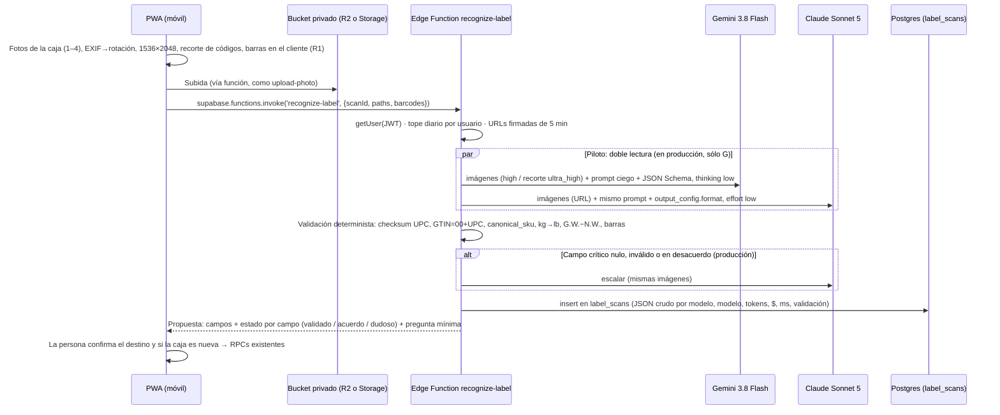

# R2 · Motores cloud para leer etiquetas de caja: APIs de OCR y LLMs multimodales

> Investigación del 15 sep 2026 para el motor de reconocimiento de PickD (ver
> `docs/label-recognition/01-lo-aprendido.md`). **Todos los precios, límites y nombres de modelo se
> leyeron ese día en la documentación y las páginas de precios oficiales** (URLs en §10). Los
> benchmarks son de terceros y se citan con fecha. Donde algo no se pudo verificar, se dice.
>
> Volumen supuesto: **200 fotos/día ≈ 6.000 fotos/mes**.

---

## 0. Resumen y recomendación

|                            | Elección                                                                                                                     | Por qué, en una línea                                                                                                                                                                                                                                                                              |
| -------------------------- | ---------------------------------------------------------------------------------------------------------------------------- | -------------------------------------------------------------------------------------------------------------------------------------------------------------------------------------------------------------------------------------------------------------------------------------------------- |
| **Motor principal**        | **Gemini 3.8 Flash** (`gemini-3.8-flash`), `thinking_level: low`, `media_resolution` alta por imagen, salida con JSON Schema | Es el n.º 1 de 53 modelos en la prueba pública que más se parece a esto: extraer **un campo concreto entre muchos números que compiten**, sobre fotos reales (97,3 %, ~7 s). Y es el más barato de los fuertes: **~$37/mes** (~$73/mes desde el 1 ene 2027)                                        |
| **Respaldo y verificador** | **Claude Sonnet 5** (`claude-sonnet-5`), `effort: low`, `output_config.format` con JSON Schema                               | Transcribe mejor carácter a carácter (OCR 91,7 % frente a 87,3 % de Gemini 3.8 Flash), lee imágenes de hasta 2576 px y es de otro proveedor, así que sus errores y caídas no van ligados a los de Gemini. **~$138/mes** si leyera todas las fotos; **~$28/mes** si sólo lee el ~20 % que se escala |
| **Árbitro opcional**       | Claude Opus 5                                                                                                                | Sólo para cajas que siguen en duda (<5 %): **< $10/mes**                                                                                                                                                                                                                                           |
| **Descartados como motor** | Cloud Vision, Document AI, Textract, Azure DI, Mistral OCR                                                                   | Devuelven texto sin nombre o hacen «OCR → LLM sobre texto» y pierden la disposición. Además cuestan igual o más ($9–180/mes). Único uso que vale la pena: **Azure DI Read, que decodifica las barras gratis** ($9/mes), como segunda lectura de barras en el servidor                              |

**Patrón:** Edge Function `recognize-label` en Supabase. Las claves quedan en `supabase secrets`, las fotos en un bucket **privado** con URL firmada de vida corta, y el flujo es: **lectura a ciegas → validación determinista (§3 de 01) → escalado a Claude si falla algo crítico → propuesta**. Nada escribe inventario sin que una persona lo confirme.

**Piloto (las 2–4 primeras semanas):** doble lectura en paralelo (Gemini + Claude) sobre **todas** las fotos. Coste ~$150–175/mes. Así se mide la tasa real de desacuerdo antes de pasar a escalar sólo lo dudoso (~$65/mes). Antes de nada, las **13 cajas de 01 §6** con los tres candidatos cuestan **menos de $2** y deciden si el principal sigue siendo Gemini (§9).

---

## 1. Qué exige el problema (criterios de evaluación)

De `01-lo-aprendido.md`:

1. **Asociar clave y valor por disposición**: dos columnas, valores corridos, cajas negras invertidas. Seis tipos de etiqueta (A–F), a veces apiladas.
2. **Distinguir 8–10 números** en una misma etiqueta: SKU, UPC, GTIN-14, frame, carton, PO, MK, lote y serie.
3. **Leer a través del daño**: film, brillo, rayones, dígitos a medias. **Juntar varias caras de una misma caja.**
4. **No inventar dígitos.** `null` antes que un dígito verosímil. Confianza y evidencia por campo.
5. **Salida con esquema fijo.** La validación (dígito de control, `canonical_sku`, kg→lb, serie de hermanas) vive **fuera** del modelo.
6. Latencia de uso en el piso: segundos, no minutos. Volumen bajo: el coste importa menos que el acierto. Un error de dato ya costó 381 unidades inexistentes.

Criterios, en orden: **(a) acierto por campo en fotos reales**, **(b) comportamiento ante texto ilegible (alucinación)**, **(c) salida estructurada fiable**, **(d) privacidad y retención**, **(e) latencia**, **(f) coste**, **(g) estabilidad del modelo (retiro, cambios de precio)**.

---

## 2. LLMs multimodales vigentes (sep 2026)

### 2.1 Tabla comparativa

| Proveedor · modelo (ID)                       | Estado / retiro                                                    | $ entrada / salida por 1M tokens                                                                                             | Imagen: resolución y tokens                                                                                                           | Salida estructurada                                                                    | Tokens estimados por foto¹           | $/foto¹                     |
| --------------------------------------------- | ------------------------------------------------------------------ | ---------------------------------------------------------------------------------------------------------------------------- | ------------------------------------------------------------------------------------------------------------------------------------- | -------------------------------------------------------------------------------------- | ------------------------------------ | --------------------------- |
| **Claude Opus 5** `claude-opus-5`             | Activo; retiro no antes del 24 jul 2027                            | $5 / $25 (batch −50 %)                                                                                                       | Alta resolución: lado largo 2576 px, máx. 4784 tokens; `⌈w/28⌉×⌈h/28⌉`                                                                | GA, `output_config.format` (JSON Schema) y `strict` en herramientas                    | 4070 img + ~1950 texto → 1100 salida | **$0,058**                  |
| **Claude Sonnet 5** `claude-sonnet-5`         | Activo; retiro no antes del 30 jun 2027                            | **$2 / $10**. El precio de lanzamiento quedó como definitivo: la subida a $3/$15 prevista para el 1 sep 2026 **no ocurrirá** | Alta resolución (Claude 4.7 y posteriores): 2576 px / 4784 tokens                                                                     | GA                                                                                     | 4070 + 1950 → 1100                   | **$0,023**                  |
| **Claude Haiku 4.5** `claude-haiku-4-5`       | Activo; retiro **no antes del 15 oct 2026** (con 60 días de aviso) | $1 / $5                                                                                                                      | Resolución estándar: 1568 px / 1568 tokens                                                                                            | GA                                                                                     | 1530 + 1500 → 800                    | $0,007                      |
| **Gemini 3.8 Flash** `gemini-3.8-flash`       | Estable (lanzado el 2 sep 2026), sin fecha de retiro               | **$0,75 / $3,75 hasta el 31 dic 2026 → $1,50 / $7,50 desde el 1 ene 2027** (batch −50 %)                                     | `media_resolution` en Gemini 3: low 280 · medium 560 · **high 1120 (defecto)** · ultra_high 2240 (por imagen). Configurable por parte | JSON Schema (subconjunto) vía `response_format` (Interactions API) o `generateContent` | 1120 + 1500 → 1100                   | **$0,0061** (2027: $0,0122) |
| Gemini 3.5 Flash-Lite `gemini-3.5-flash-lite` | Estable (21 jul 2026)                                              | $0,30 / $2,50                                                                                                                | igual que Gemini 3                                                                                                                    | igual                                                                                  | 1120 + 1500 → 850                    | $0,0029                     |
| Gemini 3.1 Flash-Lite `gemini-3.1-flash-lite` | Estable; **retiro 7 may 2027**                                     | $0,25 / $1,50                                                                                                                | igual                                                                                                                                 | igual                                                                                  | 1120 + 1500 → 850                    | $0,0019                     |
| Gemini 2.5 Flash `gemini-2.5-flash`           | Estable, sin fecha de retiro, generación anterior                  | $0,30 / $2,50                                                                                                                | 258 tokens por mosaico de 768 px                                                                                                      | igual                                                                                  | 1032 + 1500 → 1100                   | $0,0035                     |
| GPT-5.6 Terra `gpt-5.6-terra`                 | Activo                                                             | $2 / $12 (batch/flex −50 %)                                                                                                  | Parches de 32 px × 1,2; `high` = 2048 px y 2500 parches; `original` hasta 30.000 parches                                              | JSON Schema estricto (acepta `pattern`, `minLength`)                                   | 2993 + 1500 → 1100                   | $0,022                      |
| GPT-5.6 Luna `gpt-5.6-luna`                   | Activo                                                             | $0,20 / $1,20                                                                                                                | igual                                                                                                                                 | igual                                                                                  | 2993 + 1500 → 1100                   | $0,0022                     |
| GPT-5.4 mini `gpt-5.4-mini`                   | Activo                                                             | $0,75 / $4,50                                                                                                                | igual                                                                                                                                 | igual                                                                                  | 2993 + 1500 → 1100                   | $0,0083                     |

¹ Supuestos en §6: foto enviada a 1536×2048 px (3,1 MP); prompt con esquema de ~1500 tokens (×1,3 en los Claude con tokenizador nuevo, según la página de precios de Anthropic); salida JSON ~800 tokens más ~300 de razonamiento a esfuerzo bajo. **Es una estimación conservadora.** Roboflow mide $0,0030 por muestra con Sonnet 5 y $0,0018 con Gemini 3.8 Flash en extracción, con imágenes y salidas más pequeñas.

### 2.2 Claude (Anthropic)

- **Imágenes:** JPEG, PNG, GIF, WebP. Hasta 10 MB por imagen en base64. **URL** y `file_id` (Files API) como fuente. Hasta 600 imágenes por petición, pero con más de 20 cada imagen debe caber en 2000 px. Petición total de 32 MB.
- **Resolución alta automática en Sonnet 5 y Opus 5**, útil para la letra pequeña de una etiqueta fotografiada entera. Anthropic advierte que puede costar hasta ~3× más tokens y recomienda **reducir la imagen antes de enviarla** cuando no hace falta tanta fidelidad. Haiku 4.5 se queda en 1568 px.
- **Salida estructurada:** GA. JSON Schema **sin** `pattern`, `minLength`/`maxLength` ni `minimum`/`maximum`; con `enum`, `const`, `anyOf`, `$ref` interno y `additionalProperties: false`. La gramática se compila en la primera petición (latencia extra) y se cachea 24 h. Es compatible con los esquemas Zod que ya usa PickD (`zodOutputFormat` + `client.messages.parse`).
- **Confianza:** la API **no expone logprobs**. La confianza hay que pedirla en el esquema y **no es calibrada** (§5.1).
- **Limitaciones oficiales:** _«might hallucinate or make mistakes when interpreting low-quality, rotated, or very small images under 200 pixels»_. Recomiendan poner la imagen **antes** del texto y **no comprimir de más**: el JPEG agresivo degrada el texto.
- **Esfuerzo:** Sonnet 5 y Opus 5 usan `thinking: adaptive` más `output_config.effort` (`low`…`max`). Roboflow midió que en Sonnet 5 _«thinking longer changes nothing»_ en visión (misma nota con 1,4× el coste). Para extracción, `low`.

### 2.3 Gemini (Google)

- **Novedad clave de Gemini 3: `media_resolution` por imagen.** Permite mandar la foto general en `high` (1120) y un recorte de la zona de códigos en `ultra_high` (2240) en la misma petición. Google dice que en documentos la calidad «se satura en `medium`», pero **para imágenes recomienda `high`**.
- **Razonamiento:** `thinking_level` en 3.8 Flash = `low | medium | high` (defecto `medium`). En Roboflow, **3.8 Flash con esfuerzo alto tardó 57,3 s en OCR** frente a 5,6 s con esfuerzo bajo, y acertó sólo 1,5 puntos más. **Usar `low`.**
- **Entrada:** inline hasta 100 MB por petición, **URLs HTTPS públicas o prefirmadas** (no hace falta re-subir) y Files API (48 h).
- **Salida estructurada:** subconjunto de JSON Schema (`enum`, arrays de tipo con `null`, `anyOf`, `$ref`, `minItems`, `minimum`…). La doc no confirma `pattern`. Aviso oficial: _«Very large or deeply nested schemas may be rejected»_. `generateContent` expone `responseLogprobs`/`avgLogprobs`; hay que comprobar si lo acepta cada modelo 3.x.
- **Precio que cambia:** 3.6, 3.7 y 3.8 Flash tienen precio **introductorio hasta el 31 dic 2026 y se duplica el 1 ene 2027**. Hay que presupuestar con el precio de 2027.
- **Nivel gratuito = entrenan con tus datos** (_«Used to improve our products: Yes»_, revisión humana). **Sólo nivel de pago.**

### 2.4 OpenAI

- Gama actual: `gpt-6-astra` ($10/$50), `gpt-5.6-sol` ($4/$20), `gpt-5.6-terra` ($2/$12) y `gpt-5.6-luna` ($0,20/$1,20). `gpt-5-mini` y `gpt-5-nano` se retiran el **11 dic 2026**.
- **Mejor salida estructurada de las tres:** admite `pattern`, `minLength` y `format`, así que se podría forzar `^845436\d{6}$` en el UPC. Aun así, un regex no comprueba el dígito de control.
- **Visión:** parches de 32 px con multiplicador 1,2. `detail: "original"` conserva la resolución (hasta 30.000 parches). Limitaciones oficiales: _«Small text… Rotation: may misinterpret rotated or upside-down text»_.
- **Por qué no es principal:** en la prueba de extracción de Roboflow la familia 5.6 queda a 80–87 %, frente al 95–97 % de los Gemini Flash (§4). En socOCRbench, sin razonamiento, sacó 0,31–0,38, frente a ~0,70 de Gemini. Luna es muy barata ($13/mes) y buena en OCR literal (90,7–91,5 %). Sirve de **tercer voto barato en la evaluación**, no de motor.

---

## 3. APIs de OCR y de documentos

| Servicio                                                  | Qué devuelve                                                                                         | ¿Nombra los campos?     | ¿Barras?                                | Confianza           | Precio oficial                                                                                                     | $/mes (6.000 fotos)                     |
| --------------------------------------------------------- | ---------------------------------------------------------------------------------------------------- | ----------------------- | --------------------------------------- | ------------------- | ------------------------------------------------------------------------------------------------------------------ | --------------------------------------- |
| **Google Cloud Vision** `DOCUMENT_TEXT_DETECTION`         | Texto con cajas                                                                                      | No                      | No                                      | Por palabra/símbolo | 1.000/mes gratis, luego $1,50/1.000                                                                                | **$7,50**                               |
| **Document AI Enterprise OCR**                            | Texto y disposición                                                                                  | No                      | —                                       | Sí                  | $1,50/1.000 páginas (1.000 gratis). Complementos $6/1.000                                                          | $7,50                                   |
| **Document AI Custom Extractor** (generativo o entrenado) | Entidades según tu esquema                                                                           | **Sí**                  | —                                       | Por entidad         | **$30/1.000 páginas** (mismo precio con IA generativa que con modelo propio). Alojar un procesador propio: $0,05/h | **$180** (+$36 si se aloja una versión) |
| **AWS Textract** `DetectDocumentText`                     | Texto                                                                                                | No                      | No                                      | Por palabra         | $0,0015/página                                                                                                     | $9                                      |
| **Textract** `AnalyzeDocument` + **Queries**              | Respuesta a «¿cuál es el SKU?»                                                                       | Sí, pregunta a pregunta | No                                      | Por respuesta       | **$0,015/página**; Custom Queries $0,025 (con adaptador entrenado)                                                 | $90 / $150                              |
| **Textract** `AnalyzeExpense`                             | Campos de recibo/factura                                                                             | Sólo de facturas        | No                                      | Sí                  | $0,01/página                                                                                                       | $60 (no encaja)                         |
| **Azure Document Intelligence** Read                      | Texto con cajas, **barras decodificadas** (UPC-A/E, EAN-13, Code 128, Code 39, QR, DataMatrix, ITF…) | No                      | **Sí, gratis** (con confianza fija a 1) | Por palabra         | **$1,50/1.000** (0,60 por encima de 1M). 500 páginas/mes gratis en F0                                              | **$9**                                  |
| **Azure DI** Layout / Query fields                        | Disposición y hasta 20 campos por consulta                                                           | Sí (Query fields)       | Sí                                      | Sí                  | Prebuilt $10/1.000; Query fields +$10/1.000                                                                        | $60 / $120                              |
| **Azure DI** Custom (neural/generativo)                   | Campos entrenados                                                                                    | Sí                      | Sí                                      | Por campo           | $30/1.000; entrenamiento $3/h                                                                                      | $180                                    |
| **Mistral OCR 4.1** `mistral-ocr-4-1`                     | Markdown, cajas por párrafo, confianza por bloque                                                    | Con «annotations»       | No                                      | Por bloque          | OCR **$4/1.000** (batch $2); «Annotated pages» $5/1.000                                                            | $24–54²                                 |

² La página del modelo lista «OCR $4» y «Annotated Pages $5» por separado. No se pudo confirmar si se suman.

**Veredicto por servicio**

- **Cloud Vision / Enterprise OCR / Textract Detect / Azure Read:** leen bien el texto impreso, pero devuelven **números sin nombre**. Resolver cuál es cuál con reglas es justo lo que 01 §5 dice que falla: dos columnas, valores corridos, etiquetas apiladas. Sólo tienen sentido como **señal adicional** barata.
- **Textract Queries / Azure Query fields:** preguntan campo a campo, pero no «juntan dos caras» ni razonan sobre la etiqueta de encima. Además cuestan **3–5× más que Gemini** por foto.
- **Document AI Custom Extractor / Azure custom generativo:** por dentro son LLMs con un envoltorio de proceso. Cuestan **5× Gemini 3.8 Flash**, piden gestionar procesadores o entrenamiento y no ofrecen más control sobre la resolución ni la alucinación.
- **Mistral OCR 4 con annotations:** según su doc, las anotaciones del documento envían **el Markdown del OCR** (y las primeras 8 imágenes recortadas) a un LMM. **La asociación clave-valor se hace sobre texto ya linealizado**, que es donde un OCR clásico pierde la disposición. Buen OCR (OmniDocBench 93,07 según Mistral), pero en socOCRbench (documentos degradados) saca 0,5055, por debajo de Claude y Gemini.
- **Lo único rescatable:** Azure DI Read con `features=barcodes` es un **decodificador de barras en el servidor** por $0,0015/foto. Vale la pena si el lector del cliente (tema de R1) no llega a decodificar las barras. Una IA _lee los dígitos impresos_, no la barra (01 §5).

---

## 4. Evidencia de precisión (benchmarks públicos 2026)

> **Aviso:** ningún benchmark público mide **etiquetas de caja de almacén fotografiadas**. Los más
> cercanos son: extracción de un campo en fotos reales (Roboflow), extracción clave-valor en
> documentos (IDP Leaderboard) y OCR de texto degradado (socOCRbench, KIE-HVQA). **La prueba que
> decide son las 13 cajas de 01 §6** (§9).

### 4.1 Roboflow Vision Evals (actualizado el 5 sep 2026; 53 modelos, media de 3 corridas)

**«Data Extraction»**: _«finding and returning one specific piece of information from an image… a price, date, timestamp, phone number, license plate, serial number, or meter reading… locate the right field among many competing ones and return just that value in the requested format»_. Es lo más parecido a nuestra tarea. **«OCR»**: transcripción completa y exacta (impresos, manuscritos, recibos, formularios, números de serie, matrículas).

| Modelo (esfuerzo)                 | Data Extraction    | $/muestra · latencia       | OCR              | $/muestra · latencia        |
| --------------------------------- | ------------------ | -------------------------- | ---------------- | --------------------------- |
| **Gemini 3.8 Flash (low)**        | **97,3 % (#1/53)** | $0,0018 · 7,2 s            | 87,3 % (#37/53)  | $0,0024 · 5,6 s             |
| Gemini 3.8 Flash (high)           | 94,8 %             | $0,0089 · 12,9 s           | 88,8 %           | $0,064 · **57,3 s**         |
| Gemini 3 Flash (preview)          | 96,9 %             | $0,0008 · 2,0 s            | 87,6 %           | $0,0024 · 4,2 s             |
| Gemini 3.6 Flash (low)            | 95,9 %             | $0,0015 · 10,0 s           | 88,2 %           | $0,0028 · 6,3 s             |
| Gemini 3.5 Flash-Lite             | 91,8 %             | $0,0004 · 1,3 s            | 87,4 %           | $0,0011 · 1,6 s             |
| **Claude Opus 5 (low)**           | 89,7 % (#10)       | $0,0080 · 4,2 s            | **93,2 % (#6)**  | $0,020 · 8,8 s              |
| **Claude Sonnet 5 (low)**         | 89,7 % (#10)       | $0,0030 · 2,8 s            | **91,7 % (#15)** | $0,0078 · 7,2 s             |
| GPT-5.6 Luna (low / high)         | 80,4 % / 81,8 %    | $0,0004–0,0006 · 3,2–5,3 s | 90,7 % / 91,5 %  | $0,0012–0,0042 · 7,5–30,8 s |
| GPT-5.6 Terra                     | ~80 %              | ~$0,004 · 3,3–3,8 s        | 89,4 %           | $0,012–0,023 · 11,6–23 s    |
| GPT-5.4 mini (low)                | 84,2 %             | $0,0014 · 3,0 s            | 89,5 %           | $0,0042 · 6,7 s             |
| Claude Fable 5 / 5.1 (referencia) | 91,8–93,5 %        | $0,015–0,016               | 94,0 % (#1–2)    | $0,039                      |

Haiku 4.5 no aparece en estas tablas.

**Lectura:** hay un **reparto claro de fuerzas**. Los **Gemini Flash encuentran mejor el campo correcto** entre los que compiten: 95–97 % frente a ~90 % de Claude. **Claude transcribe mejor cada carácter**: 91,7–93,2 % frente a 87–89 %. Nuestra tarea necesita las dos cosas, y de ahí sale **usar ambos**. Gemini decide _qué número es el UPC_. La validación y Claude comprueban _que cada dígito sea el que está impreso_.

(Las filas se leyeron de las páginas vivas de Roboflow el 15 sep 2026. Las de Gemini 3.8 Flash, Opus 5, Sonnet 5 y GPT-5.6 Luna se contrastaron en la ficha de cada modelo. Los rangos de las filas intermedias pueden moverse.)

### 4.2 IDP Leaderboard v1.5 (Nanonets, mar 2026; 16 modelos, más de 9.000 documentos)

| Modelo                | Total | KIE (clave-valor) | OCR (manuscrito, rotado, diacríticos) | Tablas |
| --------------------- | ----- | ----------------- | ------------------------------------- | ------ |
| GPT-5.4               | 83,5  | 84,4              | 81,0                                  | 85,3   |
| Gemini 3 Pro          | 82,8  | 81,8              | 77,7                                  | 88,8   |
| **Gemini 3 Flash**    | 82,0  | 80,5              | 75,3                                  | 90,1   |
| Gemini 3.1 Pro        | 81,6  | 89,6              | 69,8                                  | 85,3   |
| **Claude Sonnet 4.6** | 80,7  | 81,2              | 73,9                                  | 86,9   |
| Claude Opus 4.6       | 80,4  | 81,1              | 74,1                                  | 85,9   |
| GPT-5-Mini            | 75,2  | 73,3              | 69,9                                  | 82,5   |
| **Claude Haiku 4.5**  | 71,2  | 72,9              | 61,2                                  | 79,6   |

Hallazgos del informe: _«Sonnet 4.6 (80.8) is as good as [Opus] 4.6 (80.3)»_, _«Gemini-3 flash matches Gemini-3 pro»_ en extracción y, **muy relevante para nosotros**, _«Handwritten form extraction hallucinates on blank fields… models fill in values for fields that are blank»_. Todavía no incluye Sonnet 5, Gemini 3.8 Flash ni GPT-5.6. **Haiku 4.5 queda ~8 puntos por debajo en KIE y ~12 en OCR**, así que queda descartado como principal.

### 4.3 Otros

- **socOCRbench v2** (documentos degradados y manuscritos de ciencias sociales): Gemini 3 Pro 0,7134, **Gemini 3 Flash (low) 0,6967**, **Sonnet 4.6 0,5791**, Opus 4.6 0,5590, Mistral OCR 4 0,5055, **GPT-5.6 sin razonamiento 0,31–0,38**. Confirma que Gemini lee bien texto dañado.
- **ExtractBench** (arXiv 2602.12247, feb 2026): _«Performance degrades sharply with schema breadth, culminating in 0% valid output on a 369-field… schema across all tested models»_. **Hay que mantener el esquema compacto** (~15–20 campos, un nivel de anidamiento).
- **KIE-HVQA** (arXiv 2506.20168, NeurIPS 2025): primer benchmark de **alucinación OCR en documentos degradados** (DNI, recibos, facturas con desenfoque, oclusión o baja tinta). Ante la duda, los modelos _«over-rely on linguistic priors»_ y **generan contenido verosímil**. Es exactamente el riesgo del «dígito tapado» de 01 §5.
- **Majestic Labs** (22 jul 2026, 17 tipos de documento): _«No engine won all 17 categories. Not one.»_ Recomienda **enrutar**: motor barato primero y modelo de frontera sólo para los fallos. Es el patrón de §8.

---

## 5. Riesgos

### 5.1 Alucinación de dígitos y confianza

| Mecanismo                                                   | Evidencia                                                                                                                                                             | Mitigación en el diseño                                                                                                                                                                                                                                                             |
| ----------------------------------------------------------- | --------------------------------------------------------------------------------------------------------------------------------------------------------------------- | ----------------------------------------------------------------------------------------------------------------------------------------------------------------------------------------------------------------------------------------------------------------------------------- |
| Completa un dígito tapado con uno verosímil                 | KIE-HVQA; Nanonets («fill in values for fields that are blank»); doc de Claude («might hallucinate… low-quality, rotated»)                                            | En el esquema, `value` **puede ser `null`**, con `legibility: clear\|partial\|illegible\|absent` y `evidence` (texto literal visto). El prompt dice: _«si un carácter no se ve, `null` y márcalo; nunca completes»_                                                                 |
| La confianza que declara el propio modelo no está calibrada | Ninguna de las tres APIs ofrece confianza por campo; Claude no expone logprobs. CONSTRUCT (arXiv 2603.18014) existe precisamente porque las señales nativas no bastan | La confianza **no la da el modelo**. Sale de: (1) **checksum** del UPC y GTIN-14 = `00`+UPC; (2) **barras** decodificadas; (3) **acuerdo entre dos modelos de proveedores distintos**; (4) cruce con catálogo y serie de hermanas. `legibility` sólo sirve para ordenar la revisión |
| Sesgo de confirmación si se le dan pistas del catálogo      | Principio general: si el prompt dice «esperamos 03-4149BR», el modelo tiende a «verlo»                                                                                | **Lectura a ciegas primero** (sin SKUs candidatos). El cruce con PickD y AS400 es un paso **posterior y determinista** (01 §4). Si hace falta desempatar, se hace una segunda llamada separada y marcada                                                                            |
| Lee los dígitos impresos, no la barra                       | 01 §5                                                                                                                                                                 | Las barras decodificadas (cliente o Azure Read) **mandan** cuando pasan el checksum. El modelo sólo rellena lo que las barras no dan                                                                                                                                                |
| Texto rotado o pequeño                                      | Docs de Claude y OpenAI                                                                                                                                               | Recorte de la zona de códigos en el cliente, mandado como segunda imagen a `ultra_high` (Gemini) o a ~2000 px (Claude); rotar según EXIF antes de subir                                                                                                                             |
| Esquema demasiado ancho                                     | ExtractBench                                                                                                                                                          | ~15 campos con 4 propiedades cada uno, sin tablas anidadas                                                                                                                                                                                                                          |

### 5.2 Privacidad y retención

Una de las 15 fotos traía una **etiqueta de FedEx con el nombre de una persona** (01, cabecera).

| Proveedor (API de pago)                          | ¿Entrena con los datos?                                                                           | Retención                                                                                                                                                                               | ZDR                                                             |
| ------------------------------------------------ | ------------------------------------------------------------------------------------------------- | --------------------------------------------------------------------------------------------------------------------------------------------------------------------------------------- | --------------------------------------------------------------- |
| **Anthropic** (Claude API)                       | No, _«never used for model training without your express permission»_                             | _«automatically delete inputs and outputs… within 30 days»_ (política comercial, 1 jul 2026). Con violación de uso: hasta 2 años. Los **Covered Models** (Fable, Mythos) exigen 30 días | Disponible por acuerdo. Sonnet 5 y Opus 5 no son Covered Models |
| **Google** (Gemini API, nivel de pago)           | No, _«Google doesn't use your prompts (including… images…) or responses to improve our products»_ | Registros _«solely for detecting and preventing violations of the Prohibited Use Policy»_; los términos no fijan un plazo                                                               | —                                                               |
| **Google** (Gemini, nivel **gratuito**)          | **Sí, con revisión humana**. _«Do not submit sensitive, confidential, or personal information»_   | —                                                                                                                                                                                       | **Prohibido para PickD**                                        |
| **OpenAI**                                       | No (desde el 1 mar 2023)                                                                          | Registros de abuso **hasta 30 días**                                                                                                                                                    | Por aprobación previa                                           |
| Cloud Vision / Document AI / Textract / Azure DI | No (condiciones cloud estándar)                                                                   | Procesamiento transitorio (según cada servicio)                                                                                                                                         | —                                                               |

**Riesgos propios de PickD, encontrados en el repo:**

1. **El bucket R2 de fotos es público** (`pub-1a61…r2.dev`, CLAUDE.md §Fotos). Las fotos de etiquetas **no deben ir ahí**. Hay que usar un prefijo en un bucket **privado** (o Supabase Storage privado) con URL firmada de ≤5 min para el proveedor y una limpieza por TTL, igual que `cleanup-gallery-trash`.
2. **`VITE_OPENAI_API_KEY`** sigue declarada en `src/vite-env.d.ts:5` y `.env.example:7`. Toda variable `VITE_*` **se incrusta en el bundle del navegador**. Aunque hoy nada la usa, hay que retirarla para que nadie ponga ahí una clave real.
3. `CLAUDE.md` dice «AI: Gemini 2.5 Flash (primary) + GPT-4o (fallback)», pero **no hay ninguna integración de IA** en `src/` ni en `supabase/functions/`. Es una línea desfasada y conviene corregirla cuando se implemente esto.

### 5.3 Ciclo de vida y precio

- **Gemini 3.8 Flash duplica su precio el 1 ene 2027.** Todo el presupuesto de §6 se da también con el precio de 2027.
- **Claude Haiku 4.5**: retiro «no antes del 15 oct 2026». Otra razón para no depender de él.
- **Gemini 3 Flash** (el más rápido en extracción, 2,0 s) sigue siendo **preview** «legacy». Tentador por latencia, pero sin compromiso de estabilidad.
- Todos los IDs de Claude de la generación 4.6+ son **instantáneas fijas**. En Gemini, `gemini-3.8-flash` es un modelo estable con nombre fijo. Conviene **guardar el modelo exacto en cada lectura** (§8.5) para poder atribuir regresiones.

### 5.4 Latencia

Por muestra (Roboflow, una imagen): Gemini 3.8 Flash low **5,6–7,2 s**, Sonnet 5 low **2,8–7,2 s**, Opus 5 low 4,2–8,8 s. Con 2–4 fotos por caja y salida JSON, lo realista son **~5–15 s**. La doble lectura **en paralelo** (`Promise.all`) tarda lo que la más lenta, no la suma. **Nunca con razonamiento alto** (57 s en Gemini 3.8 Flash OCR high).

---

## 6. Coste mensual para ~200 fotos/día

**Supuestos:** 6.000 fotos/mes; cada foto se reduce en el cliente a **1536×2048 px** (~3,1 MP, JPEG de calidad ~85; no comprimir más, porque Anthropic advierte que el JPEG agresivo degrada el texto); prompt con esquema de ~1500 tokens; salida ~1100 tokens (JSON más razonamiento bajo). Se calcula **por foto**. Si se mandan todas las caras de una caja en una sola llamada, la parte de texto se paga una sola vez, así que el coste real baja un poco. Sin caché de prompt: el ahorro sobre 1,5K tokens es despreciable a este volumen.

### 6.1 Por motor, si leyera todas las fotos

| Motor                                   | $/foto       | **$/mes** | Nota                                                               |
| --------------------------------------- | ------------ | --------- | ------------------------------------------------------------------ |
| Claude Opus 5                           | $0,058       | **$346**  | Sólo como árbitro                                                  |
| Claude Sonnet 5                         | $0,023       | **$138**  | Con la foto reducida a 1092×1456 (2028 tokens): ~$0,019 → **$114** |
| Claude Haiku 4.5                        | $0,007       | $42       | Descartado por precisión y retiro                                  |
| **Gemini 3.8 Flash**, high (2026)       | $0,0061      | **$37**   | ultra_high: $42                                                    |
| **Gemini 3.8 Flash**, high (desde 2027) | $0,0122      | **$73**   |                                                                    |
| Gemini 3.5 Flash-Lite                   | $0,0029      | $17       | Extracción 91,8 %                                                  |
| Gemini 3.1 Flash-Lite                   | $0,0019      | $12       | Se retira en may 2027                                              |
| Gemini 2.5 Flash                        | $0,0035      | $21       | Generación anterior                                                |
| GPT-5.6 Terra                           | $0,022       | $133      |                                                                    |
| GPT-5.6 Luna                            | $0,0022      | $13       | Tercer voto en la evaluación                                       |
| GPT-5.4 mini                            | $0,0083      | $50       |                                                                    |
| Cloud Vision (texto)                    | $0,0015      | $7,50     | No nombra campos                                                   |
| Azure DI Read + barras                  | $0,0015      | $9        | Segunda lectura de barras                                          |
| Textract Queries                        | $0,015       | $90       |                                                                    |
| Document AI Custom Extractor            | $0,030       | $180      | Más $0,05/h si se aloja                                            |
| Azure DI custom generativo              | $0,030       | $180      |                                                                    |
| Mistral OCR 4.1 (+annotations)          | $0,004–0,009 | $24–54    |                                                                    |

### 6.2 Por arquitectura (lo que de verdad se pagaría)

| Escenario                                                                                 | 2026                                                           | 2027                  |
| ----------------------------------------------------------------------------------------- | -------------------------------------------------------------- | --------------------- |
| **A. Piloto: doble lectura en paralelo** (Gemini 3.8 Flash + Sonnet 5 en todas las fotos) | $37 + $138 = **~$175** (reduciendo la foto para Claude: ~$150) | ~$211                 |
| **B. Producción: Gemini en todo, Sonnet 5 en el ~20 % escalado**                          | $37 + $28 = **~$65**                                           | $73 + $28 = **~$101** |
| B + Opus 5 como árbitro en el ~3 %                                                        | +$10 → ~$75                                                    | ~$111                 |
| B + Azure Read para barras en el servidor                                                 | +$9 → ~$74                                                     | ~$110                 |
| Referencia: sólo Sonnet 5                                                                 | $138                                                           | $138                  |
| Referencia: sólo Gemini 3.8 Flash                                                         | $37                                                            | $73                   |

Con cualquier diseño razonable el coste **está por debajo de ~$200/mes**. **La decisión es de acierto, no de precio.** Hay que poner alertas de gasto (presupuesto de Google Cloud Billing y límite en la Console de Anthropic) y un **tope por usuario al día** en la función, por si un bucle o un abuso dispara el consumo.

---

## 7. Recomendación razonada

### Principal: Gemini 3.8 Flash

1. **Mejor evidencia pública en la subtarea crítica**: 97,3 % (#1/53) en «encontrar el campo correcto entre muchos que compiten» sobre fotos reales (números de serie, códigos de contenedor, flancos de neumático), a $0,0018 por muestra.
2. **La familia Gemini Flash lee bien texto degradado**: socOCRbench 0,70 frente a 0,58 de Sonnet 4.6; IDP KIE 80,5, a la par que Sonnet 4.6.
3. **Control de resolución por imagen**: la foto general y el recorte de códigos en la misma llamada.
4. **Coste bajo** incluso con el precio de 2027. Estable, sin fecha de retiro. Acepta URLs firmadas (sin base64 dentro de la Edge Function).
5. **Punto débil conocido**: la transcripción literal (87,3 %) es donde nace el «dígito verosímil». Lo cubren las barras, los checksums y el verificador.

### Respaldo y verificador: Claude Sonnet 5

1. **Mejor transcripción literal** del tramo medio (91,7 %; Opus 5 93,2 %). Complementa justo el punto débil de Gemini.
2. **Resolución alta automática (2576 px)**: lee letra pequeña sin recortes.
3. **Otro proveedor**: si Gemini cae (429/5xx) el servicio sigue, y **el acuerdo entre dos familias distintas vale como señal de confianza**; dos lecturas del mismo modelo tienden a repetir el mismo error.
4. Precio definitivo de $2/$10, retiro no antes de jun 2027, `output_config.format` GA y compatible con los esquemas Zod de PickD.
5. **Contexto propio**: la verdad de terreno de 01 §6 se obtuvo leyendo las fotos con un modelo Claude (en conversación y con razonamiento). Hay indicio directo de que la familia lee bien _estas_ etiquetas. Falta medir Sonnet 5 en una sola llamada.

### Cuándo cambiar la decisión (lo decide la prueba de §9)

- Si en las 13 cajas **Sonnet 5 supera a Gemini 3.8 Flash por ≥2 campos críticos** (SKU, UPC, G.W.) o Gemini inventa un dígito que pasa checksum y Claude no, **se invierten los papeles**: Sonnet 5 principal (~$138/mes) y Gemini de verificador.
- Si **Gemini 3.5 Flash-Lite** empata con 3.8 Flash en las 13 cajas, puede ser el principal (~$17/mes, 1,3 s) con Sonnet 5 igual de verificador.
- **GPT-5.6 Luna** entra sólo si es el mejor en OCR literal de los dígitos a un coste mínimo, como tercer voto.

---

## 8. Patrón de integración con Supabase Edge Functions

### 8.1 Flujo



### 8.2 Esquema de salida (el mismo para ambos modelos)

Un objeto por campo, un nivel, compatible con los subconjuntos de Claude y Gemini (sin `pattern`; la forma se valida en código):

```jsonc
{
  "label_types": ["A_factory_taiwan" | "B_factory_gtin" | "C_factory_ord_lot" | "D_return_to_stock" | "E_pickd" | "F_fedex" | "other"],
  "stacked_labels": true,          // hay una etiqueta encima de otra
  "fields": {
    "sku":        { "value": "03-4149BR" | null, "legibility": "clear|partial|illegible|absent", "evidence": "texto literal visto", "alternatives": ["03-4148BR"] },
    "upc":        { ... }, "gtin14": { ... }, "model": { ... }, "size": { ... }, "color": { ... },
    "net_weight_kg": { ... }, "gross_weight_kg": { ... }, "frame_or_serial": { ... },
    "po": { ... }, "carton_no": { ... }, "factory_code": { ... }, "qty": { ... }
  },
  "handwritten_notes": ["10 JAN"],
  "observations": "texto breve: reetiquetada, cara dañada, etc."
}
```

**Reglas del prompt** (sistema, estable, sin datos del catálogo):

- _«Transcribe exactamente lo impreso. Si un carácter no es legible, `value: null` y `legibility: partial/illegible`. Nunca completes dígitos por deducción.»_
- _«`evidence` debe ser el texto literal tal cual aparece, incluidos guiones y espacios (`03-4000-BL`); la normalización la hace el sistema.»_
- _«Si hay varias etiquetas, los campos son de la de encima; describe la de debajo en `observations`.»_
- _«Varias imágenes son caras de UNA caja: combina y señala contradicciones.»_
- Las imágenes van **antes** del texto (recomendación de Anthropic). Cada una lleva su etiqueta de texto (`Imagen 1: cara frontal`).

### 8.3 Lógica de decisión por campo (en la función, código puro con tests)

1. **Barras válidas mandan**: UPC decodificado con checksum correcto → `validated`.
2. UPC leído por el modelo con checksum correcto y prefijo `845436` → `validated`. Checksum incorrecto → `invalid` → **escalar**.
3. GTIN-14 = `00` + UPC → segunda lectura gratis (01 §3).
4. SKU → `canonical_sku()`. Si existe en el catálogo → `matched`. Si no, queda como alta candidata (01 §4).
5. Peso: G.W. dentro del rango y G.W. − N.W. coherente con la fábrica → `validated`.
6. **Acuerdo entre los dos modelos** en campos sin checksum (frame, PO, carton) → `agreed`. Desacuerdo → `doubtful` (se muestra con las dos lecturas y nunca se escribe sin confirmación).
7. **Escalar a Claude** (en producción) si SKU o UPC es `null`, `invalid` o `partial`, si hay contradicción entre caras o si la etiqueta es tipo D sin SKU.

**Un hecho, una fuente:** los validadores (`checksum UPC`, `canonical_sku`, `kgToLbs`) ya existen en `src/utils/` y en SQL. La función debe **importar el mismo módulo TS puro** (Deno resuelve la ruta relativa si el archivo no usa nada de Vite) o dejar un comentario «copiado de X; si cambia allá, cambiar acá».

### 8.4 Detalles de la Edge Function

| Tema                         | Decisión                                                                                                                                                                                                                                                                                                                                                                                                                                  | Fuente                                                |
| ---------------------------- | ----------------------------------------------------------------------------------------------------------------------------------------------------------------------------------------------------------------------------------------------------------------------------------------------------------------------------------------------------------------------------------------------------------------------------------------- | ----------------------------------------------------- |
| **Límites**                  | Memoria 256 MB; **CPU 2 s por petición** (la espera de red no cuenta); reloj de pared 150 s (gratis) / 400 s (pago); **timeout por inactividad 150 s → 504**                                                                                                                                                                                                                                                                              | supabase.com/docs/guides/functions/limits             |
| **Imágenes**                 | **No hacer base64 dentro de la función** (gasta CPU y memoria): pasar **URL firmada** de 5 min. Claude acepta `source: {type: "url"}` y Gemini _«publicly accessible HTTPS URLs or pre-signed URLs»_                                                                                                                                                                                                                                      | Docs de visión de Claude; Gemini _file-input-methods_ |
| **Timeouts**                 | `AbortController`: principal 30 s, verificador 45 s. En el piloto, `Promise.allSettled` en paralelo                                                                                                                                                                                                                                                                                                                                       | —                                                     |
| **Registro y coste**         | `EdgeRuntime.waitUntil()` para insertar en `label_scans` después de responder. En local hace falta `policy = "per_worker"`                                                                                                                                                                                                                                                                                                                | supabase.com/docs/guides/functions/background-tasks   |
| **Llamada desde el cliente** | `supabase.functions.invoke()`, nunca `fetch` a pelo (regla de CLAUDE.md)                                                                                                                                                                                                                                                                                                                                                                  | CLAUDE.md §Fotos                                      |
| **JWT**                      | Seguir el precedente de `upload-photo`: `verify_jwt = false` en `config.toml` y `supabase.auth.getUser(token)` dentro, para no repetir la trampa del 401                                                                                                                                                                                                                                                                                  | CLAUDE.md §Fotos                                      |
| **Secretos**                 | `GEMINI_API_KEY` y `ANTHROPIC_API_KEY` en el **Llavero** (`security add-generic-password -a "$USER" -s gemini-pickd -U -w`) y cargados con `npx supabase secrets set --env-file <(printf 'GEMINI_API_KEY=%s\n' "$(security find-generic-password -s gemini-pickd -w)")` (`printf` es un builtin: el valor no queda en la lista de procesos ni en el historial; comprobar que el CLI acepta la sustitución de proceso). **Nunca `VITE_*`** | ~/dev/CLAUDE.md §Credenciales                         |
| **SDKs en Deno**             | `npm:@anthropic-ai/sdk` (`client.messages.parse` + `zodOutputFormat`) y `npm:@google/genai` (la doc actual usa `client.interactions.create({ model, input, response_format, generation_config: { thinking_level } })`; `generateContent` sigue siendo API principal)                                                                                                                                                                      | Docs oficiales                                        |
| **Tope de gasto**            | Contar las lecturas del usuario en las últimas 24 h en `label_scans` y cortar sobre un umbral (p. ej. 600)                                                                                                                                                                                                                                                                                                                                | —                                                     |
| **Realtime**                 | **No** añadir `label_scans` a la publicación de Realtime (memoria del proyecto: las escrituras masivas recargan a todos los clientes)                                                                                                                                                                                                                                                                                                     | memoria `escrituras-masivas-mirar-realtime-primero`   |
| **Escritura de inventario**  | La función **sólo propone**. Las escrituras siguen por las RPCs existentes, con confirmación humana (01 §4.3)                                                                                                                                                                                                                                                                                                                             | 01 §4                                                 |

### 8.5 Tabla `label_scans` (para auditar y evaluar)

`id, created_at, user_id, scan_group_id (caja), photo_paths[], barcodes jsonb, model_primary, model_verifier, raw_primary jsonb, raw_verifier jsonb, tokens_in/out por modelo, cost_usd, latency_ms, validation jsonb (estado por campo), proposal jsonb, human_decision jsonb, final_sku`.

Guardar **el modelo exacto y el JSON crudo** permite repetir la evaluación cuando salga Gemini 3.9 o Sonnet 5.x y atribuir cualquier regresión. `human_decision` convierte cada uso real en un **caso de prueba etiquetado** que alimenta §9.

### 8.6 Boceto de la llamada a Claude (TypeScript en Deno, SDK oficial)

```ts
import Anthropic from 'npm:@anthropic-ai/sdk';
import { zodOutputFormat } from 'npm:@anthropic-ai/sdk/helpers/zod';
import { LabelReadSchema } from './labelReadSchema.ts'; // Zod: el esquema de §8.2

const anthropic = new Anthropic({ apiKey: Deno.env.get('ANTHROPIC_API_KEY') });

const res = await anthropic.messages.parse(
  {
    model: 'claude-sonnet-5',
    max_tokens: 4000,
    output_config: { effort: 'low', format: zodOutputFormat(LabelReadSchema) },
    system: LABEL_SYSTEM_PROMPT, // estable, sin datos del catálogo
    messages: [
      {
        role: 'user',
        content: [
          ...signedUrls.flatMap((url, i) => [
            { type: 'text', text: `Imagen ${i + 1}:` },
            { type: 'image', source: { type: 'url', url } },
          ]),
          { type: 'text', text: 'Extrae los campos de la etiqueta según el esquema.' },
        ],
      },
    ],
  },
  { signal: AbortSignal.timeout(45_000) }
);
// Revisar res.stop_reason antes de usar res.parsed_output (puede ser null)
```

La llamada a Gemini lleva los mismos elementos: `model: "gemini-3.8-flash"`, `thinking_level: "low"`, imágenes por URL firmada con `media_resolution` `high` (y `ultra_high` para el recorte de códigos) y `response_format` con `mime_type: "application/json"` y el mismo esquema en JSON Schema. **Hay que confirmar la forma exacta de las partes de imagen en la Interactions API al implementarlo** (no se verificó en esta investigación).

---

## 9. Evaluación antes de comprometerse (las 13 cajas)

1. **Set:** las 15 fotos de 01 §6 (fuera del repo, sin copiarlas) y su verdad de terreno por campo.
2. **Candidatos:** Gemini 3.8 Flash (low; high y ultra_high), Claude Sonnet 5 (low), GPT-5.6 Luna (low) y, como referencia, Claude Opus 5 (low) y Gemini 3.5 Flash-Lite.
3. **Métrica por campo, no por caja** (01 §7.6): exacto en SKU (tras `canonical_sku`), UPC, GTIN, G.W., N.W., talla, color y frame. Aparte, contar:
   - **Dígitos inventados** (valor no nulo e incorrecto donde la verdad es «ilegible»). **Es la métrica que más pesa.**
   - `null` correctos (se abstuvo donde debía).
   - Tasa de escalado que dispararía §8.3.
   - Latencia p50/p95 y coste real (`usage`).
4. **Coste de la prueba:** 15 fotos × 6 configuraciones × 3 repeticiones ≈ 270 llamadas → **menos de $2**.
5. **Umbral para decidir:** el principal debe tener **0 dígitos inventados que pasen checksum** y ≥ el acierto del otro en SKU y UPC. Si los dos empatan, se queda el más barato como principal y el otro como verificador.
6. Repetir con las `human_decision` de `label_scans` al mes del piloto (decenas o cientos de casos reales).

---

## 10. Fuentes (consultadas el 15 sep 2026)

**Anthropic**

- Modelos: https://platform.claude.com/docs/en/about-claude/models/overview
- Precios (incluye la nota de que Sonnet 5 se queda en $2/$10): https://platform.claude.com/docs/en/about-claude/pricing
- Visión (tokens `⌈w/28⌉×⌈h/28⌉`, resolución alta 2576 px / 4784 tokens, límites): https://platform.claude.com/docs/en/build-with-claude/vision
- Salida estructurada: https://platform.claude.com/docs/en/build-with-claude/structured-outputs
- Retiros: https://platform.claude.com/docs/en/about-claude/model-deprecations
- Retención y ZDR: https://platform.claude.com/docs/en/manage-claude/api-and-data-retention · https://privacy.claude.com/en/articles/7996866-how-long-do-you-store-my-organization-s-data

**Google Gemini**

- Precios: https://ai.google.dev/gemini-api/docs/pricing
- Modelos: https://ai.google.dev/gemini-api/docs/models · Retiros: https://ai.google.dev/gemini-api/docs/deprecations
- Media resolution: https://ai.google.dev/gemini-api/docs/media-resolution · Imágenes: https://ai.google.dev/gemini-api/docs/image-understanding
- Salida estructurada: https://ai.google.dev/gemini-api/docs/structured-output · Razonamiento: https://ai.google.dev/gemini-api/docs/thinking
- Entrada de archivos y URLs: https://ai.google.dev/gemini-api/docs/file-input-methods · Referencia `generateContent`: https://ai.google.dev/api/generate-content
- Términos y uso de datos: https://ai.google.dev/gemini-api/terms

**OpenAI**

- Precios: https://developers.openai.com/api/docs/pricing · Visión: https://developers.openai.com/api/docs/guides/images-vision
- Salida estructurada: https://developers.openai.com/api/docs/guides/structured-outputs · Razonamiento: https://developers.openai.com/api/docs/guides/reasoning
- Datos: https://developers.openai.com/api/docs/guides/your-data · Retiros: https://developers.openai.com/api/docs/deprecations

**APIs de OCR y documentos**

- Cloud Vision: https://cloud.google.com/vision/pricing
- Document AI: https://cloud.google.com/document-ai/pricing
- Textract: https://aws.amazon.com/textract/pricing/ (tarifas leídas del JSON oficial `https://b0.p.awsstatic.com/pricing/2.0/meteredUnitMaps/textract/USD/current/textract.json`, US East)
- Azure DI: https://azure.microsoft.com/en-us/pricing/details/document-intelligence/ (tarifas de https://prices.azure.com/api/retail/prices, eastus) · Complementos y barras: https://learn.microsoft.com/en-us/azure/ai-services/document-intelligence/concept/add-on-capabilities
- Mistral: https://docs.mistral.ai/models/ocr-4-1 · https://mistral.ai/news/ocr-4/ · https://docs.mistral.ai/capabilities/document_ai/annotations/

**Supabase**

- Límites: https://supabase.com/docs/guides/functions/limits · Tareas en segundo plano: https://supabase.com/docs/guides/functions/background-tasks

**Benchmarks y estudios**

- Roboflow Vision Evals: https://playground.roboflow.com/evals/data-extraction · https://playground.roboflow.com/evals/ocr · fichas: https://playground.roboflow.com/models/google/gemini-3-8-flash · https://playground.roboflow.com/models/anthropic/claude-sonnet-5 · https://playground.roboflow.com/models/anthropic/claude-opus-5 · https://playground.roboflow.com/models/openai/gpt-5-6-luna · blog: https://blog.roboflow.com/claude-sonnet-5-for-vision/
- IDP Leaderboard: https://www.idp-leaderboard.org/ · https://nanonets.com/blog/idp-leaderboard-1-5/
- socOCRbench: https://noahdasanaike.github.io/posts/sococrbench.html
- ExtractBench: https://arxiv.org/abs/2602.12247
- KIE-HVQA (alucinación OCR): https://arxiv.org/abs/2506.20168
- CONSTRUCT (confianza en salidas estructuradas): https://arxiv.org/abs/2603.18014
- Majestic Labs, «OCR is a routing problem now»: https://majesticlabs.dev/blog/202607/ocr-is-a-routing-problem-now
- Contexto sobre retención (prensa): https://www.axios.com/2026/08/19/openai-previews-zero-retention-safety-system-as-anthropic-requires-data-logs

**No verificado o pendiente:** latencia con varias imágenes por caja (sólo hay datos de una imagen); si «Annotated pages» de Mistral se suma al precio del OCR; la forma exacta de las partes de imagen en la Interactions API de Gemini; soporte de `responseLogprobs` en Gemini 3.x; que `supabase secrets set --env-file` acepte sustitución de proceso.
