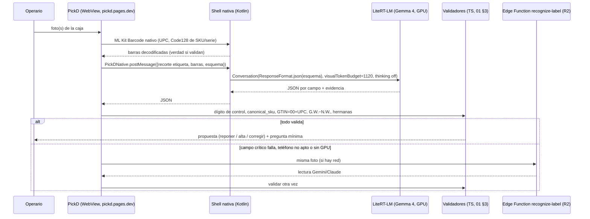

# R7 · Motor local en el teléfono: runtimes on-device en Android, modelos con visión y cómo los usa la PWA

> Investigación del 15 sep 2026 para el motor de reconocimiento de etiquetas de caja de PickD
> (`docs/label-recognition/01-lo-aprendido.md`). Idea de Rafael: una app que sirva de «servidor local» de
> modelos abiertos (como Google AI Edge Gallery) para que PickD reconozca y razone **en el teléfono, sin
> internet y sin pasar por Supabase**.
>
> **No repite** lo que cubren R1 (modelos abiertos para servidor), R2 (APIs en la nube) ni el informe de
> OCR/barras en el navegador. Aquí se trata sólo de **cómo se corre en Android** y **cómo habla la PWA con eso**.
>
> Todo lo marcado **[medido]** sale de una fuente con dispositivo y fecha. Lo marcado **[estimación]** es
> cuenta propia sobre esas cifras. Lo que no se pudo comprobar se dice. La lista de fuentes está en §10.

---

## 0. En una página

**Veredicto corto.** La idea funciona técnicamente hoy. La pieza que usa Gallery (**LiteRT-LM**) es una
librería Kotlin abierta (Apache 2.0) con imagen, **salida con JSON Schema** y GPU/NPU. Además ya existen
apps abiertas que exponen un modelo del teléfono como API compatible con OpenAI (**OlliteRT**, **MNN Chat**).
Pero hay tres hechos que cambian el planteamiento:

1. **En local no es más rápido que la nube para esta tarea.** En un teléfono tope de gama (clase Galaxy S26
   Ultra), Gemma 4 E2B por GPU tardaría **~4–8 s por foto** y E4B **~8–16 s** **[estimación]**. Gemini 3.8
   Flash tarda ~7 s y Sonnet 5 ~3 s, con más acierto (R2). En gama media (Pixel 8a, Galaxy A55) la GPU
   **falla o no cabe**, y por CPU serían **~45–60 s por foto** **[estimación]**: no se puede usar en el piso.
   Lo que tarda es **generar el JSON** en el teléfono. El salto por Supabase apenas cuenta.
2. **Lo que se gana es otra cosa:** funcionar **sin red**, **privacidad** (la foto de FedEx lleva el nombre
   de una persona), **coste marginal 0** y no depender de cuotas. **Se pierde acierto:** en el IDP
   Leaderboard, Gemma 4 E4B saca **53,9** frente a **82,0** de Gemini 3 Flash y **80,7** de Claude Sonnet
   4.6 (datos de R1/R2). Y justo las cajas difíciles de §2 de `01` (daño, etiquetas apiladas, dos caras)
   son donde un modelo de 2–4B falla más.
3. **Un «servidor en 127.0.0.1» es la vía rápida de prototipar, no la robusta.** Desde Chrome 142 (también en
   Android), una web pública que llama a `127.0.0.1` pasa por el permiso **Local Network Access**
   (`loopback-network` desde Chrome 145). Además, el servidor necesita un servicio en primer plano que Android
   limita, y otra app del mismo teléfono puede usar el puerto. Y **Gemini Nano (AICore) no se puede usar desde
   segundo plano**: devuelve `BACKGROUND_USE_BLOCKED` aunque haya un servicio en primer plano.

### Arquitectura recomendada (si se decide ir a local)

| Pieza                              | Elección                                                                                                                                                                      | Por qué                                                                                                                                                                                                                                                              |
| ---------------------------------- | ----------------------------------------------------------------------------------------------------------------------------------------------------------------------------- | -------------------------------------------------------------------------------------------------------------------------------------------------------------------------------------------------------------------------------------------------------------------- |
| **Runtime**                        | **LiteRT-LM** (`com.google.ai.edge.litertlm:litertlm-android`, v0.17.0 del 9 sep 2026)                                                                                        | Es lo que usa Gallery. Tiene imagen, `ResponseFormat.json(schema)` (Kotlin, desde el 16 jul 2026), `visualTokenBudget`, GPU/NPU y los números oficiales más altos en Android para Gemma 4                                                                            |
| **Modelo**                         | **Gemma 4 E4B** en teléfonos de 12 GB; **E2B** en 8 GB. Visión por GPU, presupuesto visual **1120**, _thinking_ apagado                                                       | Apache 2.0. Resolución y relación de aspecto variables (1120 tokens ≈ 2,6 MP útiles). Ficheros `.litertlm` oficiales sin puerta de acceso. Los Qwen3.5-VL para LiteRT-LM son conversiones comunitarias, con visión a 512×512 fija y **sin verificar en GPU Android** |
| **Integración robusta**            | **Shell nativa Android** con WebView que carga `https://pickd.pages.dev` y un puente por origen (`WebViewCompat.addWebMessageListener`), o **Capacitor** con un plugin propio | El modelo corre en el proceso de la app que está en pantalla. Así no hay permiso LNA, ni servicio en primer plano, ni puerto abierto, y sí puede usar AICore y ML Kit nativos                                                                                        |
| **Integración rápida (prototipo)** | **OlliteRT** tal cual + `fetch('http://127.0.0.1:8000/v1/chat/completions')` desde la PWA                                                                                     | Un día de trabajo para medir las 13 cajas en el teléfono real, sin escribir Kotlin                                                                                                                                                                                   |
| **Encaje en el motor**             | Barras (ML Kit/ZXing) → lectura local con esquema → validadores de `01 §3` → **si falla algo crítico o el teléfono no puede, a la nube** (R2)                                 | El modelo local hace la primera pasada de lo fácil. La nube queda para lo dudoso y para los teléfonos sin GPU usable                                                                                                                                                 |

**Antes de construir nada:** saber **qué teléfonos hay en el piso** (SoC y RAM) y pasar las 13 cajas por
Gallery → «Ask Image» con Gemma 4 E2B/E4B y el prompt real, cronómetro en mano (§8). Si los teléfonos son de
gama media, la idea local muere ahí y la respuesta es la nube + barras en el navegador.

---

## 1. Qué le pide nuestro flujo a un motor local

Sale de `01-lo-aprendido.md`. Lo que importa aquí es lo que cambia en un teléfono:

| #   | Requisito                                                                 | Qué significa en local                                                                                                       |
| --- | ------------------------------------------------------------------------- | ---------------------------------------------------------------------------------------------------------------------------- |
| L1  | **1–3 fotos por caja**, a veces dos caras dañadas que sólo juntas se leen | Varias imágenes en un turno (`maxNumImages`) o un turno por foto con fusión en código                                        |
| L2  | **JSON con esquema fijo**, `null` antes que un dígito inventado           | Decodificación restringida (JSON Schema) en el runtime. Validación fuera del modelo                                          |
| L3  | **Texto pequeño**: UPC de 12 dígitos, `WMEI00094`, `G.W. 20.30`           | Resolución visual alta. Un encoder fijo de 512×512 sobre la foto entera no alcanza, así que hay que **recortar la etiqueta** |
| L4  | **Segundos, no minutos** por caja                                         | Lo que marca el tiempo es la velocidad de _decode_ del teléfono                                                              |
| L5  | Teléfonos del almacén, **gama desconocida**                               | La fragmentación de GPU en Android es el riesgo principal (§3.3)                                                             |
| L6  | PickD es una **PWA** en Chrome/Brave con deploy por push a `main`         | Cualquier pieza nativa debe respetar ese modelo de despliegue o justificar romperlo                                          |
| L7  | Privacidad (etiqueta FedEx con nombre de persona)                         | Local la resuelve por diseño                                                                                                 |

---

## 2. Cómo está hecho Google AI Edge Gallery (lo que Rafael probó)

Repo `google-ai-edge/gallery`: Apache 2.0, ~24,7k estrellas, release **1.0.19** del 2 sep 2026, activo
(último push el 14 sep). Lo leído en el código:

| Aspecto              | Qué hay                                                                                                                                                                                                       | Dónde                                                           |
| -------------------- | ------------------------------------------------------------------------------------------------------------------------------------------------------------------------------------------------------------- | --------------------------------------------------------------- |
| Plataforma           | Kotlin 2.2.21 + Jetpack Compose + Hilt. `minSdk 31` (Android 12), `targetSdk 37`                                                                                                                              | `Android/src/app/build.gradle.kts`                              |
| **Runtime LLM**      | **LiteRT-LM** (`com.google.ai.edge.litertlm:litertlm-android`; en `main` fija 0.11.0)                                                                                                                         | `gradle/libs.versions.toml`, `ui/llmchat/LlmChatModelHelper.kt` |
| Segundo runtime      | **ML Kit GenAI Prompt API** (Gemini Nano vía AICore, `mlkit-genai-prompt 1.0.0-beta2`) con `ImagePart`, `ModelReleaseStage`, `ModelPreference`                                                                | `runtime/aicore/AICoreModelHelper.kt`                           |
| Visión clásica       | LiteRT/TFLite de Play Services (`play-services-tflite-*`) y CameraX                                                                                                                                           | libs                                                            |
| Cómo carga el modelo | `EngineConfig(modelPath, backend = CPU/GPU/NPU, visionBackend = GPU…, audioBackend = CPU, cacheDir)` → `engine.createConversation(SamplerConfig…)`. El código anota _«must be GPU for Gemma 3n»_ en la visión | `LlmChatModelHelper.kt` l.104–186                               |
| Catálogo de modelos  | JSON versionado por release (`model_allowlists/1_0_19.json`) con `sizeInBytes`, `minDeviceMemoryInGb`, `accelerators`, `visionAccelerator`, `capabilities` (thinking, speculative decoding)                   | raíz del repo                                                   |
| Descargas            | Hugging Face con OAuth (AppAuth) + WorkManager (`DownloadWorker.kt`)                                                                                                                                          | `data/`, `worker/`                                              |
| Extras 2026          | Agent Skills, **MCP experimental** (servidores remotos por HTTPS), chat multimodal (1.0.18), importación de `.litertlm` desde HF (1.0.16), benchmark integrado                                                | `mcp/README.md`, releases                                       |
| **Servidor HTTP**    | **No existe.** El issue #552 («HTTP API server mode», abr 2026) sigue **abierto**. La comunidad lo resolvió con forks y con OlliteRT (§7)                                                                     | issue #552                                                      |

Modelos con imagen en el catálogo 1.0.19:

| Modelo             | Archivo                                                                   | Tamaño      | RAM mínima que exige Gallery | Contexto | Visión en |
| ------------------ | ------------------------------------------------------------------------- | ----------- | ---------------------------- | -------- | --------- |
| **Gemma-4-E2B-it** | `litert-community/gemma-4-E2B-it-litert-lm`                               | **2,59 GB** | **8 GB**                     | 32K      | GPU       |
| **Gemma-4-E4B-it** | `litert-community/gemma-4-E4B-it-litert-lm`                               | **3,66 GB** | **12 GB**                    | 32K      | GPU       |
| Gemma-3n-E2B-it    | `google/gemma-3n-E2B-it-litert-lm` (con puerta de acceso, licencia Gemma) | 3,66 GB     | 8 GB                         | 4K       | cpu,gpu   |
| Gemma-3n-E4B-it    | `google/gemma-3n-E4B-it-litert-lm`                                        | 4,92 GB     | 12 GB                        | 4K       | cpu,gpu   |

**Lección para nosotros:** Gallery es una **app de demostración**. Todo lo que hace lo expone la librería:
un `Engine`, una `Conversation`, contenidos `ImageFile/ImageBytes` y un catálogo JSON. Copiar el patrón cuesta
unas cientos de líneas de Kotlin, no una app entera.

---

## 3. Runtimes on-device en Android (sep 2026)

### 3.1 Tabla comparativa

| Runtime                                                                               | Imagen                                                                      | JSON restringido                                                                                              | Aceleración Android                                                                                     | Modelos con visión útiles                                                                                                | API de integración                                                                                                       | Licencia · actividad                                                                                                       | Veredicto para PickD                                                               |
| ------------------------------------------------------------------------------------- | --------------------------------------------------------------------------- | ------------------------------------------------------------------------------------------------------------- | ------------------------------------------------------------------------------------------------------- | ------------------------------------------------------------------------------------------------------------------------ | ------------------------------------------------------------------------------------------------------------------------ | -------------------------------------------------------------------------------------------------------------------------- | ---------------------------------------------------------------------------------- |
| **LiteRT-LM** (Google)                                                                | Sí (`Content.ImageFile/ImageBytes`, `visionBackend` aparte, `maxNumImages`) | **Sí**: `ResponseFormat.json/regex` en Kotlin (16 jul 2026). En C++, LLGuidance con JSON Schema, Regex y Lark | CPU (XNNPACK), **GPU (OpenCL/ML Drift)**, **NPU** (Tensor, Qualcomm QNN, MediaTek NeuroPilot)           | Gemma 4 E2B/E4B oficiales. Comunidad: Qwen3.5-0.8B/2B-VL, PaddleOCR-VL-1.6, InternVL3.5, LFM2.5-VL, SmolVLM2…            | Kotlin estable (Android/JVM), C++, C API, Python. CLI con `serve` OpenAI (sólo escritorio)                               | Apache 2.0 · v0.17.0 (9 sep 2026); 6 releases entre jun y sep 2026                                                         | **Elegido**                                                                        |
| **MediaPipe LLM Inference API**                                                       | Sí (Gemma 3n)                                                               | No                                                                                                            | CPU/GPU                                                                                                 | Gemma 3n/4 (`.task`)                                                                                                     | Android/Web                                                                                                              | **Sólo mantenimiento**; Google pide migrar a LiteRT-LM                                                                     | Descartado                                                                         |
| **AICore · ML Kit GenAI Prompt API** (Gemini Nano)                                    | Sí (`ImagePart`, varias imágenes)                                           | Sí, «Generate structured output» (**alpha**)                                                                  | Lo gestiona el sistema                                                                                  | Gemini Nano nano-v2/v3/v4 (Gemma 4 llega por el _AICore Developer Preview_)                                              | `com.google.mlkit:genai-prompt:1.0.0-beta4`                                                                              | Beta, sin SLA · **sólo tope de gama** (§3.2) · entrada < 4000 tokens · cuota por app · **sólo con la app en primer plano** | Opción de cero descargas **dentro** de una app nativa; **imposible como servidor** |
| **Chrome Prompt API** (`LanguageModel`)                                               | Sí (image/audio)                                                            | Sí (`responseConstraint`)                                                                                     | —                                                                                                       | Gemini Nano                                                                                                              | JS                                                                                                                       | **No funciona en Chrome para Android** (sólo Win/macOS/Linux/ChromeOS Plus)                                                | No aplica                                                                          |
| **llama.cpp** (`libmtmd`)                                                             | Sí (imagen, audio, vídeo; `llama-server` OpenAI)                            | Sí (gramáticas/JSON Schema en server)                                                                         | CPU (KleidiAI/SME2), **OpenCL Adreno** (750/810/830/840), **Hexagon** (sólo Q4_0/Q8_0/IQ4_NL/MXFP4/F16) | GGUF: Gemma 4 E2B/E4B, Qwen3.5 (+mmproj), GLM-OCR, PaddleOCR-VL, HunyuanOCR, SmolVLM, InternVL                           | C/C++, app `llama.android`, Termux, bindings RN/Capacitor                                                                | MIT · build b10985 (15 sep 2026)                                                                                           | Viable pero **lento en visión** en móvil (§3.3)                                    |
| **MNN** (Alibaba)                                                                     | Sí (Qwen3-VL, Qwen3.5, Gemma 4 texto/visión/audio)                          | No documentado                                                                                                | CPU Arm82/SME, OpenCL, Vulkan, **Hexagon NPU** (3.6.1)                                                  | Qwen3.5, Qwen3-VL 4B/8B, Gemma 4, LFM2.5                                                                                 | C++/Java. **MNN Chat trae servidor API** (§7)                                                                            | Apache 2.0 · 3.6.1 (23 jul 2026)                                                                                           | Alternativa seria, sobre todo para Qwen                                            |
| **GenieX** (Qualcomm; **el repo `NexaAI/nexa-sdk` redirige hoy a `qualcomm/GenieX`**) | Sí (VLM GGUF con mmproj o bundles de AI Hub)                                | —                                                                                                             | **Sólo Snapdragon**: llama.cpp (NPU/GPU/CPU) o QAIRT (NPU)                                              | Qwen3-VL-2B GGUF, Qwen2.5-VL-7B (AI Hub), Gemma 4 E2B/E4B GGUF                                                           | Kotlin `geniex-android:0.3.1` (**sólo Snapdragon 8 Elite / 8 Elite Gen 5**). `geniex serve` OpenAI sólo en Windows/Linux | BSD-3 + Términos de Qualcomm · v0.6.1 (3 sep 2026), _developer preview_                                                    | Sólo si la flota es Snapdragon 8 Elite                                             |
| **ExecuTorch** (PyTorch)                                                              | Sí (runner multimodal)                                                      | No                                                                                                            | XNNPACK, Vulkan, Qualcomm, MediaTek, Samsung Exynos                                                     | Ejemplos `gemma4` (E2B/E4B imagen+audio «on mobile devices»), `smolvlm`, `internvl3`, `llava`; export de Qwen3-VL (v1.4) | Kotlin `LlmModule`                                                                                                       | BSD · v1.4.1 (14 ago 2026)                                                                                                 | Más trabajo de export que LiteRT-LM para lo mismo                                  |
| **MLC LLM**                                                                           | Modelos `phi3v`, `llava`, `qwen2_5_vl` en el árbol                          | Sí (en su motor)                                                                                              | OpenCL Adreno/Mali                                                                                      | —                                                                                                                        | App MLC Chat, REST en escritorio                                                                                         | Apache 2.0 · último commit 17 ago 2026 (arreglos de compilador)                                                            | Ritmo bajo; descartado                                                             |

### 3.2 AICore / Gemini Nano: por qué no sirve como «servidor»

Citas textuales de la documentación de ML Kit GenAI (actualizada el 10 sep 2026):

- _«GenAI API inference is permitted only when the app is the top foreground application. Using the API when
  the app is not in the foreground, **including using a foreground service**, will result in an
  `ErrorCode.BACKGROUND_USE_BLOCKED` response.»_
- _«AICore enforces an inference quota per app»_ → `BUSY` y `PER_APP_BATTERY_USE_QUOTA_EXCEEDED` (cuota diaria).
- _«Input must be under 4000 tokens»_. _«This API is not supported on devices with an unlocked bootloader.»_
- Dispositivos con Prompt API: **nano-v2** (OnePlus 13, Xiaomi 15/17, Galaxy Z Fold7…), **nano-v3** (Pixel 9/10,
  Galaxy **S26**, OPPO Find X8/X9…) y **nano-v4** (Pixel 11, Galaxy Z Flip8/Fold8). **Ningún gama media.** La
  versión de Nano cambia según el teléfono, así que la misma foto puede dar respuestas distintas.

**Consecuencia:** una app servidor en segundo plano no puede llamar a Gemini Nano. Sólo sirve dentro de la
app que está en pantalla, es decir, en la opción B de §5. Aun así es un complemento de «cero descargas»
para los tope de gama compatibles, no la base.

### 3.3 La fragmentación de GPU es el riesgo real (issues abiertos, sep 2026)

| Teléfono / SoC                                                  | Qué pasa                                                                                                                             | Fuente                                                 |
| --------------------------------------------------------------- | ------------------------------------------------------------------------------------------------------------------------------------ | ------------------------------------------------------ |
| **Galaxy A55** (Exynos 1480, Xclipse 530), un gama media típico | Gemma 4 E2B por GPU devuelve **basura**. Por CPU va bien, pero lento                                                                 | LiteRT-LM #2611 (abierto); Gallery #910                |
| **Pixel 8 / 8 Pro** (Tensor G3)                                 | `Backend.GPU()` se crea sin error y falla en la inferencia: _«Can not find OpenCL library»_                                          | LiteRT-LM #1860 (abierto)                              |
| **Pixel 9** (Tensor G4, Mali-G715)                              | La GPU muere con `CL_INVALID_COMMAND_QUEUE` después de 1–3 turnos                                                                    | #2421 (abierto)                                        |
| **Pixel 10** (Tensor G5)                                        | E4B da SIGSEGV en la primera inferencia. E2B funciona                                                                                | #2566 (abierto)                                        |
| **Galaxy S26/S26+ Exynos 2600**                                 | «Failed to create engine» con todos los modelos                                                                                      | #1864, Gallery #548/#882                               |
| Galaxy S25+ (Snapdragon 8 Elite)                                | E4B con visión por **CPU** da SIGSEGV en la **segunda** imagen de la misma conversación. Por GPU no                                  | #2056 (abierto)                                        |
| Android GPU en general                                          | +780 MB residentes frente a iOS (los pesos se copian a la GPU en vez de mapearse)                                                    | #3507 (abierto)                                        |
| Conversiones comunitarias en Snapdragon                         | Inicio del motor en GPU de **74–110 s** y 2× la memoria de CPU; «on Snapdragon phones the CPU backend is still the practical choice» | tarjetas HF de `litert-community/Qwen3.5-0.8B` y `-2B` |
| llama.cpp vía llama.rn, Snapdragon 8 Gen 3                      | «TTFT with vision models is very high — **60-80s for a single image** with Gemma 4B»; la CPU sale igual o mejor que OpenCL/HTP       | llama.cpp discusión #22791                             |
| llama.cpp, CPU Snapdragon 8 Elite                               | OvisOCR2 0,8B, una página: **~30 s** (con regresión a 81 s en `master`)                                                              | llama.cpp #27649                                       |
| Qualcomm IQ8 (QCS8275)                                          | Etapa de visión de Gemma 4 E2B: **~8 s en CPU, ~20 s en NPU**                                                                        | LiteRT-LM #2187                                        |

**Lectura:** los números bonitos son de un **Galaxy S26 Ultra con Adreno**. Fuera de ahí hay que tener
**lista blanca de dispositivos y caída a CPU (o a la nube)** desde el primer día. Es lo mismo que hace Gallery
con `minDeviceMemoryInGb` y la elección de acelerador.

---

## 4. Modelos candidatos que corren en un teléfono

### 4.1 Tabla

«Medido» = cifra publicada con dispositivo. La calidad OCR/documento viene de las model cards y de R1. Ninguna
mide etiquetas de caja: la prueba que decide son las 13 cajas.

| Modelo                         | Tamaño en teléfono                                                                            | RAM                                                                          | Velocidad Android **[medido]**                                                                                       | Imagen: resolución                                                                                                   | Calidad OCR/doc reportada                                                  | Licencia                                                                    | JSON                                 |
| ------------------------------ | --------------------------------------------------------------------------------------------- | ---------------------------------------------------------------------------- | -------------------------------------------------------------------------------------------------------------------- | -------------------------------------------------------------------------------------------------------------------- | -------------------------------------------------------------------------- | --------------------------------------------------------------------------- | ------------------------------------ |
| **Gemma 4 E2B** (2 abr 2026)   | 2,59 GB `.litertlm` (pesos mixtos 2/4/8 bits, PLE mapeadas)                                   | Gallery exige 8 GB. Proceso: CPU 1.733 MB · GPU 676 MB (+~780 MB GPU, #3507) | **S26 Ultra GPU: prefill 3.808 t/s, decode 52,1 t/s** (MTP 66–92), TTFT 0,3 s. **CPU: 557 / 46,9**, TTFT 1,8 s       | Variable. Presupuesto **70/140/280/560/1120** tokens; parche 16 px, pooling 3 → 48 px por token. 1120 ≈ 1606×1606 px | OmniDocBench 1.5 (edit distance ↓) **0,290** · MMMU Pro 44,2               | 🟢 Apache 2.0                                                               | LiteRT-LM `ResponseFormat.json`      |
| **Gemma 4 E4B**                | 3,66 GB                                                                                       | 12 GB. CPU 3.283 MB · GPU 710 MB                                             | **S26 Ultra GPU: 1.293 / 22,1 t/s** (MTP 37–49), TTFT 0,8 s. CPU 195 / 17,7                                          | Igual                                                                                                                | OmniDocBench **0,181** · MMMU Pro 52,6 · **IDP 53,9** (R1)                 | 🟢 Apache 2.0                                                               | Igual                                |
| Gemma 3n E2B/E4B (jun 2025)    | 3,66 / 4,92 GB                                                                                | 8 / 12 GB                                                                    | Superado por Gemma 4 (mismo runtime)                                                                                 | MobileNet-V5: 256/512/768 px; «Processes up to 60 frames per second on a Google Pixel»                               | Peor que Gemma 4                                                           | 🟡 Licencia Gemma (con puerta de acceso)                                    | Igual                                |
| **Qwen3.5-2B** (VL) (mar 2026) | `Qwen3.5-2B-VL_int8.litertlm` **3,15 GB** (comunidad) · GGUF Q4_0 1,22 GB + mmproj F16 668 MB | 8 GB en CPU; «Pixel-class 8 GB GPU does not fit»                             | S26 (SM8850), **ruta de texto**: GPU 450 / 17,5 t/s, CPU 181 / 19,0. «Android is not gated for this build» en visión | **Fija 512×512 → 256 tokens** en la build LiteRT (upstream es dinámico en llama.cpp/MNN)                             | OCRBench 85,4 · CC-OCR 75,8 (R1)                                           | 🟢 Apache 2.0                                                               | Sí (LiteRT-LM o gramática llama.cpp) |
| Qwen3.5-0.8B (VL)              | 1,30 GB (comunidad)                                                                           | Pixel 8a (8 GB): CPU sí, GPU no                                              | **Pixel 8a CPU: prefill 50–134, decode 8–13,6 t/s**, TTFT 2–5,3 s. GPU «no cabe». S26 GPU 551 / 35,1                 | 512×512 fija                                                                                                         | OCRBench 79,1 (R1)                                                         | 🟢 Apache 2.0                                                               | Sí                                   |
| Qwen3.5-4B                     | 2,6–4,1 GB (sólo texto en LiteRT) · GGUF Q4_0 2,58 GB + mmproj 672 MB                         | —                                                                            | Sin fila Android para visión                                                                                         | Dinámica en llama.cpp/MNN                                                                                            | OCRBench 85,0 (R1)                                                         | 🟢 Apache 2.0                                                               | Sí                                   |
| **PaddleOCR-VL-1.6** (0,9B)    | `.litertlm` comunitario (decodificador fp16)                                                  | GPU 1.786 MB de pico (S26)                                                   | **Pixel 8a CPU, Gallery: página OCR 22 s, tabla 17 s** (texto exacto)                                                | Fija 560×560 → 400 tokens                                                                                            | OmniDocBench v1.6 96,33 (upstream). **Sin KIE**: devuelve texto, no campos | 🟢 Apache 2.0                                                               | No (texto/tabla)                     |
| GLM-OCR (0,9B)                 | GGUF (llama.cpp)                                                                              | —                                                                            | Sin cifra Android                                                                                                    | Dinámica                                                                                                             | Nanonets-KIE 93,7 (R1)                                                     | 🟢 MIT                                                                      | Sí (KIE a JSON)                      |
| InternVL3.5-1B/2B/4B           | `.litertlm` comunitario                                                                       | —                                                                            | S26 GPU corre (sin fila de velocidad)                                                                                | 448×448 → 256 tokens                                                                                                 | Superado por Qwen3.5 (R1)                                                  | 🟢 Apache 2.0                                                               | Sí                                   |
| SmolVLM2 256M/500M/2.2B        | `.litertlm` comunitario / GGUF                                                                | —                                                                            | —                                                                                                                    | —                                                                                                                    | Débil en texto denso (R1)                                                  | 🟢 Apache 2.0                                                               | Parcial                              |
| LFM2.5-VL 450M/1.6B/3B         | `.litertlm` comunitario / GGUF                                                                | —                                                                            | Pixel 8a funciona                                                                                                    | 512×512 con mosaicos. **Bug LiteRT-LM #3246: sólo ve el cuarto superior**                                            | OCRBench v2 41,44 (1.6B)                                                   | 🔴 LFM Open License: uso comercial **sólo con ingresos anuales < USD 10 M** | Tool calling                         |
| MiniCPM-V 4 (4,1B)             | `.litertlm` comunitario                                                                       | —                                                                            | —                                                                                                                    | —                                                                                                                    | R1 destaca a la 4.5 (8,7B) en OCRBench; la 4 no se midió                   | 🟢 Apache 2.0                                                               | Sí                                   |
| Phi-4-multimodal (5,6B)        | No se encontró build LiteRT-LM/Android                                                        | —                                                                            | —                                                                                                                    | —                                                                                                                    | —                                                                          | 🟢 MIT                                                                      | —                                    |
| PaliGemma 2 3B                 | Requiere _fine-tuning_ por tarea                                                              | —                                                                            | —                                                                                                                    | 448 (variante `mix-448`)                                                                                             | —                                                                          | 🟡 Gemma (puerta de acceso)                                                 | No                                   |

### 4.2 Lo que de verdad importa entre ellos

- **Gemma 4 E2B/E4B son los únicos con `.litertlm` oficial, visión de resolución variable y cifras oficiales
  en Android.** La resolución variable es decisiva para L3: con el presupuesto 1120, un recorte de etiqueta de
  ~1500 px del lado largo entra casi sin reescalar. Las conversiones comunitarias usan un encoder **cuadrado
  fijo** (512 o 560 px). Una foto de caja entera a 512×512 pierde los dígitos del UPC. Con recorte previo es
  otra cosa.
- **Qwen3.5-2B/4B leen mejor en papel** (OCRBench 85 frente a un MMMU/OmniDoc modesto en Gemma 4 E), pero en
  Android dependen de **un único mantenedor no oficial** (`john-rocky/edge-compat`, 1 estrella) o de
  llama.cpp/MNN, que son mucho más lentos en visión en móvil (§3.3). Vale la pena medirlos por MNN, no apostar.
- **PaddleOCR-VL-1.6** es el mejor **transcriptor** que cabe en un Pixel 8a, pero no hace KIE. Serviría como
  «OCR local» con asociación clave-valor en código, justo lo que `01 §5` dice que falla sin un VLM.
- **LFM2.5-VL queda fuera por licencia** (Jamis supera con seguridad los USD 10 M) y por el bug del runtime.

---

## 5. «App servidor local» + PWA: cómo habla una PWA HTTPS con algo nativo en el mismo teléfono

### 5.1 Opciones evaluadas

|        | Opción                                                                                                                                                                                                                               | Cómo funciona                                                                                                                                                      | Qué la frena (verificado)                                                                                                                                                                                                                                                                                                                                                                                                                                                                                                                                                                                                                                                                                                                                                                                                                                                                                                                                                                                                                                                                                                          | Robustez   | Coste de construir                                                                   |
| ------ | ------------------------------------------------------------------------------------------------------------------------------------------------------------------------------------------------------------------------------------ | ------------------------------------------------------------------------------------------------------------------------------------------------------------------ | ---------------------------------------------------------------------------------------------------------------------------------------------------------------------------------------------------------------------------------------------------------------------------------------------------------------------------------------------------------------------------------------------------------------------------------------------------------------------------------------------------------------------------------------------------------------------------------------------------------------------------------------------------------------------------------------------------------------------------------------------------------------------------------------------------------------------------------------------------------------------------------------------------------------------------------------------------------------------------------------------------------------------------------------------------------------------------------------------------------------------------------- | ---------- | ------------------------------------------------------------------------------------ |
| **A**  | **Servidor HTTP/WebSocket en `127.0.0.1`** dentro de una app nativa aparte (OlliteRT, MNN Chat)                                                                                                                                      | La PWA hace `fetch('http://127.0.0.1:PORT/v1/chat/completions')` con la imagen en base64                                                                           | (1) **Local Network Access**: Chrome **142** (escritorio y **Android**) pide permiso a una web pública que conecta con loopback. Desde **145**, permiso `loopback-network`. Desde **147** también WebSockets. (2) **Contenido mixto: no bloquea** (`localhost`/`127.0.0.1` son orígenes confiables). (3) **CORS**: el servidor debe responder al _preflight_ y fijar `Access-Control-Allow-Origin: https://pickd.pages.dev`. (4) El servidor sólo sigue vivo con un **servicio en primer plano**: `dataSync` tiene **tope de 6 h cada 24 h** (Android 15+) y no arranca desde `BOOT_COMPLETED`; `specialUse` pasa revisión en Play (sideload no). Además hay que excluir la app de la optimización de batería y hay OEM que matan procesos. (5) Dos procesos pesados (Chrome + modelo de 2,6–3,7 GB) en 8 GB: el _low-memory killer_ puede recargar la pestaña de PickD. (6) **Seguridad**: cualquier app del teléfono llega al puerto, así que hacen falta token y comprobación de `Origin` (precedente: Meta/Yandex usaron puertos locales de Android para rastrear, junio 2025). (7) **AICore no funciona desde segundo plano** | Media-baja | **Muy bajo** (OlliteRT ya existe)                                                    |
| **B**  | **Shell nativa con WebView propia** que carga `https://pickd.pages.dev`, con puente JS↔Kotlin **restringido por origen** (`WebViewCompat.addWebMessageListener(webView, "PickDNative", setOf("https://pickd.pages.dev"), listener)`) | La PWA llama a `PickDNative.postMessage(...)` con la foto (string o `ArrayBuffer` con `WEB_MESSAGE_ARRAY_BUFFER`) y la respuesta vuelve por `JavaScriptReplyProxy` | **LNA no aplica a Android WebView** (lo dice la guía de LNA). Rige el permiso de red local de Android 17, que es para la LAN, y aquí no hay red. El modelo corre **en el proceso en pantalla**: sin servicio en primer plano y con AICore permitido. Hay que resolver la fontanería del WebView: permiso de cámara (`onPermissionRequest`), `<input type=file>`, service worker, subida de fotos. Mantiene el **deploy por push** y el aviso `useAppUpdate`                                                                                                                                                                                                                                                                                                                                                                                                                                                                                                                                                                                                                                                                        | **Alta**   | Medio (una Activity, un plugin Kotlin de ~300–500 líneas, un APK por sideload o MDM) |
| **B′** | **Capacitor** con plugin propio (`LabelReader`) sobre LiteRT-LM                                                                                                                                                                      | Igual que B, con la fontanería de cámara y archivos ya hecha                                                                                                       | `server.url` (cargar la web remota) es, según la doc de Capacitor, _«intended for use with live-reload servers… **not intended for use in production**»_. Lo oficial es **empaquetar `dist`** en el APK, y eso **rompe el deploy por push**: cada cambio pide APK nuevo o _live update_ (Capgo). `@capgo/capacitor-llm` (MPL-2.0) ya usa LiteRT-LM y Gemini Nano en Android, pero **su README no documenta entrada de imagen**                                                                                                                                                                                                                                                                                                                                                                                                                                                                                                                                                                                                                                                                                                     | Alta       | Medio                                                                                |
| **C**  | **Trusted Web Activity + postMessage** (Chrome 115+, `androidx.browser` ≥ 1.6)                                                                                                                                                       | PickD sigue en Chrome, abierta desde una app contenedora que recibe mensajes                                                                                       | Chrome queda en primer plano y la app contenedora en segundo: vale el mismo freno de (4) y (7) de A. Los mensajes son strings (fotos en base64). Doc de 2023 sin cambios                                                                                                                                                                                                                                                                                                                                                                                                                                                                                                                                                                                                                                                                                                                                                                                                                                                                                                                                                           | Media      | Medio                                                                                |
| **D**  | **Intents / App Links con vuelta** (`intent://…`) o **Web Share API → app → Web Share Target**                                                                                                                                       | La PWA abre la app con un intent. La app procesa y devuelve la respuesta con un enlace a PickD o compartiendo el JSON                                              | Dos saltos de app y dos hojas de compartir **por caja**. El resultado viaja en la URL o hace falta un paso manual. Con 1–3 fotos por caja es inviable en el piso                                                                                                                                                                                                                                                                                                                                                                                                                                                                                                                                                                                                                                                                                                                                                                                                                                                                                                                                                                   | Media      | Bajo, pero la experiencia es mala                                                    |
| **E**  | **El modelo dentro de la PWA** (WebGPU)                                                                                                                                                                                              | —                                                                                                                                                                  | Lo cubre el informe de navegador. Dato de aquí: el `.litertlm` web de Gemma 4 es **sólo texto** (_«Currently the model is text-only»_) y la Prompt API de Chrome no existe en Android                                                                                                                                                                                                                                                                                                                                                                                                                                                                                                                                                                                                                                                                                                                                                                                                                                                                                                                                              | —          | —                                                                                    |

### 5.2 Recomendación

- **La más robusta: B** (shell nativa con WebView + puente por origen + LiteRT-LM en proceso). Resuelve los
  cuatro frenos de A a la vez: sin permiso LNA, sin servicio en primer plano, sin puerto expuesto y con AICore
  disponible. Y **conserva lo que PickD ya tiene** (deploy por push a `main`, `version.json`, `useAppUpdate`).
  B′ (Capacitor) sólo gana si se acepta empaquetar el front en el APK.
- **La más rápida de construir: A con OlliteRT** tal cual, **sólo para medir**. Se instala el APK, se descarga
  Gemma 4 E2B/E4B, «Start server» con escucha en loopback, token y CORS al origen de PickD, y desde la consola
  de Chrome del teléfono se lanza `fetch` a `127.0.0.1:8000`. Aparece una vez el permiso «loopback-network» y
  se mide. **No es para producción**: el tope de 6 h/24 h de `dataSync` (OlliteRT declara ese tipo) y el
  _low-memory killer_ rompen una jornada de piso.

### 5.3 Flujo de B, de punta a punta

Puntos de diseño que salen de la evidencia:

- **Mantener el motor caliente.** `engine.initialize()` _«can take a significant amount of time (e.g., up to
  10 seconds)»_, y la primera compilación de GPU tarda más: hay que cargarlo al abrir la pantalla de recepción,
  no al disparar la foto. `cacheDir` acelera la segunda carga.
- **Una conversación nueva por caja.** Hay _context bleed_ y crashes en la segunda imagen de una misma
  conversación (#2056; tarjeta de PaddleOCR-VL: «One image per chat»). Varias caras de la misma caja van
  **en el mismo turno** o se fusionan en código.
- **No usar el `compressImage` actual (máx. 1200 px) para esto.** Hay que mandar el **recorte de la etiqueta a
  resolución nativa** (≤ ~1600 px de lado para el presupuesto 1120).
- **Lista blanca de dispositivos** (SoC + RAM + prueba de humo al instalar). Donde la GPU falla (§3.3), se va a
  la **nube**, no a la CPU: en gama media la CPU tarda casi un minuto (§6).
- **Razonar en código, no en el modelo.** _Thinking_ apagado (`ThinkingConfig`), porque los tokens de
  razonamiento cuentan en `maxOutputToken` y el _decode_ es lo lento. El «razonamiento» de `01 §4` (orden de
  búsqueda, serie de hermanas, cinco salidas) ya es determinista.

---

## 6. Rendimiento realista para 1–3 fotos por caja

### 6.1 Cuenta por foto

`t ≈ t_encoder_visión + (tokens_imagen + tokens_prompt) / prefill + tokens_salida / decode` (motor ya cargado).

Supuestos **[estimación]**: recorte de etiqueta con presupuesto **1120** tokens de imagen; prompt con esquema y
reglas de **~900** tokens; salida **JSON compacto de ~250 tokens** sin _thinking_. El tiempo del encoder de
visión **no está publicado** para GPU de teléfono. Se asumen **1–3 s** en GPU de tope de gama. El único dato
publicado son **8 s en CPU** en un Qualcomm IQ8 (#2187), así que para CPU de gama media se toman 8–15 s.

| Escenario                                                                           | Base                                                                                                          | Visión | Prefill (2.020 tok) | Decode (250 tok) | **Total por foto**              | **Caja de 2 fotos** (un turno) |
| ----------------------------------------------------------------------------------- | ------------------------------------------------------------------------------------------------------------- | ------ | ------------------- | ---------------- | ------------------------------- | ------------------------------ |
| **Tope de gama, GPU · Gemma 4 E2B**                                                 | S26 Ultra: 3.808 / 52–92 t/s [medido]                                                                         | 1–3 s  | 0,5 s               | 2,7–4,8 s        | **~4–8 s**                      | ~6–12 s                        |
| **Tope de gama, GPU · Gemma 4 E4B**                                                 | S26 Ultra: 1.293 / 22–49 t/s [medido]                                                                         | 1–3 s  | 1,6 s               | 5,1–11,4 s       | **~8–16 s**                     | ~11–21 s                       |
| Tope de gama, CPU (caída) · E2B                                                     | S26 Ultra CPU: 557 / 47 t/s [medido]                                                                          | 4–8 s  | 3,6 s               | 5,3 s            | **~13–17 s**                    | ~20–26 s                       |
| **Gama media, CPU · E2B** (Pixel 8a / A55)                                          | ~4–5× más lento que S26 en CPU, inferido de Qwen3.5-0.8B en Pixel 8a (8–13,6 t/s) frente a 2B en S26 (19 t/s) | 8–15 s | 14–18 s             | 21–28 s          | **~45–60 s**                    | ~1,5 min                       |
| Gama media, CPU · E2B con presupuesto recortado (280 img + 500 prompt + 150 salida) | Igual                                                                                                         | 5–10 s | ~6 s                | ~15 s            | **~26–31 s**                    | ~45 s                          |
| Gama media, CPU · PaddleOCR-VL-1.6 (sólo texto)                                     | Pixel 8a: página 22 s, tabla 17 s [medido]                                                                    | incl.  | incl.               | salida corta     | **~10–20 s** + parseo en código | ~20–35 s                       |
| **Nube · Gemini 3.8 Flash (low)**                                                   | Roboflow: 7,2 s/muestra, Data Extraction 97,3 % (R2)                                                          | —      | —                   | —                | **~7 s** + subida ~0,5–2 s      | 1 llamada con 2 imágenes       |
| Nube · Claude Sonnet 5 (low)                                                        | 2,8 s, 89,7 % (R2)                                                                                            | —      | —                   | —                | **~3 s** + subida               | —                              |
| Nube · Gemini 3.5 Flash-Lite                                                        | 1,3 s, 91,8 % (R2)                                                                                            | —      | —                   | —                | **~1,5 s** + subida             | —                              |

**Lectura:**

- En un tope de gama, **local ≈ nube en tiempo**, no mejor. Con E4B es peor.
- En gama media, **local no cumple L4** («segundos, no minutos»).
- La latencia de Supabase (un salto de ~100–300 ms, **[estimación]**) es irrelevante al lado de 4–60 s de
  modelo. «Sin pasar por Supabase» no es donde está el tiempo.
- **Barras primero** cambia la cuenta: si ML Kit lee UPC y SKU exactos, el modelo sólo tiene que llenar
  modelo, talla, color y pesos, y la salida baja a ~100 tokens (−60 % de _decode_).

### 6.2 Calidad frente a la nube

| Métrica pública (ninguna es de etiquetas de caja) | Local en teléfono               | Nube                                                                  | Fuente             |
| ------------------------------------------------- | ------------------------------- | --------------------------------------------------------------------- | ------------------ |
| IDP Leaderboard v1.5 (KIE, OCR, tablas)           | **Gemma 4 E4B 53,9**            | Gemini 3 Flash **82,0** · Claude Sonnet 4.6 **80,7** · Haiku 4.5 71,2 | R1 / R2            |
| OmniDocBench 1.5 (edit distance ↓)                | E2B **0,290** · E4B **0,181**   | Gemma 4 31B 0,131 (servidor)                                          | Model card Gemma 4 |
| OCRBench                                          | Qwen3.5-2B **85,4** · 0.8B 79,1 | —                                                                     | R1                 |
| Extracción de un campo entre muchos (Roboflow)    | Sin fila de modelos de teléfono | Gemini 3.8 Flash 97,3 % · Sonnet 5 89,7 %                             | R2                 |

**Conclusión de calidad:** un modelo de 2–4B en el teléfono **leerá bien las etiquetas A/B limpias**, que ya
resuelven las barras, y **peor las difíciles** (daño, apiladas, dos caras, `20.?0`). Ahí es donde hace falta
el modelo grande. El riesgo de `01 §5` (**inventar un dígito verosímil**) crece con modelos pequeños. Lo
contienen los validadores, pero sube la tasa de escalado a la nube o a la persona. **Hay que medirlo con las
13 cajas** (R5 §6.3, test de enmascarado de dígitos).

### 6.3 Qué ganamos y qué perdemos

| Ganamos                                                           | Perdemos                                                                                                                                                   |
| ----------------------------------------------------------------- | ---------------------------------------------------------------------------------------------------------------------------------------------------------- |
| **Funciona sin red** (sótano, contenedor 6436N, Wi-Fi caído)      | **Acierto** (§6.2) y calibración de la confianza sin medir                                                                                                 |
| **Privacidad**: la foto de FedEx no sale del teléfono             | **Latencia en gama media** (~0,5–1,5 min por caja)                                                                                                         |
| **Coste marginal 0** frente a ~$37–175/mes de la nube (R2)        | **Hardware**: hace falta tope de gama con 8–12 GB. La flota actual se desconoce                                                                            |
| Sin cuotas, retiradas de modelos ni cambios de precio de terceros | **Fragmentación de GPU** (§3.3): lista blanca y soporte por modelo de teléfono                                                                             |
| Latencia estable sin depender de la cobertura                     | **Descarga de 2,6–3,7 GB** por teléfono, y actualizarla                                                                                                    |
| Barras y OCR nativos (ML Kit) mejores que en el navegador (vía B) | **Batería y calor**: OlliteRT habla de **5–10 W** mientras genera. 200 fotos/día × ~10 s ≈ **4 Wh/día**, ~20 % de una batería de 5000 mAh **[estimación]** |
| —                                                                 | **Mantenimiento de una app nativa**: APK, permisos, versiones de LiteRT-LM. Este Mac no tiene toolchain Android; el build va en la PC Windows              |

---

## 7. Proyectos que ya lo hacen y qué se puede reutilizar

| Proyecto                                                                       | Qué es                                                                      | Runtime                                                | Lo que tiene                                                                                                                                                                                                                                                                                                                                                                                                                                                                                                               | Qué copiar o reutilizar                                                                                                    | Licencia · actividad                                |
| ------------------------------------------------------------------------------ | --------------------------------------------------------------------------- | ------------------------------------------------------ | -------------------------------------------------------------------------------------------------------------------------------------------------------------------------------------------------------------------------------------------------------------------------------------------------------------------------------------------------------------------------------------------------------------------------------------------------------------------------------------------------------------------------- | -------------------------------------------------------------------------------------------------------------------------- | --------------------------------------------------- |
| **OlliteRT** (`NightMean/OlliteRT`)                                            | «Ollama para Android»: el teléfono sirve una API **OpenAI y Anthropic**     | **LiteRT-LM**                                          | Ktor CIO, plugin CORS, token _bearer_, reglas de IP, escucha «sólo loopback» (`127.0.0.1`) o LAN, **visión** (imágenes en `/v1/chat/completions`), streaming SSE, benchmark, métricas Prometheus. Servicio en primer plano `dataSync` + `connectedDevice` y `WAKE_LOCK`. **Limitaciones declaradas**: un modelo y una petición a la vez; tokens estimados como caracteres ÷ 4; _«grammar-based output constraints… are not available»_ (su última beta es del 6 jun, anterior al `ResponseFormat` de LiteRT-LM del 16 jul) | **Prototipo de la opción A sin escribir código.** Referencia de cómo mapear OpenAI → `Conversation` e imágenes → `Content` | Apache 2.0 · v0.9.6-beta.1 (6 jun 2026), push 5 sep |
| **MNN Chat** (`alibaba/MNN/apps/Android/MnnLlmChat`)                           | App de chat multimodal con **servicio API**                                 | MNN                                                    | OpenAI + **Anthropic (`/v1/messages`)**, por defecto **`127.0.0.1:8080`**, **CORS apagado por defecto**, **API key activada por defecto**, `image_url` soportado, servicio en primer plano `dataSync`. Modelos: Gemma 4 E2B/E4B, Qwen3.5, Qwen3-VL 4B/8B, LFM2.5. Aviso: _«tested exclusively on the OnePlus 13 and Xiaomi 14 Ultra»_                                                                                                                                                                                      | La vía para **medir Qwen3.5/Qwen3-VL con visión dinámica** en el mismo teléfono y comparar con Gemma 4                     | Apache 2.0 · app 0.8.3                              |
| Forks de Gallery (`xiaoyao9184/gallery` rama `as-server`, `Uriziel01/gallery`) | Gallery con servidor                                                        | LiteRT-LM                                              | Parches puntuales de abr 2026                                                                                                                                                                                                                                                                                                                                                                                                                                                                                              | Poco: OlliteRT los supera                                                                                                  | Apache 2.0 · parados desde abr 2026                 |
| `knooob/pocket-llm-server-android`                                             | Servidor OpenAI offline                                                     | —                                                      | 25 estrellas, sin push desde abr 2026                                                                                                                                                                                                                                                                                                                                                                                                                                                                                      | Nada                                                                                                                       | Apache 2.0                                          |
| **LiteRT-LM CLI `litert-lm serve`**                                            | Servidor OpenAI oficial (`/v1/models`, `/v1/chat/completions`, puerto 9379) | LiteRT-LM                                              | **Sólo Linux/macOS/Windows/Raspberry Pi**, no es app Android                                                                                                                                                                                                                                                                                                                                                                                                                                                               | Sirve para medir el prompt y el esquema en el Mac antes del teléfono                                                       | Apache 2.0                                          |
| **GenieX** (ex-Nexa SDK)                                                       | SDK Qualcomm con VLM y NPU                                                  | llama.cpp / QAIRT                                      | Kotlin `geniex-android` sólo en Snapdragon 8 Elite. `serve` sólo escritorio                                                                                                                                                                                                                                                                                                                                                                                                                                                | Si la flota es 8 Elite, es la vía NPU                                                                                      | BSD-3 + ToU Qualcomm                                |
| **Google AI Edge Gallery**                                                     | La app que probó Rafael                                                     | LiteRT-LM + AICore                                     | Catálogo JSON de modelos con RAM mínima y acelerador; `LlmChatModelHelper` (config de motor y visión); `AICoreModelHelper` (Prompt API con imagen); descargas con WorkManager                                                                                                                                                                                                                                                                                                                                              | **Copiar el patrón** de catálogo, descarga, elección de acelerador y caída a CPU                                           | Apache 2.0                                          |
| `@capgo/capacitor-llm`                                                         | Plugin Capacitor de LLM local                                               | LiteRT-LM (`.litertlm`), Gemini Nano, `.task` heredado | Descarga de modelos y chat por eventos. **Imagen no documentada**                                                                                                                                                                                                                                                                                                                                                                                                                                                          | Base para B′ si se elige Capacitor (añadir `ImageBytes` + `ResponseFormat`)                                                | MPL-2.0 · 8.1.5 (15 sep 2026)                       |
| `llama-cpp-capacitor`, `@cantoo/capacitor-llama`                               | Plugins Capacitor de llama.cpp                                              | llama.cpp                                              | —                                                                                                                                                                                                                                                                                                                                                                                                                                                                                                                          | Sólo si se eligiera GGUF (más lento en visión)                                                                             | —                                                   |
| `react-native-litert-lm`, `expo-litert-lm`                                     | Bindings RN/Expo de LiteRT-LM (Gemma 4)                                     | LiteRT-LM                                              | —                                                                                                                                                                                                                                                                                                                                                                                                                                                                                                                          | No aplica (PickD no es RN)                                                                                                 | —                                                   |
| PocketPal AI, ChatterUI, SmolChat, LLM Hub                                     | Apps de chat local (llama.rn/llama.cpp)                                     | llama.cpp                                              | No se evaluaron como servidor                                                                                                                                                                                                                                                                                                                                                                                                                                                                                              | —                                                                                                                          | MIT / AGPL-3.0 / Apache 2.0                         |
| Termux + `llama-server`                                                        | llama.cpp en terminal                                                       | llama.cpp                                              | Un usuario de Pixel 10 Pro XL reporta **2–4 tok/s en CPU**, «unusable», frente a 50–70 con LiteRT-LM (Gallery #552)                                                                                                                                                                                                                                                                                                                                                                                                        | No                                                                                                                         | MIT                                                 |

---

## 8. Plan de validación (antes de decidir)

1. **Inventario de teléfonos (1 h).** Para cada teléfono del piso: modelo, `adb shell getprop ro.soc.model` y
   RAM. Cruzar con §3.3 y con las listas de AICore. **Si ninguno es tope de gama con ≥ 8 GB y GPU Adreno sana,
   aquí se para**: nube (R2) + barras en el navegador.
2. **Prueba sin código (medio día).** Gallery 1.0.19 → «Ask Image» con **Gemma 4 E2B y E4B** en el mejor
   teléfono disponible, con las 15 fotos de las 13 cajas **recortadas a la etiqueta** y el esquema de R5 §7.2
   pegado como prompt. Medir por foto: segundos hasta el JSON completo, campos correctos y **dígitos
   inventados**. Mismas fotos por MNN Chat con Qwen3.5-2B/4B.
3. **Prototipo de integración (1 día).** OlliteRT en loopback con token y CORS a `https://pickd.pages.dev` →
   `fetch` desde PickD (consola remota de Chrome). Comprobar el aviso `loopback-network`, CORS, qué pasa con
   la pantalla bloqueada o tras 30 min, y el consumo de batería de una tanda de 50 fotos.
4. **Criterio de paso a la opción B** (propuesto):
   - ≥ 90 % de acierto por campo **validable** en las 13 cajas, con **0 dígitos inventados que pasen los
     validadores**.
   - **p50 ≤ 10 s por caja** en los teléfonos reales.
   - GPU estable 50 fotos seguidas.
   - Si no se cumple, lo local queda sólo como **modo sin red** (barras + OCR local + cola que sube a la nube
     cuando vuelve la cobertura).
5. **Si pasa, construir B** en la PC Windows: shell con WebView + `addWebMessageListener` (origen
   `https://pickd.pages.dev`), plugin `LabelReader` (LiteRT-LM, `ResponseFormat.json`,
   `ExperimentalFlags.visualTokenBudget = 1120`, `visionBackend = GPU`, lista blanca por SoC), ML Kit Barcode
   nativo y caída a la Edge Function de R2. En PickD, un adaptador `labelEngine` con dos implementaciones
   (`native` si existe `window.PickDNative`, `cloud` en otro caso), para que la PWA siga funcionando en Chrome.

---

## 9. Riesgos y huecos de esta investigación

| Riesgo o hueco                                                                                                                                              | Impacto                                      | Mitigación                                                                     |
| ----------------------------------------------------------------------------------------------------------------------------------------------------------- | -------------------------------------------- | ------------------------------------------------------------------------------ |
| **No hay cifra publicada del encoder de visión de Gemma 4 en GPU de teléfono** ni de extracción imagen→JSON en Android                                      | Las filas de §6 pueden variar ±50 %          | Paso 2 del plan                                                                |
| Las cifras de Android son de **un solo teléfono** (S26 Ultra) y de Google                                                                                   | Optimismo                                    | Medir en la flota real                                                         |
| Datos de gama media **inferidos** de modelos distintos (Qwen3.5-0.8B en Pixel 8a)                                                                           | Orden de magnitud, no cifra                  | Paso 2                                                                         |
| Conversiones comunitarias (Qwen3.5-VL, PaddleOCR-VL, InternVL) de **un mantenedor no oficial**                                                              | Rotura con cada versión de LiteRT-LM         | Usar sólo Gemma 4 oficial en producción                                        |
| Bugs abiertos de GPU (§3.3) y un crash en la ruta de decodificación restringida con E4B (lo cita #2566 sobre #2149)                                         | Crash o basura en campo                      | Lista blanca + prueba de humo + caída a nube                                   |
| **LNA en Brave Android**: migró a la implementación de Chromium (1.88.x, mar 2026), pero hay issues abiertos («no prompt but connection initiated», #54898) | Opción A inestable en Brave                  | B no depende de LNA                                                            |
| Permiso de red local de Android 17 (`ACCESS_LOCAL_NETWORK`): la doc habla de «local network address» y **no aclara loopback**                               | Podría afectar a A al subir `targetSdk` a 37 | Verificar en el prototipo; B no usa sockets                                    |
| ¿Restringe Android el uso de GPU (OpenCL) por procesos en segundo plano? **No encontrado documentado**                                                      | A podría degradarse con la PWA delante       | Medir en el paso 3                                                             |
| Tope de 6 h/24 h de `dataSync`. `specialUse` pide justificación en Play (no en sideload)                                                                    | A se corta a mitad de jornada                | Sideload con `specialUse` o, mejor, B                                          |
| Gemini Nano: salida distinta por versión (nano-v2/v3/v4), cuota diaria y sólo tope de gama                                                                  | Resultados no reproducibles                  | Sólo como complemento en B, nunca como base                                    |
| El motor local **no ve el catálogo**: el cruce con PickD/AS400 sigue necesitando datos                                                                      | Sin red no hay cruce completo                | Caché local de `sku_metadata` (ya existe TanStack Query + persistencia) o cola |

---

## 10. Fuentes

**Google AI Edge / LiteRT-LM**

- Gallery (repo, README, releases 1.0.16–1.0.19, código): https://github.com/google-ai-edge/gallery · allowlist: https://github.com/google-ai-edge/gallery/blob/main/model_allowlists/1_0_19.json · MCP: https://github.com/google-ai-edge/gallery/blob/main/mcp/README.md · issue HTTP server #552: https://github.com/google-ai-edge/gallery/issues/552
- LiteRT-LM (README, release v0.17.0): https://github.com/google-ai-edge/LiteRT-LM · Kotlin: https://github.com/google-ai-edge/LiteRT-LM/blob/main/docs/api/kotlin/getting_started.md · `ResponseFormat.kt`: https://github.com/google-ai-edge/LiteRT-LM/blob/main/kotlin/java/com/google/ai/edge/litertlm/ResponseFormat.kt · decodificación restringida: https://github.com/google-ai-edge/LiteRT-LM/blob/main/docs/api/cpp/constrained-decoding.md
- Overview y benchmarks: https://ai.google.dev/edge/litert-lm/overview · servidor OpenAI de la CLI: https://ai.google.dev/edge/litert-lm/cli/openai_server · NPU: https://ai.google.dev/edge/litert/next/litert_lm_npu
- MediaPipe LLM Inference (modo mantenimiento): https://ai.google.dev/edge/mediapipe/solutions/genai/llm_inference/android
- Model cards: https://huggingface.co/litert-community/gemma-4-E2B-it-litert-lm · https://huggingface.co/litert-community/gemma-4-E4B-it-litert-lm · https://huggingface.co/google/gemma-4-E2B-it (incl. `processor_config.json`)
- Blogs: https://developers.googleblog.com/bring-state-of-the-art-agentic-skills-to-the-edge-with-gemma-4/ (2 abr 2026) · https://developers.googleblog.com/blazing-fast-on-device-genai-with-litert-lm/ · https://developers.googleblog.com/en/introducing-gemma-3n-developer-guide/ · https://huggingface.co/blog/gemma4
- Issues de GPU/visión: https://github.com/google-ai-edge/LiteRT-LM/issues/2611 · /1860 · /2421 · /2566 · /1864 · /2056 · /2187 · /2699 · /3507 · /2149 · Gallery /910 · /35

**AICore / Chrome**

- ML Kit GenAI (dispositivos, cuota, segundo plano): https://developers.google.com/ml-kit/genai · Prompt API: https://developers.google.com/ml-kit/genai/prompt/android/get-started · elegir modelo: https://developers.google.com/ml-kit/genai/prompt/android/select-model · Developer Preview: https://developers.google.com/ml-kit/genai/aicore-dev-preview · https://developer.android.com/ai/gemini-nano
- Chrome Prompt API (sin Android): https://developer.chrome.com/docs/ai/prompt-api · https://developer.chrome.com/docs/ai/get-started
- Local Network Access: https://developer.chrome.com/blog/local-network-access · guía de adopción (18 may 2026): https://docs.google.com/document/d/1QQkqehw8umtAgz5z0um7THx-aoU251p705FbIQjDuGs · spec (7 ago 2026): https://wicg.github.io/local-network-access/ · Chromestatus (142 escritorio/Android; split 145; WebSockets 147): https://chromestatus.com/feature/5152728072060928 · https://chromestatus.com/feature/5068298146414592 · https://chromestatus.com/feature/5197681148428288
- Brave LNA: https://github.com/brave/brave-browser/issues/51843 · https://github.com/brave/brave-browser/issues/49241 · https://github.com/brave/brave-browser/issues/54898
- Precedente de abuso de localhost en Android: https://localmess.github.io/

**Android plataforma e integración**

- Permiso de red local (Android 16/17): https://developer.android.com/privacy-and-security/local-network-permission
- Servicios en primer plano, tipos y tope de 6 h: https://developer.android.com/develop/background-work/services/fg-service-types · https://developer.android.com/develop/background-work/services/fgs/timeout
- `WebViewCompat.addWebMessageListener`: https://developer.android.com/reference/androidx/webkit/WebViewCompat · `WebMessageCompat` (ArrayBuffer): https://developer.android.com/reference/androidx/webkit/WebMessageCompat
- TWA postMessage: https://developer.chrome.com/docs/android/post-message-twa · Intents: https://developer.chrome.com/docs/android/intents · Web Share Target: https://developer.chrome.com/docs/capabilities/web-apis/web-share-target
- Capacitor config (`server.url` no para producción): https://capacitorjs.com/docs/config · `@capgo/capacitor-llm`: https://github.com/Cap-go/capacitor-llm

**Otros runtimes**

- llama.cpp multimodal: https://github.com/ggml-org/llama.cpp/blob/master/docs/multimodal.md · OpenCL: https://github.com/ggml-org/llama.cpp/blob/master/docs/backend/OPENCL.md · Snapdragon/Hexagon: https://github.com/ggml-org/llama.cpp/blob/master/docs/backend/snapdragon/README.md · Android: https://github.com/ggml-org/llama.cpp/blob/master/docs/android.md · discusión #22791: https://github.com/ggml-org/llama.cpp/discussions/22791 · issue #27649: https://github.com/ggml-org/llama.cpp/issues/27649
- MNN (releases 3.6.0/3.6.1): https://github.com/alibaba/MNN/releases · MNN Chat: https://github.com/alibaba/MNN/tree/master/apps/Android/MnnLlmChat · API desde PC: https://github.com/alibaba/MNN/blob/master/apps/Android/MnnLlmChat/docs/api_access_from_pc.md
- GenieX (ex-Nexa SDK): https://github.com/qualcomm/GenieX · https://geniex.aihub.qualcomm.com/en/models/supported · https://geniex.aihub.qualcomm.com/en/run/android/quickstart
- ExecuTorch: https://github.com/pytorch/executorch · ejemplo Gemma 4: https://github.com/pytorch/executorch/tree/main/examples/models/gemma4
- MLC LLM: https://github.com/mlc-ai/mlc-llm

**Modelos comunitarios y otros**

- https://huggingface.co/litert-community/Qwen3.5-2B · https://huggingface.co/litert-community/Qwen3.5-0.8B · https://huggingface.co/litert-community/Qwen3.5-4B · https://huggingface.co/litert-community/PaddleOCR-VL-1.6 · https://huggingface.co/litert-community/InternVL3_5-2B · https://huggingface.co/litert-community/LFM2.5-VL-1.6B · registro de mediciones: https://github.com/john-rocky/edge-compat
- LFM2.5-VL y licencia: https://huggingface.co/LiquidAI/LFM2.5-VL-1.6B · GGUF: https://huggingface.co/unsloth/Qwen3.5-2B-GGUF · https://huggingface.co/ggml-org/gemma-4-E2B-it-GGUF
- Licencias en HF de SmolVLM2, MiniCPM-V 4, Phi-4-multimodal, PaliGemma 2, Qwen3.5, Qwen3-VL, GLM-OCR, Gemma 3n: https://huggingface.co/HuggingFaceTB/SmolVLM2-2.2B-Instruct · https://huggingface.co/openbmb/MiniCPM-V-4 · https://huggingface.co/microsoft/Phi-4-multimodal-instruct · https://huggingface.co/google/paligemma2-3b-mix-448 · https://huggingface.co/Qwen/Qwen3.5-2B · https://huggingface.co/zai-org/GLM-OCR
- OlliteRT: https://github.com/NightMean/OlliteRT (README, `docs/ARCHITECTURE.md`, `docs/FAQ.md`, `docs/SECURITY.md`, `AndroidManifest.xml`)

**Cruce con otros informes de esta carpeta:** calidad de modelos abiertos y de la IDP Leaderboard en
`R1-opensource.md`. Latencias, precios y Roboflow Vision Evals de la nube en `R2-cloud-vlm.md`. Esquema,
validadores y evaluación en `R5-precision.md`.
