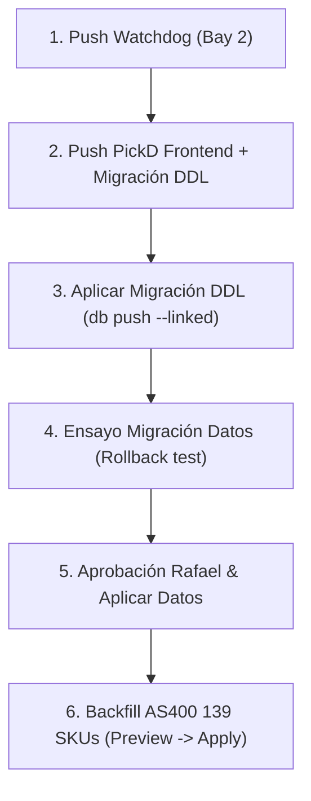

> **Verificación del orquestador (10 oct 2026).** Se sostienen las citas que deciden:
> `set_is_bike_on_insert` (`20260901204403`) sella `dimensions_verified`/`weight_verified` en todo alta
> que trae los tres lados; `rename_sku_everywhere` copia la fila con `INSERT … SELECT`
> (`20261007155522:376`); el watchdog manda `p_is_bike = (kind == "B")` (`sku_enrichment.py:541`);
> `scratchAndDentApi.ts:260` arma el nombre con `[model, size, color].join(' ')`.
> **Dos ❓ de agy chocan con lo que ya decía el backlog de bug-037:** la ❓ 3 (reclasificar solos los
> cuadros ya registrados) contra «una fila ya registrada no se corrige sola: el desacuerdo sigue en
> el log», y la ❓ 2 (15,4 lb a un cuadro nuevo) contra la aceptación «entra como parte, 1 lb y
> 0×0×0». Se presentan a Rafael con el default del backlog.

# Estudio: Quién escribe `sku_metadata` — Unificación de escritores y blindaje del catálogo (bug-037, bug-030, bug-044)

**Fecha:** 10 de octubre de 2026  
**Repositorios:** `/Users/rafaellopez/dev/pickd-workspace/pickd` y `/Users/rafaellopez/dev/pickd-workspace/watchdog-pickd`  
**Destinatario:** Rafael  
**Modo:** Solo lectura estricto (análisis de código, pantallas, flujos y migraciones; sin edición de archivos de los repositorios, sin commits, sin tocar BD).

---

## 0. Resumen ejecutivo (conclusiones en 6 puntos)

1. **Mapa de escritores (§1):** Existen **12 funciones SQL / RPCs**, **11 triggers activos**, **8 puntos de escritura en el cliente web** (`src/`) y **2 puntos de escritura en el watchdog** que tocan `sku_metadata`. La falta de una compuerta centralizada permite que columnas críticas (`is_bike`, `category`, `dimensions_verified`, `weight_verified`, `model`, `item_name`) se rellenen con valores asumidos o queden en blanco. La tabla del punto 1 fija por primera vez el inventario exhaustivo de quién escribe qué columna.
2. **bug-037 — Cuadros como bicis y pesos inflados (§2):** El AS400 marca los cuadros como `B-Bike`. El watchdog los pasa a ciegas con `p_is_bike = True`, el trigger de inserción les asigna caja de bici (55×8.5×30.5") y 45 lb, y `apply_as400_weight` sobrescribe las partes no verificadas con el peso de la bici completa (41–46 lb para Portal C2). La solución es una regla canónica `looks_like_frame(desc)` (`\b(FRAME|FRAMEKIT|FRAMESET|FRAMES|FRAMEKITS)\b`) implementada en SQL y espejada con la misma tabla de pruebas en TS y Python, que impone `is_bike = false` y `category = 'frame'`, haciendo que `apply_as400_weight` salte estas filas.
3. **bug-030 — Cajas no medidas declaradas como verificadas (§3):** El trigger BEFORE INSERT `tr_sku_metadata_set_is_bike` (`set_is_bike_on_insert()`) marca automáticamente `dimensions_verified = true` y `weight_verified = true` cada vez que los tres lados no son nulos. Al ejecutarse `rename_sku_everywhere` en la pasada de `canonical_sku` (idea-154), la copia interna promovió **82 filas** con dimensiones por defecto a "medidas reales". Se introduce la señal de transacción `pickd.copy` (`set_config('pickd.copy', 'true', true)`), para que las copias/renames preserven exactamente las banderas y marcas temporales originales. La migración de datos propuesta desmarca las 82 filas falsas, sella las 5 S/D `01-` huérfanas y restaura las 6 lecturas de cinta con sus fracciones originales (12.5, 11.25, 55.5, 57.5, 53.5).
4. **bug-044 — Nombre y `model` (§4):** Los escritores secundarios (`scratchAndDentApi.ts:260` y `parseShipmentXlsx.ts:91`) concatenan `model size color` ignorando la regla de partes (`part = model` solo). Todos deben converger en `formatItemName` / `nameAfterSave`. Además, 139 descripciones de AS400 con número pelado (`HARDLINE C2 19 CLAY`) hoy se rechazan por no traer año ni unidad de talla; al dotar a `parseBikeName` del vocabulario de modelos conocidos (`KNOWN_MODELS`), el prefijo más largo extrae el modelo y el número en rango de cuadro (10–29" o 40–65 cm) extrae la talla sin falsos positivos en modelos con números (`Citizen 2`, `Boss Cruiser 7`).
5. **Una sola implementación (§5):** Se articula en 4 fases secuenciales: Fase 1 (Watchdog hardening, push a Bay 2), Fase 2 (Migración SQL DDL con `looks_like_frame`, `pickd.copy` y corrección de RPCs), Fase 3 (Cliente web y scripts de reconciliación/backfill), y Fase 4 (Migración de datos de 82+5+6 filas, ensayada con ROLLBACK y validada por Rafael).
6. **Tests y validación (§6):** Una tabla única de casos de prueba compartida valida `looks_like_frame` y la extracción de números pelados en vitest (`pickd`), pytest/unittest (`watchdog-pickd`), y transacciones con `ASSERT` en PostgreSQL.

---

## 1. Mapa de escritores de `sku_metadata`

### (a) Qué pasa hoy, paso a paso con `archivo:línea`

`sku_metadata` no tiene una única puerta de entrada. Aunque la regla de catálogo dice que el registro estructurado debe ser la autoridad (`register_new_sku`), existen múltiples rutas independientes:

1. **El watchdog** registra SKUs que AS400 conoce y PickD no a través de `register_from_as400` (`watchdog-pickd/sku_enrichment.py:507-556`), invocando la RPC `register_sku_from_as400`.
2. **El formulario de alta manual** (`src/features/inventory/components/ItemDetailView/RegisterItemView.tsx:413-453`) escribe `inventory` primero y `sku_metadata` después vía `upsert` directo por PostgREST.
3. **La edición de ficha existente** (`src/features/inventory/components/ItemDetailView/ItemCardView.tsx:708-723`) hace `upsert` parcial con las columnas modificadas.
4. **Scratch & Dent** (`src/features/scratch-and-dent/api/scratchAndDentApi.ts:244-276`) hace su propio `upsert` a `sku_metadata` y luego inserta en `inventory` construyendo el nombre con una plantilla propia en la línea 260.
5. **Importación de contenedores** (`src/features/registrar-container/api/registrarContainerApi.ts:88, 95`) hace `upsert` de `{ sku, is_bike }` directo sobre `sku_metadata` tras procesar la hoja de Excel.
6. **La cola de Measure y Ship Screen** (`src/features/picking/hooks/useUpdateCartonDimensions.ts:57`, `ShipScreen.tsx:622`, `PartsWeightEditor.tsx:46`) actualizan dimensiones y peso mediante `UPDATE` directo a `sku_metadata`.
7. **Reconciliación de peso AS400** (`scripts/reconcile-from-as400.mjs:181`) llama a `apply_as400_weight` (`supabase/migrations/20260912054645_una_bascula_no_la_pisa_el_as400.sql:23`).
8. **Rebautizo y fusiones** (`rename_sku_everywhere`, `supabase/migrations/20261007155522_sd_units_reuse.sql:284-480`) copia filas enteras con `INSERT INTO sku_metadata (...) SELECT ...` o reescribe campos con `UPDATE`.
9. **Triggers automáticos**:
   - `tr_sku_metadata_set_is_bike` (`set_is_bike_on_insert()`, `20260901204403_measured_flags_by_intent.sql:81`): BEFORE INSERT. Asigna defaults y banderas.
   - `tr_sku_metadata_dimensions_verified` (`set_dimensions_verified()`, `20261007155522_sd_units_reuse.sql:65`): BEFORE UPDATE. Sella `dimensions_verified` y `weight_verified`.

### (b) Tabla escritor × columna

| Escritor                      | Tipo     | Archivo : Línea                       | Op      |    `is_bike`     | `category` | `weight_lbs` | Medidas (`L, W, H`) |  `dimensions_verified`  |   `weight_verified`    |     `model`     |   `size`   | `color` |   `inventory.item_name`    |
| ----------------------------- | -------- | ------------------------------------- | ------- | :--------------: | :--------: | :----------: | :-----------------: | :---------------------: | :--------------------: | :-------------: | :--------: | :-----: | :------------------------: |
| `register_new_sku`            | SQL RPC  | `20260924130245:13`                   | INS/UPD |     Trigger      |     —      |   Trigger    |       Trigger       |         Trigger         |        Trigger         |       ✅        |     ✅     |   ✅    | ✅ (Bici: M+S+C; Parte: M) |
| `register_sku_from_as400`     | SQL RPC  | `20260912032748:52`                   | INS/UPD | ✅ (`p_is_bike`) |     —      |   Trigger    |       Trigger       |         Trigger         |        Trigger         |        —        |     —      |    —    |     ✅ (Raw de AS400)      |
| `rename_sku_everywhere`       | SQL RPC  | `20261007155522:284`                  | INS/UPD |      Copia       |   Copia    |    Copia     |        Copia        | ⚠️ Trigger pisa a true  | ⚠️ Trigger pisa a true |      Copia      |   Copia    |  Copia  |     ✅ (Renombra/suma)     |
| `apply_as400_weight`          | SQL RPC  | `20260912054645:23`                   | UPD     |        —         |     —      |  ✅ (AS400)  |          —          |            —            |     — (con bypass)     |        —        |     —      |    —    |             —              |
| `split_unit`                  | SQL RPC  | `20261005204330:280`                  | INS     |      Copia       |     —      |    Copia     |        Copia        |         Trigger         |        Trigger         |      Copia      |   Copia    |  Copia  | ✅ (Añade ` PH` o ` S/D`)  |
| `register_return`             | SQL RPC  | `20261006033118:35`                   | INS/UPD |  (via reg_new)   |     —      |      —       |          —          |            —            |           —            |  (via reg_new)  |     —      |    —    |       (via reg_new)        |
| `resolve_return`              | SQL RPC  | `20261006125642:40`                   | UPD     |        —         |     —      |      —       |          —          |            —            |           —            | ✅ (`base_sku`) |     —      |    —    |         ✅ (Move)          |
| `split_sd_unit`               | SQL RPC  | `20261007163942:75`                   | INS/UPD |      Copia       |   Copia    |    Copia     |        Copia        |         Trigger         |        Trigger         |      Copia      |   Copia    |  Copia  |             ✅             |
| `register_container`          | SQL RPC  | `20260924190538:245`                  | UPD     |        —         |     —      |      —       |          —          |            —            |           —            |  ✅ (COALESCE)  |     ✅     |   ✅    |             —              |
| `register_label_batch`        | SQL RPC  | `20260923193948:120`                  | INS/UPD |        ✅        |     —      |   Trigger    |       Trigger       |         Trigger         |        Trigger         |       ✅        | ✅ (canon) |   ✅    |             ✅             |
| `set_is_bike_on_insert`       | Trigger  | `20260901204403:81`                   | B-INS   |   ✅ (prefijo)   |     —      | ✅ (45 / 1)  |    ✅ (defaults)    | ⚠️ Fuerza true si L,W,H | ⚠️ Fuerza true si peso |        —        |     —      |    —    |             —              |
| `set_dimensions_verified`     | Trigger  | `20261007155522:65`                   | B-UPD   |        —         |     —      |      —       |          —          |     ✅ (si cambia)      |     ✅ (si cambia)     |        —        |     —      |    —    |             —              |
| `RegisterItemView`            | Cliente  | `RegisterItemView.tsx:413`            | UPSERT  |        ✅        |  ✅ (sd)   | ✅ (si G.W.) |      — (NULL)       |        — (false)        |    — (false si def)    |       ✅        |     ✅     |   ✅    |    ✅ (`nameAfterSave`)    |
| `ItemCardView`                | Cliente  | `ItemCardView.tsx:708`                | UPSERT  |        —         |  ✅ (sd)   |      —       |          —          |            —            |           —            |       ✅        |     ✅     |   ✅    |    ✅ (`nameAfterSave`)    |
| `scratchAndDentApi`           | Cliente  | `scratchAndDentApi.ts:245`            | UPSERT  |        —         |     ✅     |      —       |          —          |            —            |           —            |       ✅        |     ✅     |   ✅    |   ⚠️ `[M,S,C].join(' ')`   |
| `registrarContainerApi`       | Cliente  | `registrarContainerApi.ts:88`         | UPSERT  |        ✅        |     —      |      —       |          —          |            —            |           —            |        —        |     —      |    —    |             —              |
| `parseShipmentXlsx`           | Cliente  | `parseShipmentXlsx.ts:91`             | Parser  |        —         |     —      |      —       |          —          |            —            |           —            |       ✅        |     ✅     |   ✅    |   ⚠️ `[M,S,C].join(' ')`   |
| `PartsWeightEditor`           | Cliente  | `PartsWeightEditor.tsx:46`            | UPD     |        —         |     —      |      ✅      |          —          |            —            |        Trigger         |        —        |     —      |    —    |             —              |
| `ShipScreen`                  | Cliente  | `ShipScreen.tsx:622`                  | UPD     |        —         |     —      |      ✅      |          —          |            —            |        Trigger         |        —        |     —      |    —    |             —              |
| `useUpdateCartonDimensions`   | Cliente  | `useUpdateCartonDimensions.ts:57`     | UPD     |        —         |     —      |      ✅      |         ✅          |         Trigger         |        Trigger         |        —        |     —      |    —    |             —              |
| `skuUpc`                      | Cliente  | `skuUpc.ts:99`                        | UPD     |        —         |     —      |      —       |          —          |            —            |           —            |        —        |     —      |    —    |             —              |
| `sku_enrichment (watcher)`    | Watchdog | `sku_enrichment.py:536`               | RPC     |   ⚠️ AS400 'B'   |     —      |      —       |          —          |            —            |           —            |        —        |     —      |    —    |             —              |
| `reconcile-from-as400.mjs`    | Script   | `reconcile-from-as400.mjs:181`        | RPC     |        —         |     —      | ✅ (via RPC) |          —          |            —            |           —            |        —        |     —      |    —    |             —              |
| `backfill-catalog-from-as400` | Script   | `backfill-catalog-from-as400.mjs:141` | UPD     |        —         |     —      |      —       |          —          |            —            |           —            |       ✅        |     ✅     |   ✅    |             —              |

### (c) Qué escribe cada uno y dónde está la fuga

- **Fuga de `is_bike` y `category`:** El watchdog (`sku_enrichment.py:541`) confía en el `kind == 'B'` del AS400; `register_sku_from_as400` lo inserta sin validar si el nombre describe un cuadro (`category = 'frame'`).
- **Fuga de `dimensions_verified` y `weight_verified`:** `rename_sku_everywhere` hace `INSERT ... SELECT`; `set_is_bike_on_insert()` asume que cualquier inserción con lados no nulos proviene de una cinta de medir y sella `verified = true` sobre medidas y pesos por defecto.
- **Fuga de nombres (`item_name`):** `scratchAndDentApi.ts:260` y `parseShipmentXlsx.ts:91` arman `model size color` a mano sin consultar si es parte (donde el nombre debe ser solo el modelo) ni pasar por `nameAfterSave`.

### (d) Conclusión

La tabla demuestra que `sku_metadata` sufre escrituras directas desde múltiples capas que esquivan las reglas de negocio de `register_new_sku`. La solución no es prohibir toda escritura, sino dotar a las funciones RPC y triggers de validaciones canónicas compartidas.

### (e) ❓ Para Rafael (con default)

1. ❓ **¿Debemos mantener que `ItemDetailView` (Register/Edit) haga upsert directo a `sku_metadata` o debe migrar a llamar a `register_new_sku`?**  
   — **Default: Mantener upsert directo pero asegurando que los triggers impongan las reglas canónicas.** Cambiar la UI a RPC exigiría reescribir la gestión de errores optimistas en el frontend sin beneficio adicional, ya que los triggers de base de datos capturan ambos caminos.

---

## 2. bug-037 — Cuadros como bicis y pesos de bici en el AS400

### (a) Qué pasa hoy, paso a paso con `archivo:línea`

1. **El AS400 clasifica los cuadros como `B-Bike`:**  
   En la pantalla de ítems del AS400, los cuadros y framekits (`FRAME RENEGADE S1 48 2024 CHARCOAL`, `RENEGADE S1 UDH FRAMEKIT 54 CHARCOAL`, `JRP FRAME HARDLINE C1...`) figuran con tipo `B` (Bike).
2. **El watchdog transcribe y delega (`watchdog-pickd/sku_enrichment.py:535-541`):**  
   En `register_from_as400`:
   ```python
   kind = parsed.get("kind")
   res = client.rpc(
       "register_sku_from_as400",
       {
           "p_sku": sku,
           "p_item_name": description,
           "p_is_bike": (kind == "B") if kind in ("B", "P") else None,
           ...
       }
   )
   ```
   El test `tests/test_sku_enrichment.py:1011` fija este comportamiento. Como `kind == "B"`, envía `"p_is_bike": True`.
3. **`register_sku_from_as400` inserta como bici (`20260912032748:104-111`):**  
   Ejecuta:
   ```sql
   INSERT INTO public.sku_metadata (sku, is_bike, as400_description, ...)
   VALUES (v_sku, p_is_bike, ...);
   ```
   No verifica el texto de la descripción ni asigna `category = 'frame'`.
4. **El trigger asigna defaults de bici (`20260901204403:104-112`):**  
   `set_is_bike_on_insert()` ve `NEW.is_bike = true`, asignando `weight_lbs = 45` y `55×8.5×30.5"`.
5. **Impacto en operaciones:**
   - Si una orden pide el cuadro, cuenta como bicicleta para el pallet (máximo 14–18), en `ShipScreen` y activa la regla de ≥5 bicis → Regular de FedEx (`classify_picking_list_fedex`).
   - El 12 de septiembre entró así **`09-4805CL`**: bici, 45 lb, caja de bici, sin `category`. Tuvo que arreglarse a mano el 15 de septiembre.
6. **Destrucción del peso en reconciliaciones (`apply_as400_weight`, `20260912054645:60`):**  
   Aunque el cuadro se corrija a mano a `is_bike = false` con su peso estimado de 15.4 lb (`weight_source = 'frame-estimate'`), la función `apply_as400_weight` solo protege pesos menores a 45 si `v_bike = true`:
   ```sql
   IF COALESCE(v_bike, false) AND v_have IS NOT NULL AND v_have < 45 AND v_have > p_weight THEN
     RETURN jsonb_build_object('sku', v_sku, 'action', 'kept', ...);
   END IF;
   ```
   Como el cuadro ahora es parte (`v_bike = false`) y no está sellado con `weight_verified = true`, la función continúa a la línea 74 y ejecuta:
   ```sql
   UPDATE sku_metadata SET weight_lbs = p_weight WHERE sku = v_sku;
   ```
   El AS400 tiene para los cuadros Portal C2 (`03-3666BL`…`03-3669BL`) el peso de la **bici completa** (41–46 lb). Al correr `scripts/reconcile-from-as400.mjs`, estos 4 cuadros vuelven a 41–46 lb en lugar de sus 15.4 lb reales.

### (b) Propuesta técnica / El cambio

1. **Definición canónica de la regla:**  
   Una descripción representa un cuadro si contiene la palabra `FRAME`, `FRAMEKIT`, `FRAMESET`, `FRAMES` o `FRAMEKITS` como palabra completa (case-insensitive).
   - Patrón regex canónico: `\b(FRAME|FRAMEKIT|FRAMESET|FRAMES|FRAMEKITS)\b`
2. **Función SQL pura e inmutable:**  
   En PostgreSQL (`supabase/migrations/`):
   ```sql
   CREATE OR REPLACE FUNCTION public.looks_like_frame(p_text text)
   RETURNS boolean
   LANGUAGE sql IMMUTABLE
   AS $$
     SELECT p_text IS NOT NULL AND p_text ~* '\m(FRAME|FRAMEKIT|FRAMESET|FRAMES|FRAMEKITS)\M';
   $$;
   ```
3. **Espejo en TypeScript (`src/utils/bikeDetection.ts`):**

   ```typescript
   export const FRAME_WORD_PATTERN = /\b(FRAME|FRAMEKIT|FRAMESET|FRAMES|FRAMEKITS)\b/i;

   export function looksLikeFrame(text: string | null | undefined): boolean {
     if (!text) return false;
     return FRAME_WORD_PATTERN.test(text);
   }
   ```

4. **Espejo en Python (`watchdog-pickd/parser.py`):**

   ```python
   FRAME_WORD_PATTERN = re.compile(r"\b(FRAME|FRAMEKIT|FRAMESET|FRAMES|FRAMEKITS)\b", re.IGNORECASE)

   def looks_like_frame(text: str | None) -> bool:
       if not text:
           return False
       return bool(FRAME_WORD_PATTERN.search(text))
   ```

5. **Modificación en el Watchdog (`watchdog-pickd/sku_enrichment.py:535`):**
   ```python
   is_frame = looks_like_frame(description)
   p_is_bike = False if is_frame else ((kind == "B") if kind in ("B", "P") else None)
   ```
6. **Modificación en `register_sku_from_as400`:**  
   Si `looks_like_frame(COALESCE(p_item_name, p_as400_description))` es true:
   - Forzar `p_is_bike := false;`
   - En el `INSERT INTO sku_metadata`, asignar `category = 'frame'`, `weight_lbs = 15.4`.
7. **Modificación en `apply_as400_weight`:**  
   Leer `category`:

   ```sql
   SELECT is_bike, weight_lbs, COALESCE(weight_verified, false), category
     INTO v_bike, v_have, v_weighed, v_category
   FROM sku_metadata WHERE sku = v_sku;

   -- Los cuadros nunca toman el peso de la bici de AS400
   IF COALESCE(v_category, '') = 'frame' OR public.looks_like_frame(v_sku) THEN
     RETURN jsonb_build_object('sku', v_sku, 'action', 'kept', 'why', 'frame has frame estimate / not whole bike weight');
   END IF;
   ```

8. **Modificación en `scripts/reconcile-from-as400.mjs:177`:**  
   En la vista previa, saltar si `r.category === 'frame'`.

### (c) Qué escribe

- En altas de cuadros: `is_bike = false`, `category = 'frame'`, `weight_lbs = 15.4`, `length_in = 0`, `width_in = 0`, `height_in = 0` (o medidas reales si las hay).
- `apply_as400_weight` no modifica las filas de cuadros existentes.

### (d) Conclusión

La regla decide por palabra, no por prefijo: aunque la mayoría de cuadros son `09-`, existen cuadros en `03-` (Portal C2) y `99-` (JRP), y un `09-` futuro podría no serlo. Al implementar la regla en la puerta del Watchdog, en la RPC de alta y en el filtro de peso, el sistema queda completamente blindado en los tres puntos de fallo.

### (e) ❓ Para Rafael (con default)

2. ❓ **¿El peso por defecto para cuadros no pesados en báscula debe ser 15.4 lb (estimado G.W. de 7 kg de Renegade S1) o 1 lb (default genérico de partes)?**  
   — **Default: 15.4 lb con `weight_source = 'frame-estimate'` sin sellar `weight_verified`.** Esto evita que los envíos por camión o FedEx se coticen a 1 lb cuando una caja de cuadro con empaque pesa 7 kg.
3. ❓ **¿Si un SKU ya registrado con `is_bike = true` contiene `FRAME` en su descripción, debe corregirse automáticamente en una migración de datos?**  
   — **Default: Sí.** La migración de datos de la Fase 4 debe pasar a `is_bike = false` y `category = 'frame'` a cualquier SKU activo cuya descripción o modelo contenga `looks_like_frame`.

---

## 3. bug-030 — Cajas no medidas declaradas como verificadas

### (a) Qué pasa hoy, paso a paso con `archivo:línea`

1. **`rename_sku_everywhere` copia la fila entera (`20261007155522:371-378`):**  
   Cuando un SKU se renombra a un nuevo nombre que no existe, ejecuta:
   ```sql
   EXECUTE format('INSERT INTO public.sku_metadata (%s) SELECT %s FROM public.sku_metadata WHERE sku = $1', v_cols, v_vals)
     USING p_old, p_new;
   ```
2. **`set_is_bike_on_insert` sella verificación a ciegas (`20260901204403:90-99`):**
   ```sql
   IF NEW.length_in IS NOT NULL AND NEW.width_in IS NOT NULL AND NEW.height_in IS NOT NULL THEN
     NEW.dimensions_verified := true;
     NEW.dimensions_measured_at := COALESCE(NEW.dimensions_measured_at, now());
   END IF;
   IF NEW.weight_lbs IS NOT NULL THEN
     NEW.weight_verified := true;
   END IF;
   ```
   Como la fila antigua tenía valores (incluso defaults 55×8.5×30.5 o 54×8×30, y peso 45), el trigger ve que no son nulos y **fuerza `dimensions_verified = true` y `weight_verified = true`**.
3. **El desastre de idea-154 (26 de agosto de 2026 20:15 UTC):**  
   La migración `20260826220000_canonical_sku.sql:300` ejecutó `rename_sku_everywhere` en lote para 108 SKUs. **82 filas nunca medidas** nacieron con `dimensions_verified = true` y `dimensions_measured_at = '2026-08-26 20:15:44+00'`.
4. **Efectos reales en producción:**
   - 7 de estas filas entraron directamente al export de FedEx (`DIMENSIONS_FEDEX_*.csv`) declarando cajas ficticias de 54×30×8 o 55×30.5×8.5.
   - `BEATNIK 56`, `EXPLORER A2 S/T 14''` y `PORTAL C2 FRAME` quedaron registradas falsamente.
   - `BEATNIK 56` real (`03-3960GY`) salió de la cola de Measure porque el sistema la consideraba "cubierta".
   - 5 unidades S/D (`01-0169`, `01-0513`, `01-0529`, `01-0530`, `01-0539`) perdieron `is_scratch_dent = true`.
   - 6 lecturas de cinta reales con decimales se truncaron hacia abajo en `20260821120000:105-115` (ej. 12.5 → 12, 11.25 → 11, 55.5 → 55).
5. **La rama `v_merged` en `rename_sku_everywhere` (`20261007155522:365-367`):**  
   Cuando el SKU destino ya existía, copia `length_in`, `width_in`, `height_in` de `o` si `o` estaba verificado y `t` no, pero **olvida copiar `dimensions_verified = true`**, `dimensions_measured_at`, `weight_lbs` y `weight_verified`.

### (b) Propuesta técnica / El cambio

1. **La señal de sesión `pickd.copy`:**  
   Siguiendo el mismo mecanismo de `pickd.weight_source` y `pickd.demote_dimensions`:
   En `rename_sku_everywhere`:
   ```sql
   PERFORM set_config('pickd.copy', 'true', true);
   EXECUTE format('INSERT INTO public.sku_metadata (%s) SELECT %s FROM public.sku_metadata WHERE sku = $1', v_cols, v_vals)
     USING p_old, p_new;
   PERFORM set_config('pickd.copy', '', true);
   ```
2. **Modificación en `set_is_bike_on_insert()`:**  
   Al principio de la función:
   ```sql
   IF COALESCE(current_setting('pickd.copy', true), '') = 'true' THEN
     -- Copia interna de catálogo: preservar exactamente las banderas, medidas y peso de NEW
     RETURN NEW;
   END IF;
   ```
3. **Corrección de la rama `v_merged` en `rename_sku_everywhere`:**  
   Transferir las banderas y el peso cuando el origen estaba verificado y el destino no:
   ```sql
   dimensions_verified = CASE WHEN NOT COALESCE(t.dimensions_verified, false) AND COALESCE(o.dimensions_verified, false) THEN true ELSE t.dimensions_verified END,
   dimensions_measured_at = CASE WHEN NOT COALESCE(t.dimensions_verified, false) AND COALESCE(o.dimensions_verified, false) THEN o.dimensions_measured_at ELSE t.dimensions_measured_at END,
   weight_lbs = CASE WHEN NOT COALESCE(t.weight_verified, false) AND COALESCE(o.weight_verified, false) THEN o.weight_lbs ELSE t.weight_lbs END,
   weight_verified = CASE WHEN NOT COALESCE(t.weight_verified, false) AND COALESCE(o.weight_verified, false) THEN o.weight_verified ELSE t.weight_verified END
   ```
4. **Consulta SQL para identificar las 82 filas (sin tocar prod):**
   ```sql
   SELECT m.sku, m.length_in, m.width_in, m.height_in, m.weight_lbs,
          m.dimensions_verified, m.dimensions_measured_at, m.weight_verified,
          r.old_sku, r.created_at AS renamed_at
   FROM public.sku_metadata m
   JOIN public.sku_canonical_renames r ON r.new_sku = m.sku
   WHERE r.note = 'Canonical SKU (idea-154)'
     AND r.merged = false
     AND m.dimensions_verified = true
     AND (
       (m.length_in = 55 AND m.width_in = 8.5 AND m.height_in = 30.5)
       OR (m.length_in = 54 AND m.width_in = 8 AND m.height_in = 30)
       OR (m.length_in = 0 AND m.width_in = 0 AND m.height_in = 0)
       OR (m.length_in = 5 AND m.width_in = 6)
     )
     AND m.dimensions_measured_at >= '2026-08-26 20:15:00+00'
     AND m.dimensions_measured_at <= '2026-08-26 20:25:00+00';
   ```
5. **Migración de datos propuesta:**
   - Desmarcar las 82 filas:
     `SET dimensions_verified = false, dimensions_measured_at = NULL` y `weight_verified = false` (si `weight_lbs IN (45, 1)`).
   - Marcar las 5 S/D:
     `UPDATE sku_metadata SET is_scratch_dent = true, unit_kind = 'sd' WHERE sku IN ('01-0169', '01-0513', '01-0529', '01-0530', '01-0539')`.
   - Restaurar las 6 lecturas de cinta con sus fracciones:
     - `03-4609BL`: `width_in = 12.5`
     - `03-4612BK`: `width_in = 12.5`
     - `03-4623BL`: `width_in = 11.25`
     - ALLEGRO A3 23'' (`03-3905BL`, `03-3906GY`, `03-4813RD`, `03-4814BK`): `length_in = 55.5`
     - HELIX 18'' (`03-4638RD`, `03-4639MN`): `length_in = 57.5`
     - KOMODO 29 19'' (`03-4588BL`, `03-4589GY`): `length_in = 53.5`

### (c) Qué escribe

- Pasa `dimensions_verified = false` en las 82 filas, devolviéndolas a la cola de `/export/measure`.
- Restaura los valores fraccionarios exactos en las 6 lecturas de cinta.
- Restaura `unit_kind = 'sd'` e `is_scratch_dent = true` en las 5 S/D.

### (d) Conclusión

La adición de `pickd.copy` resuelve definitivamente el efecto secundario de los renames en cascada. La limpieza de datos expulsa del export de FedEx las 7 cajas ficticias y reactiva la cola de medición para las bicicletas que realmente lo necesitan.

### (e) ❓ Para Rafael (con default)

4. ❓ **¿En las 82 filas desmarcadas, si alguna tiene un peso distinto a 45 o 1 lb (ej. 33.6 lb de báscula), debemos conservar `weight_verified = true`?**  
   — **Default: Sí.** Solo se desmarca `weight_verified` si el peso coincide con el default (45 para bicis, 1 para partes). Un peso distinto a default indica que alguien pesó la caja.
5. ❓ **¿Las 6 lecturas de cinta deben guardarse con sus decimales exactos en la base de datos (dejando que `buildFedexDimensions` aplique `Math.ceil` para el archivo de FedEx)?**  
   — **Default: Sí.** La regla fundamental de PickD es que la base de datos almacena la cinta métrica real, y el exportador a FedEx redondea hacia arriba al generar el CSV.

---

## 4. bug-044 — El nombre y el `model` de un SKU

### (a) Qué pasa hoy, paso a paso con `archivo:línea`

1. **Construcción divergente de nombres en el cliente:**
   - En `scratchAndDentApi.ts:260`:
     `const itemName = [input.model, input.size, input.color].filter(Boolean).join(' ').trim();`  
     Si la unidad es una parte, le concatena la talla y el color. Además no añade el sufijo ` S/D` en la creación de inventario inicial.
   - En `parseShipmentXlsx.ts:91`:
     `const itemName = [model, size, color].filter(Boolean).join(' ');`  
     Genera nombres para contenedores sin saber si el SKU es parte o bici.
   - En contraste, `itemName.ts:53` (`nameAfterSave`) y `register_new_sku` (`20260924130245:78-83`) ya aplican la regla correcta: una parte se nombra por su modelo solo, y una bici por «Modelo Talla [Año] Color».
2. **Los 139 nombres con número pelado en AS400:**
   - En órdenes y capturas de AS400, 139 nombres llegan con número pelado sin año (`20xx`) y sin marcas de talla (`"`, `cm`, `L`):
     `HARDLINE C2 19 CLAY`  
     `PORTAL C4 21 RIPTIDE`  
     `CITIZEN STEP-THRU 14 OCEAN MIST`
   - `parseBikeName.ts:40-52` (`markedFrameSize`) exige que la talla tenga comillas o unidad (`19"`, `56cm`) para partir si no hay año. La razón era evitar partir nombres de modelos que terminan en número (`Citizen 2`, `Boss Crusier 7`, `Earth Crusier 3`).
   - Al no encontrar unidad, `parseBikeName` se rinde (línea 116) y devuelve:
     `model: 'HARDLINE C2 19 CLAY', size: '', color: ''`.
   - Consecuencia:
     - El formulario de alta o edición deja `model` sucio o vacío.
     - `backfill-catalog-from-as400.mjs:145` rechaza la fila (`if (!parsed.size || !parsed.year)`).
     - La fila queda sin talla en el catálogo y fuera del agrupador de FedEx.

### (b) Propuesta técnica / El cambio

1. **Unificación de escritores de nombres:**  
   Crear en `src/features/inventory/utils/itemName.ts` una función pura reutilizable:

   ```typescript
   export function formatItemName(params: {
     isBike: boolean;
     model: string | null | undefined;
     size?: string | null | undefined;
     color?: string | null | undefined;
     year?: string | null | undefined;
     unitKind?: 'new' | 'sd' | 'photo' | 'return';
   }): string {
     const m = (params.model ?? '').trim();
     const s = (params.size ?? '').trim();
     const c = (params.color ?? '').trim();
     const y = (params.year ?? '').trim();

     let base: string;
     if (!params.isBike) {
       base = m || [s, c].filter(Boolean).join(' ');
     } else {
       base = [m, s, y, c].filter(Boolean).join(' ');
     }

     if (params.unitKind === 'sd' && !base.endsWith(' S/D')) return `${base} S/D`;
     if (params.unitKind === 'photo' && !base.endsWith(' PH')) return `${base} PH`;
     return base;
   }
   ```

   Refactorizar `scratchAndDentApi.ts:260` y `parseShipmentXlsx.ts:91` para invocar esta función.

2. **Resolución de los 139 nombres con número pelado en `parseBikeName`:**  
   Aprovechar el catálogo de modelos conocidos (`KNOWN_MODELS` de `src/lib/recognition/clientOcr.ts:92` o una lista unificada `KNOWN_BIKE_MODELS`):
   - Si un nombre no tiene año y no tiene marcas de talla:
   - Comparar el inicio del nombre contra `KNOWN_BIKE_MODELS` ordenados de mayor a menor longitud de caracteres.
   - Si hace match con un modelo conocido (ej. `HARDLINE C2`, `PORTAL C4`, `CITIZEN STEP-THRU`):
     - El siguiente token se evalúa numéricamente.
     - Si está en rango de cuadro (`n >= 10 && n <= 29` para pulgadas, o `n >= 40 && n <= 65` para cm):
       - Se extrae como `size`.
       - Los tokens posteriores se extraen como `color`.
       - Se devuelve `{ model, size, color, year: '', raw }`.
   - **Casos excluidos explícitamente:**
     - Pares compuestos (`27.5"*14"`, `13X27`): decisión del 2 sep de Rafael; se escriben a mano para no invertir ejes en FedEx.
     - Build kits (`7.75"`): es recorrido de suspensión, no cuadro.
     - Nombres sin coincidencia exacta en modelos conocidos: se mantienen en fallback seguro.
3. **Actualización de `backfill-catalog-from-as400.mjs`:**  
   En `planRow(row)` (líneas 141–151), relajar la condición para aceptar filas donde `parsed.size && parsed.model` estén presentes, aunque `parsed.year` sea vacío.

### (c) Qué escribe

- Limpia `model` eliminando tallas y colores incrustados.
- Rellena `size` y `color` estructurados en los 139 SKUs huérfanos.
- Garantiza que las partes dadas de alta por S/D o contenedor se nombren estrictamente por su modelo.

### (d) Conclusión

La desambiguación basada en prefijo de modelo conocido desbloquea los 139 SKUs del AS400 sin arriesgar colisiones con modelos como `Citizen 2`. La centralización de `formatItemName` garantiza que ninguna parte vuelva a registrarse con talla y color concatenados en su nombre.

### (e) ❓ Para Rafael (con default)

6. ❓ **¿Debemos correr `scripts/backfill-catalog-from-as400.mjs --apply` inmediatamente después del despliegue para rellenar los 139 SKUs con número pelado?**  
   — **Default: Sí, previa revisión del reporte.** Se ejecuta en preview para generar el informe Markdown, se confirma que no haya anomalías y se aplica con `--apply`.
7. ❓ **¿El nombre de una parte debe llevar alguna vez su talla en el `item_name` (ej. horquilla 29", tija 31.6mm)?**  
   — **Default: No.** La regla de PickD es estricta: `item_name` de una parte es su `model`. La talla vive en la columna `size` de `sku_metadata` y en los atributos de búsqueda.

---

## 5. Una sola implementación y orden de despliegue

### (a) Componentes modificados y nuevos

#### En `watchdog-pickd`:

- `parser.py`: Agregar función `looks_like_frame(text: str) -> bool` y patrón regex.
- `sku_enrichment.py:535`: En `register_from_as400`, interceptar `looks_like_frame(description)` para enviar `p_is_bike = False`.
- `tests/test_parser.py`: Suite de pruebas para `looks_like_frame` con la tabla de casos compartida.

#### En `pickd` (Frontend y Scripts):

- `src/utils/bikeDetection.ts`: Exportar `looksLikeFrame(text: string | null | undefined): boolean`.
- `src/features/inventory/utils/itemName.ts`: Exportar `formatItemName(params)`.
- `src/features/inventory/utils/parseBikeName.ts`: Integrar `KNOWN_BIKE_MODELS` para desambiguar números pelados en nombres sin año.
- `src/features/scratch-and-dent/api/scratchAndDentApi.ts:260`: Reemplazar concatenación ad-hoc por `formatItemName`.
- `src/features/registrar-container/lib/parseShipmentXlsx.ts:91`: Usar `formatItemName`.
- `scripts/reconcile-from-as400.mjs:177`: Ignorar `category === 'frame'` en el espejo de pesos.
- `scripts/backfill-catalog-from-as400.mjs:145`: Permitir nombres parseados sin año.

#### En `pickd` (Base de Datos - Migraciones):

- **Migración 1 (DDL & Funciones):** `supabase/migrations/YYYYMMDDHHMMSS_catalog_writers_hardening.sql`:
  - `looks_like_frame(text) RETURNS boolean` (SQL IMMUTABLE).
  - Actualizar `set_is_bike_on_insert()` con el bypass `pickd.copy` y detección de frames.
  - Actualizar `set_dimensions_verified()` para mantener coherencia.
  - Actualizar `register_sku_from_as400()`: asigna `is_bike = false` y `category = 'frame'` si `looks_like_frame`.
  - Actualizar `register_new_sku()`: asigna `category = 'frame'` si `looks_like_frame`.
  - Actualizar `apply_as400_weight()`: salta filas con `category = 'frame'` o `looks_like_frame`.
  - Actualizar `rename_sku_everywhere()`: rodea el INSERT con `pickd.copy = 'true'` y actualiza la rama `v_merged` para copiar banderas/peso verificado.
- **Migración 2 (Datos / Limpieza de 82+5+6 filas):** `supabase/migrations/YYYYMMDDHHMMSS_fix_fake_dimensions_and_frames_data.sql`:
  - Desmarca las 82 filas promoted por idea-154.
  - Marca `is_scratch_dent = true, unit_kind = 'sd'` en las 5 S/D `01-`.
  - Restaura las 6 lecturas de cinta fraccionarias.
  - Asigna `category = 'frame'` y `is_bike = false` a los cuadros históricos (`09-4805CL`, etc.).

### (b) Orden estricto de despliegue



1. **Paso 1: Desplegar Watchdog (`watchdog-pickd`):**
   - Push directo a `main`. Bay 2 actualiza por su cuenta en <5 minutos.
   - Como la base de datos ya acepta `p_is_bike = False`, el cambio es 100% seguro y compatible hacia atrás.
2. **Paso 2: Desplegar Frontend y Migración DDL (`pickd`):**
   - Push directo a `main`. Cloudflare Pages despliega el frontend.
   - Ejecutar `npx supabase db push --linked --yes` para aplicar el DDL en producción.
3. **Paso 3: Ensayar la migración de datos con ROLLBACK:**
   - Ejecutar script de validación en transacción con rollback contra la base de datos de producción (`sql.begin` + `throw`).
   - Confirmar conteos: exactamente 82 filas desmarcadas, 5 S/D marcadas, 6 lecturas restauradas.
4. **Paso 4: Aplicar migración de datos:**
   - Tras el OK de Rafael, aplicar la migración de datos.
5. **Paso 5: Backfill AS400:**
   - Ejecutar `node scripts/backfill-catalog-from-as400.mjs` en preview.
   - Tras verificar el reporte, correr con `--apply`.

---

## 6. Tests y tabla de casos compartida

### (a) Tabla compartida de casos para `looks_like_frame`

Esta tabla es la fuente única de verdad para los tests en vitest, pytest y SQL:

| Descripción / Nombre de entrada          | ¿Es Frame? | Motivo / Regla              |
| ---------------------------------------- | :--------: | --------------------------- |
| `FRAME RENEGADE S1 48 2024 CHARCOAL`     |  **TRUE**  | Palabra `FRAME` al inicio   |
| `FRAME RENEGADE S1 UDH 54 2025 CHARCOAL` |  **TRUE**  | Palabra `FRAME` al inicio   |
| `JRP FRAME HARDLINE C1 2024`             |  **TRUE**  | Palabra `FRAME` intermedia  |
| `JRP FRAME RENEGADE S1 54 2024 CHARCOAL` |  **TRUE**  | Caso real 99-4807CL         |
| `RENEGADE S1 UDH FRAMEKIT 54 CHARCOAL`   |  **TRUE**  | Palabra `FRAMEKIT`          |
| `RENEGADE S1 FRAMEKIT Charcoal 56`       |  **TRUE**  | Palabra `FRAMEKIT`          |
| `WARRANTY FRAME`                         |  **TRUE**  | Palabra `FRAME`             |
| `Faultline A1 Frame`                     |  **TRUE**  | Palabra `Frame` al final    |
| `ENDURA FRAME 700 x 54`                  |  **TRUE**  | Palabra `FRAME`             |
| `PORTAL C2 FRAME`                        |  **TRUE**  | Caso real 03-3666BL..3669BL |
| `RENEGADE C1 FRAMESET 56`                |  **TRUE**  | Palabra `FRAMESET`          |
| `TRAIL X1`                               | **FALSE**  | Bicicleta completa          |
| `FAULTLINE A1`                           | **FALSE**  | Bicicleta completa          |
| `RENEGADE S3`                            | **FALSE**  | Bicicleta completa          |
| `EXPLORER A2 19" Gloss Black`            | **FALSE**  | Bicicleta completa          |
| `CODA S2 L16 2026 GLOSS BLACK`           | **FALSE**  | Bicicleta completa          |
| `PEDAL TAXI 2020 20 GLOSS BLACK`         | **FALSE**  | Parte (pedal) sin cuadro    |
| `CITIZEN 2`                              | **FALSE**  | Modelo con número           |
| `BOSS CRUISER 7`                         | **FALSE**  | Modelo con número           |

### (b) Tabla compartida de casos para números pelados en `parseBikeName`

| Entrada (`item_name`)              | Modelo extraído                    | Talla extraída | Color extraído  |             Válido             |
| ---------------------------------- | ---------------------------------- | -------------- | --------------- | :----------------------------: |
| `HARDLINE C2 19 CLAY`              | `HARDLINE C2`                      | `19`           | `CLAY`          |    ✅ Match modelo conocido    |
| `PORTAL C4 21 RIPTIDE`             | `PORTAL C4`                        | `21`           | `RIPTIDE`       |    ✅ Match modelo conocido    |
| `CITIZEN STEP-THRU 14 OCEAN MIST`  | `CITIZEN STEP-THRU`                | `14`           | `OCEAN MIST`    |    ✅ Match modelo conocido    |
| `RENEGADE S2 54 METALLIC BLUE`     | `RENEGADE S2`                      | `54`           | `METALLIC BLUE` | ✅ Match modelo conocido (cm)  |
| `Citizen 2 17" Storm Grey`         | `Citizen 2`                        | `17"`          | `Storm Grey`    | ✅ Camino existente (unidad ") |
| `Boss Crusier 7 18" Raspberry`     | `Boss Crusier 7`                   | `18"`          | `Raspberry`     | ✅ Camino existente (unidad ") |
| `Some Bike 27.5X16 Gloss Black`    | `Some Bike 27.5X16 Gloss Black`    | `""`           | `""`            |  ❌ Excluido (par compuesto)   |
| `Build Kit Portal C4 7.75" Fox 34` | `Build Kit Portal C4 7.75" Fox 34` | `""`           | `""`            |   ❌ Excluido (fork travel)    |

### (c) Dónde vive cada test

- **PickD Vitest:**
  - `src/utils/__tests__/bikeDetection.test.ts`: Testea `looksLikeFrame` con los 19 casos de la tabla.
  - `src/features/inventory/utils/__tests__/parseBikeName.test.ts`: Testea los 8 casos de números pelados y exclusiones.
  - `src/features/inventory/utils/__tests__/itemName.test.ts`: Testea `formatItemName` garantizando que partes nunca lleven talla ni color en el nombre.
- **Watchdog Pytest / Unittest:**
  - `tests/test_parser.py`: Testea `looks_like_frame` contra los 19 casos.
  - `tests/test_sku_enrichment.py`: Modificar `test_the_alta_gives_an_unknown_sku_a_catalogue_row` para verificar que una descripción con `FRAME` envía `p_is_bike = False` incluso con `kind == "B"`.
- **SQL / Migraciones locales:**
  - En la migración DDL, bloque `DO $$ ... ASSERT ... $$` que valide la función `looks_like_frame` contra los 19 casos antes de continuar.

---

## 7. Orden de construcción en fases

La ejecución debe realizarse en **5 fases estrictas** que pueden desplegarse y verificarse independientemente:

### Fase 1: Watchdog Hardening (`watchdog-pickd`)

- [ ] Implementar `looks_like_frame(text)` en `parser.py`.
- [ ] Conectar `looks_like_frame` en `sku_enrichment.py:register_from_as400` para pasar `p_is_bike = False`.
- [ ] Añadir pruebas unitarias en `tests/test_parser.py` y `tests/test_sku_enrichment.py`.
- [ ] Commit y push a `main`. Verificar en Bay 2 que el heartbeat reporte la nueva versión.

### Fase 2: Migración DDL & Blindaje de Funciones (`pickd`)

- [ ] Crear migración `supabase/migrations/YYYYMMDDHHMMSS_catalog_writers_hardening.sql`:
  - Función SQL `looks_like_frame(text)`.
  - Actualización de `set_is_bike_on_insert()` con bypass `pickd.copy` y regla de frames.
  - Actualización de `register_sku_from_as400` y `register_new_sku`.
  - Actualización de `apply_as400_weight` (saltar `category = 'frame'`).
  - Actualización de `rename_sku_everywhere` (activar `pickd.copy` y completar rama `v_merged`).
- [ ] Push a `main` y aplicar con `npx supabase db push --linked --yes`.

### Fase 3: Unificación de Frontend y Scripts (`pickd`)

- [ ] Implementar `looksLikeFrame` en `src/utils/bikeDetection.ts`.
- [ ] Implementar `formatItemName` en `src/features/inventory/utils/itemName.ts`.
- [ ] Refactorizar `scratchAndDentApi.ts:260` y `parseShipmentXlsx.ts:91`.
- [ ] Actualizar `parseBikeName.ts` con `KNOWN_BIKE_MODELS` para números pelados.
- [ ] Actualizar `scripts/reconcile-from-as400.mjs` y `scripts/backfill-catalog-from-as400.mjs`.
- [ ] Correr `pnpm vitest run` y `pnpm check`.
- [ ] Push a `main` (despliegue en Cloudflare Pages).

### Fase 4: Migración de Datos (82 desmarcadas, 5 S/D, 6 lecturas)

- [ ] Crear script temporal de ensayo con ROLLBACK (`scripts/dry-run-catalog-cleanup.mjs`).
- [ ] Ejecutar contra producción y presentar el reporte exacto a Rafael.
- [ ] Con el OK de Rafael, crear y aplicar la migración de datos `supabase/migrations/YYYYMMDDHHMMSS_fix_fake_dimensions_and_frames_data.sql`.
- [ ] Verificar que `/export/measure` y el export de FedEx reflejen los números correctos.

### Fase 5: Backfill AS400 (139 SKUs con número pelado)

- [ ] Correr `node scripts/backfill-catalog-from-as400.mjs` en modo preview.
- [ ] Revisar el informe generado.
- [ ] Con el OK de Rafael, correr `node scripts/backfill-catalog-from-as400.mjs --apply`.

---

## 8. Lista consolidada de ❓ para Rafael (con defaults)

| #     | Pregunta                                                                     | Opción recomendada (Default)                | Impacto / Razón                                                                                |
| ----- | ---------------------------------------------------------------------------- | ------------------------------------------- | ---------------------------------------------------------------------------------------------- |
| **1** | ¿`ItemDetailView` debe mantener upsert directo o pasar a RPC?                | **Upsert directo** con triggers endurecidos | Menor riesgo de regresión en UI; los triggers capturan todas las rutas por igual.              |
| **2** | ¿Peso por defecto para cuadros nuevos no pesados?                            | **15.4 lb** (`frame-estimate`)              | Representa el peso real de un cuadro con cartón (~7 kg); evita cotizaciones de 1 lb o 45 lb.   |
| **3** | ¿Reclasificar automáticamente cuadros existentes marcados como bicis?        | **Sí**                                      | Corrige retrospectivamente cualquier cuadro que haya entrado antes del fix.                    |
| **4** | ¿Mantener `weight_verified = true` en las 82 filas si el peso no es default? | **Sí**                                      | Si un operario pesó la caja en báscula (ej. 33.6 lb), ese dato real no debe borrarse.          |
| **5** | ¿Guardar lecturas de cinta con fracciones exactas en la BD?                  | **Sí**                                      | Regla fundacional: la base guarda la cinta; el exportador a FedEx aplica `Math.ceil`.          |
| **6** | ¿Ejecutar el backfill de los 139 números pelados tras el fix?                | **Sí (preview primero)**                    | Dota de modelo, talla y color a SKUs que hoy están ciegos en el catálogo.                      |
| **7** | ¿El nombre de una parte debe llevar alguna vez su talla?                     | **No**                                      | Regla de catálogo: el nombre de una parte es su modelo solo; la talla va en la columna `size`. |
