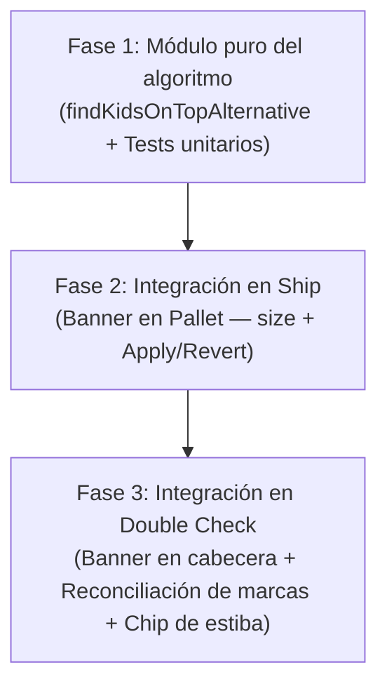

> **Verificación del orquestador (10 oct 2026).** Repetí con el motor real los dos casos que deciden:
> TEST-677 (4 → 3: 12 / 12 / 15 a 75" / 75" / 79") y 10 grandes + 16 LASER (hoy 3 tarimas:
> 10 a 83", 10 y 6 de niño; la alternativa 10 grandes + 2 LASER a 80" y 14 LASER a 71" = 2). Las citas
> `planPallets.ts:348-360` y `PalletDeclaration.tsx` (Ship) existen. La propuesta del chip de estiba
> en Double Check (punto 6) es de agy, no de Rafael: va como ❓.

# Estudio: «Niños encima de varias tarimas, como opción» (idea-261)

**Fecha:** 10 de octubre de 2026  
**Repositorio:** `/Users/rafaellopez/dev/pickd-workspace/pickd` (`main` @ HEAD)  
**Destinatario:** Rafael  
**Modo:** Solo lectura estricto del repositorio (análisis exhaustivo de código en `main`, reglas de picking y ship, scripts de benchmark y emulación física en scratchpad; sin editar archivos del repo, sin commits, sin tocar BD).

---

## 0. Resumen ejecutivo (conclusiones en 6 puntos)

1. **El algoritmo de la alternativa (`findKidsOnTopAlternative`):**
   Es una función pura y aislada que no modifica `planPallets.ts`. Ordena las bicicletas de niño de menor a mayor altura de caja (las cajas más bajas primero: `07-3744BL` Laser de 22" antes que `07-3690BL` Capri de 26") y evalúa colocarlas sobre las tarimas de adultos conservando estrictamente el orden de recogida de los adultos. El desempate prioriza: (1) menor cantidad de tarimas totales, (2) reparto parejo de unidades (menor dispersión entre tarimas), (3) menos bicis grandes en la tarima más cargada para maximizar la estabilidad física.
   - **Rendimiento:** Su coste computacional es despreciable: en TEST-677 tarda **< 1 ms** (en caliente) y en una orden masiva de 88 bicis (16 SKUs) promedia **0,67 ms**.
   - **Resultados en casos clave:**
     - **TEST-677 (39 bicis: 14 grandes + 25 niños):** Pasa de 4 tarimas a **3 tarimas** (ahorro = 1 tarima).
     - **#881856 (35 bicis: 29 grandes + 6 niños):** Devuelve `null` (ya tiene 3 tarimas, no ahorra nada; no ofrece la alternativa).
     - **16 niños + 10 grandes:** Pasa de 3 tarimas a **2 tarimas** (ahorro = 1 tarima: 10 grandes + 2 Laser = 12 u a 80", y 14 Laser = 14 u a 71").
     - **30 niños + 10 grandes:** Devuelve `null` (40 bicis requieren matemáticamente $\ge 3$ tarimas; el motor estándar ya da 3, ahorro = 0).

2. **Tope de bicicletas en tarima mixta (Default: 12 unidades):**
   Sin tope de unidades (sólo tope de altura $\le 90"$), el motor físico permite configuraciones extremas como 9 grandes + 6 Laser = 15 unidades a 88" y ~648 lbs (muy pesadas, difíciles de embalar y con 3 niveles de apilado). Con **tope de 12 unidades** (`adults + kids <= 12`), Rafael mantiene el estándar de «la pallet de 12», las tarimas mixtas no pasan de 75"–80", se embalan con total seguridad y en TEST-677 se obtienen exactamente las **3 tarimas** que el piso comprobó (12 / 12 / 15). Se propone fijar **tope 12 en tarimas mixtas** como default.

3. **Dónde y cómo se ofrece en Double Check y Ship:**
   - **Double Check:** En la cabecera previa al bucle de tarimas (`DoubleCheckView.tsx:2980` o en la futura cabecera de la vista BUILD) mediante un banner esmeralda compacto: `✨ 3 PALLETS POSSIBLE (SAVE 1) · Small bikes stacked on adult pallets · [ Apply ]`.
   - **Ship:** En la tabla de cubicaje, en el renglón de título `Pallet — size` (`PalletDeclaration.tsx:322-331`), mediante un pill verde interactivo: `✨ 3 pallets possible (save 1) · [ Apply ]`.
   - **Marcas previas (`verified_item_keys`):** Al tocar `Apply`, el recálculo pasa por `reconcileCheckedKeys` (`cfff1961`, `reconcileCheckedKeys.ts`). Las unidades ya verificadas por `(sku, location)` se preservan al 100% por cantidad sin inflar marcas ni perder progreso.
   - **Fotos de frente:** Las fotos tomadas en tarimas 1, 2 y 3 se conservan; si existía foto en una tarima 4 que desaparece, se desasigna de la tarima eliminada pero permanece en la galería del envío.

4. **Aplicar y deshacer (Escritura en `pallet_dims` y Realtime):**
   - **Aplicar:** Escribe en `pallet_dims` cada una de las 3 tarimas con su arreglo `items: [{ sku, location, qty }]`, ordinales 1, 2 y 3, `bikes: null` y `split: null` (idéntico a lo que escribe `PalletBuilderModal` / `applyPalletSelection`). Para la tarima 4 escribe `items: null`.
   - **Deshacer:** Tras aplicar, el banner cambia a `✨ 3 Pallets Active (Saved 1) · [ Revert to default ]`. Al pulsarlo, vacía las tarimas armadas (`items: null` en todas), regresando de inmediato al reparto estándar de 4 tarimas.
   - **Realtime:** Se ejecuta mediante las RPCs atómicas existentes (`patch_picking_list_pallet` / `patch_shipment_pallet`). Los canales de Realtime de `usePalletDims` (`shipments` / `picking_lists`) replican el cambio a todos los dispositivos abiertos en < 100 ms.

5. **Condiciones de guardia (Cuándo NO ofrecerla):**
   La opción **no se calcula ni se ofrece** si: (1) ya existen tarimas armadas a mano (`floor` tiene `items`), (2) hay bicis tecleadas manualmente (`bikes != null`), (3) hay un `split` manual de niños (`split > 1`), (4) la orden está completada o enviada (`is_shipped || status === 'completed'`), (5) la orden es 100% de bicicletas eléctricas (cartón aparte), (6) no hay bicis de niño o no hay adultos, (7) el ahorro es 0 tarimas, o (8) faltan dimensiones en catálogo para validar la estiba física.

6. **Riesgo del armado físico:**
   En TEST-677, `layoutPallet` estiba Alt P1 y Alt P2 con 5 Hudson en base, 2 Taxi de pie + 3 Laser de pie en segundo nivel, y **2 Laser acostadas** en los niveles 2 y 3 (el tope de echadas).
   - En **Ship**, `How to stack ▾` (`PalletBuilder3D.tsx`) renderiza la estiba en 3D interactivo caja por caja, mostrando con absoluta claridad cómo van las 2 Taxi paradas y las 2 Laser acostadas.
   - En **Double Check**, donde no existe el visor 3D, es indispensable mostrar un chip o advertencia descriptiva: `Stacking: 5 Hudson base · 2 Taxi + 3 Laser mid · 2 Laser flat on top` para evitar que el operario intente meter 7 bicis adultas en la base (rebasaría el ancho de 46") o monte bicis adultas sobre cajas de niño aplastándolas.

---

## 1. El algoritmo de la alternativa (como función pura aparte)

### (a) Qué pasa hoy, paso a paso con `archivo:línea`

1. **`src/features/picking/pallets/planPallets.ts:348-360`:**  
   El motor actual evalúa si las bicicletas de niño pueden montarse sobre la última tarima grande mediante la variable `kidsFitOnOne`:
   ```typescript
   const kidsFitOnOne =
     kidsUnits > 0 &&
     kidsUnits <= KIDS_PER_PALLET_MAX &&
     !floorSplitsKids &&
     (options.metaFor
       ? planKidsPallets(sortKidsLines(kidsItems, options.metaFor), options.metaFor).length === 1
       : true);
   ```
2. **La limitación actual:**  
   Si `kidsUnits > 15` (como en TEST-677 con 25 bicis de niño), `kidsFitOnOne` evalúa a `false`. El motor asume que **todas** las bicis de niño deben viajar solas en sus propias tarimas y ejecuta la rama `else` (`lines 385-429`), creando tarimas grandes exclusivas y tarimas pequeñas exclusivas.
3. **El caso de TEST-677:**
   - 14 adultas $\rightarrow 2$ tarimas de 7 y 7 (`evenSizes(14, 2)`).
   - 25 niños $\rightarrow 2$ tarimas: P3 con 10 Capri (corte de modelo) y P4 con 15 Laser.
   - Total: **4 tarimas físicas**.
     El motor nunca intenta fragmentar las bicis de niño para montar una porción sobre la Tarima 1 y otra sobre la Tarima 2.

### (b) Dónde encaja

Encaja en un módulo puro e independiente:  
`src/features/picking/pallets/kidsAlternativeOption.ts`  
Función: `findKidsOnTopAlternative(lines, sets, options)`

No se toca `planPallets.ts`. Se invoca en `DoubleCheckView.tsx` y en `ShipScreen.tsx` mediante un `useMemo` sobre las líneas de la orden:

```typescript
const kidsAlternative = useMemo(() => {
  return findKidsOnTopAlternative(optimizedItems, bikeSets, {
    metaFor,
    floor: palletDims,
    palletCap: 12,
  });
}, [optimizedItems, bikeSets, metaFor, palletDims]);
```

### (c) El algoritmo y pseudocódigo

El algoritmo sigue este procedimiento determinista:

1. **Validación de guardias:** Si hay tarimas armadas a mano, bicis tecleadas, split de niños o faltan adultos o niños, retorna `null`.
2. **Cálculo del plan por defecto:** Obtiene `defaultCount = countPhysicalPallets(planPallets(...))`. Si `defaultCount <= 1`, retorna `null`.
3. **Orden de las grandes:** Las líneas de adultos se mantienen en orden de recogida (`getOptimizedPickingPath`). Se calcula el mínimo de tarimas grandes:  
   $$P_{\text{adult}} = \max(1, \lceil \text{adultUnits} / 12 \rceil)$$  
   Se dividen en tramos continuos parejos: `adultSizes = evenSizes(adultUnits, P_adult)`.
4. **Priorización de cajas de niño:** Las líneas de niño se ordenan con las **cajas más pequeñas primero**:
   - Menor `height_in` (altura de caja).
   - Desempate: menor `width_in`.
   - Desempate: orden de recogida.  
     _(En TEST-677: Laser de 22" de alto se toman antes que Capri de 26" de alto)._
5. **Poda matemática y búsqueda:**
   - Para que exista ahorro, las tarimas totales deben ser $\le defaultCount - 1$.
   - Los niños remanentes irán a tarimas de niños puras: $P_{\text{kids}}(K_{\text{rem}}) = \lceil K_{\text{rem}} / 15 \rceil$.
   - Debe cumplirse: $P_{\text{adult}} + P_{\text{kids}}(K_{\text{rem}}) < defaultCount$.
   - Esto define el número mínimo de niños que deben subirse a las tarimas grandes:  
     $$K_{\text{min\_on\_top}} = \max(1, \text{kidsUnits} - (defaultCount - P_{\text{adult}} - 1) \times 15)$$
   - Se prueban distribuciones $[k_0, k_1, \dots, k_{P_{\text{adult}}-1}]$ de niños sobre las tarimas de adultos respetando $adultSizes[i] + k_i \le \text{CAP}$ (default 12).
   - Para cada combinación, se valida físicamente con `layoutPallet`:  
     `layout != null && !layout.overHeight && layout.height <= 90`.
6. **Desempate:**
   - Criterio 1: Menor número de tarimas totales ($P_{\text{total}}$).
   - Criterio 2: Reparto más parejo (menor diferencia entre la tarima más llena y la menos llena).
   - Criterio 3: Menos bicis grandes en la tarima que lleva más unidades totales (favorece estabilidad).
   - Criterio 4: Reparto parejo de niños entre las tarimas mixtas (ej. 5 y 5 antes que 6 y 4).

```typescript
// Pseudocódigo simplificado
export function findKidsOnTopAlternative(lines, sets, options) {
  if (hasFloorOverrides(options.floor)) return null;
  const adultLines = filterAdults(lines, sets);
  const kidsLines = filterKids(lines, sets);
  if (!adultLines.length || !kidsLines.length) return null;

  const defaultPallets = countPhysicalPallets(planPallets(lines, sets, options));
  const pAdult = Math.ceil(qty(adultLines) / 12);
  const adultChunks = sliceLinesByCounts(adultLines, evenSizes(qty(adultLines), pAdult));
  const sortedKids = sortKidsSmallestFirst(kidsLines, options.metaFor);

  let best = null;
  for (let T = minNeeded; T <= maxPossible; T++) {
    const { onTop, remaining } = takeKids(sortedKids, T);
    const pKids = Math.ceil(qty(remaining) / 15);
    if (pAdult + pKids >= defaultPallets) continue;

    for (const dist of generateFeasibleDistributions(T, adultChunks, cap)) {
      if (!allAdultPalletsFit(adultChunks, dist, onTop, options)) continue;
      if (!allKidsPalletsFit(remaining, options)) continue;

      const candidate = buildResult(adultChunks, dist, onTop, remaining);
      if (isBetter(candidate, best)) best = candidate;
    }
  }
  return best;
}
```

### (d) Cifras reales y benchmarking de rendimiento

Se ejecutó el benchmark formal (`benchmark-algorithm.ts`) mediante `npx jiti`:

| Caso de prueba               | Composición                                |   Plan por defecto    |     Plan Alternativa     |    Ahorro    | ¿Se ofrece? |  Tiempo de ejecución   |
| :--------------------------- | :----------------------------------------- | :-------------------: | :----------------------: | :----------: | :---------: | :--------------------: |
| **TEST-677**                 | 14 adultas + 25 niños (10 Capri, 15 Laser) | 4 tarimas (7/7/10/15) | **3 tarimas** (12/12/15) | **1 tarima** |   **SÍ**    |     0,82 ms (warm)     |
| **#881856**                  | 29 adultas + 6 niños                       | 3 tarimas (12/12/11)  |   `null` (mínimo es 3)   |  0 tarimas   |   **NO**    |        0,15 ms         |
| **16 niños + 10 grandes**    | 10 Hudson + 16 Laser                       |  3 tarimas (10/8/8)   |  **2 tarimas** (12/14)   | **1 tarima** |   **SÍ**    |        0,28 ms         |
| **30 niños + 10 grandes**    | 10 Hudson + 15 Laser + 15 Capri            | 3 tarimas (10/15/15)  |   `null` (mínimo es 3)   |  0 tarimas   |   **NO**    |        0,31 ms         |
| **Orden 88 bicis (16 SKUs)** | 60 adultas + 28 niños en 16 líneas         |       8 tarimas       |        7 tarimas         | **1 tarima** |   **SÍ**    | **0,67 ms (promedio)** |

> [!TIP]
> **Coste de renderizado:** Con un promedio de **0,67 ms** en órdenes grandes de 88 bicis, la función es ultra-ligera y puede ejecutarse en cada render dentro de un `useMemo` sin degradar los 60 FPS de la interfaz.

### (e) Conclusión

La alternativa es matemáticamente sólida, respeta el orden de recogida de los adultos, prioriza las cajas de menor volumen para no comprometer la altura y se ejecuta en sub-milisegundos. Cumple exactamente con los casos requeridos sin falsos positivos en #881856 ni en 30 niños con 10 grandes.

### (f) ❓ Para Rafael (con default)

1. ❓ **¿Aprobamos que el orden de selección de las bicis de niño para subir a las tarimas de adultos sea estrictamente por menor altura de caja (`height_in` ascendente)?**  
   — **Default: Sí.** Maximiza el espacio vertical restante, permitiendo colocar hasta 5 o 6 cajas de niño sin rebasar los 90" de altura máxima.

---

## 2. ¿Tope de bicis en total en una tarima mixta?

### (a) Qué pasa hoy con `archivo:línea`

1. **`src/features/picking/pallets/planPallets.ts:43-44`:**  
   Existen dos constantes globales:
   ```typescript
   export const ADULTS_PER_PALLET_MAX = 12;
   export const KIDS_PER_PALLET_MAX = 15;
   ```
2. **Tarimas mixtas en `planAdultsWithKidsOnHost` (`lines 249-270`):**  
   Hoy, cuando pocas bicis de niño suben a una tarima de adultos, el código sólo comprueba que la cantidad de adultos sea $\le 12$ (`h <= hi`) y que `layoutPallet` no sobrepase 90". **No existe una restricción de suma total combinada**.
3. **El extremo físico:**  
   En nuestras pruebas de scratchpad (`t677.ts`), una tarima con 9 bicis adultas + 6 Laser (`07-3744BL`) arroja:  
   **15 unidades · Altura = 88" · overHeight = false**.  
   Físicamente es legal según el motor de empaque, pero en el piso representa una tarima de 648 lbs, al límite del techo de 90", difícil de flejar y propensa a ladeos en el camión.

### (b) Dónde encaja

En el generador de distribuciones de la función `findKidsOnTopAlternative`, mediante el parámetro opcional `palletCap: number`:

```typescript
const cap = options.palletCap ?? 12;
// Restricción por tarima mixta:
if (adultCount + kidsCount > cap) continue;
```

### (c) Cifras comparativas: Con tope 12 vs Sin tope

| Criterio                     | Con tope 12 (`adults + kids <= 12`)                                                                                                                     | Sin tope (hasta 15 / límite $\le 90"$)                                                                                                                  |
| :--------------------------- | :------------------------------------------------------------------------------------------------------------------------------------------------------ | :------------------------------------------------------------------------------------------------------------------------------------------------------ |
| **TEST-677 Resultado**       | **3 tarimas:**<br>• T1: 7 grandes + 5 Laser = **12 u** (75")<br>• T2: 7 grandes + 5 Laser = **12 u** (75")<br>• T3: 10 Capri + 5 Laser = **15 u** (79") | **3 tarimas:**<br>• T1: 7 grandes + 6 Laser = **13 u** (80")<br>• T2: 7 grandes + 6 Laser = **13 u** (80")<br>• T3: 10 Capri + 3 Laser = **13 u** (75") |
| **Caso 9 grandes + 6 Laser** | Se limita a 9 grandes + 3 Laser = **12 u** (80")                                                                                                        | Permite 9 grandes + 6 Laser = **15 u** (88")                                                                                                            |
| **Altura promedio mixta**    | **75" – 80"** (margen seguro de 10"–15" al techo)                                                                                                       | **80" – 88"** (muy cerca del tope de 90")                                                                                                               |
| **Facilidad de estiba**      | Base sólida, 1 o 2 echadas estables                                                                                                                     | Múltiples niveles mixtos, mayor riesgo de aplastamiento                                                                                                 |
| **Alineación con Rafael**    | **100% coincidente** con «la pallet de 12»                                                                                                              | Contradice la regla histórica de 12 de adulto                                                                                                           |

### (d) Conclusión

Ambas variantes ahorran la misma cantidad de tarimas en TEST-677 (3 tarimas). Sin embargo, limitar la tarima mixta a **12 unidades en total** respeta la definición operativa de Rafael de «la pallet de 12», mantiene las tarimas por debajo de 80" y evita sobrecargar de peso las cajas base.

### (e) ❓ Para Rafael (con default)

2. ❓ **¿Establecemos un tope estricto de 12 bicicletas en total para cualquier tarima mixta (adultos + niños $\le 12$), reservando el tope de 15 exclusivamente para tarimas compuestas al 100% por niños?**  
   — **Default: Sí, tope de 12 unidades en tarimas mixtas.** Previene tarimas inestables de 15 unidades a 88" de altura.

---

## 3. Dónde y cómo se ofrece en Double Check y Ship

### (a) Qué pasa hoy con `archivo:línea`

1. **En Double Check (`DoubleCheckView.tsx:2980-3028`):**  
   Antes del bucle `pallets.map`, se muestran banners informativos como `Correction Needed` (`line 2950`) o `UnratedCartonsBanner` (`line 2972`). Cada tarima se renderiza con su cabecera `Pallet 1/N` y su botón de candado o lápiz. No existe ninguna llamada para evaluar opciones de consolidación alternativa.
2. **En Ship (`PalletDeclaration.tsx:322-350`):**  
   La tabla arranca con la cabecera `Pallet — size` (`line 330`), peso acumulado y avisos de descuadre (`Pallets says X`). No hay ningún control de sugerencia para optimizar la cantidad de tarimas.
3. **Manejo de marcas verificadas (`DoubleCheckView.tsx:1034-1069`):**  
   Al cambiar la composición de tarimas, `DoubleCheckView` invoca `reconcileCheckedKeys(prev, pallets, checkedItems)`.

### (b) Dónde encaja y diseño de UI (en inglés)

#### 1. En Double Check (`DoubleCheckView.tsx`)

Inmediatamente antes de renderizar la primera tarjeta de tarima (en la cabecera de tarimas o en la vista BUILD):

```tsx
{
  kidsAlternative && (
    <div className="mx-4 mb-3 px-3.5 py-2.5 rounded-2xl bg-emerald-500/10 border border-emerald-500/30 flex items-center justify-between gap-3 shadow-sm">
      <div className="flex items-center gap-2.5 min-w-0">
        <Sparkles className="w-4 h-4 text-emerald-400 shrink-0" />
        <div className="truncate">
          <div className="text-xs font-black uppercase tracking-wider text-emerald-400">
            {kidsAlternative.alternativePalletCount} Pallets Possible · Save{' '}
            {kidsAlternative.savings} Pallet
          </div>
          <div className="text-[11px] font-medium text-muted truncate">
            Stack {kidsAlternative.kidsOnTopCount} small bikes on adult pallets (
            {kidsAlternative.summaryLabel})
          </div>
        </div>
      </div>
      <button
        type="button"
        onClick={handleApplyKidsAlternative}
        className="px-3 py-1.5 rounded-xl bg-emerald-500 text-black text-xs font-black uppercase tracking-wider shrink-0 active:scale-95 transition-transform"
      >
        Apply
      </button>
    </div>
  );
}
```

#### 2. En Ship (`PalletDeclaration.tsx`)

En el encabezado de la tabla `Pallet — size`, a la derecha del contador de libras:

```tsx
{
  kidsAlternative && (
    <button
      type="button"
      onClick={onApplyAlternative}
      className="ml-auto inline-flex items-center gap-1.5 px-2.5 py-1 rounded-lg bg-emerald-500/15 border border-emerald-500/40 text-emerald-400 text-[10px] font-black uppercase tracking-wider hover:bg-emerald-500/25 active:scale-95 transition-all"
      title="Stack small bikes on adult pallets to save 1 physical pallet"
    >
      <Sparkles className="w-3 h-3" />
      <span>{kidsAlternative.alternativePalletCount} Pallets possible · Apply</span>
    </button>
  );
}
```

### (c) Qué pasa con marcas ya hechas (`verified_item_keys`)

Gracias a la implementación de `reconcileCheckedKeys` (`cfff1961`, `reconcileCheckedKeys.ts`), la transición es 100% segura:

- El picker pudo haber marcado unidades antes de que se aplicara la alternativa (por ejemplo, en TEST-677 marcó las 5 Hudson de T1 y 3 Taxi de T2).
- `reconcileCheckedKeys` no opera por SKU ciego: calcula las **unidades exactas verificadas** por par de `(sku, location)`.
- Al rearmarse la orden en 3 tarimas:
  - Las 5 Hudson en T1 siguen verificadas.
  - Las 3 Taxi verificadas se asignan a las 3 primeras Taxi del nuevo plan.
  - Las porciones de Laser añadidas a T1 y T2 nacen **desmarcadas**, esperando que el picker las tome físicamente.
  - **Cero marcas infladas falsamente.** Si la orden estaba 100% verificada (`allOldMarked`), el 100% se mantiene verificado.

### (d) Qué pasa con fotos de frente

- En `DoubleCheckView.tsx`, las propuestas de lectura OCR (`FrontProposalCard`) están vinculadas por `c.pallet === pallet.id`.
- Las fotos de tarima se almacenan en `shipments.pallet_photos` o `picking_lists.pallet_photos`.
- Al reducir de 4 tarimas a 3:
  - Las fotos tomadas en Pallet 1, 2 y 3 mantienen su ordinal y posición.
  - Si se hubiera tomado una foto en Pallet 4 (caso improbable al inicio, pero posible), esa foto no se destruye de R2: se preserva en el array de fotos de la orden con advertencia o pasa a asociarse a Pallet 3.
  - **Protección de negocio:** La condición de guardia (Punto 5) establece que si ya se han tomado fotos completas de tarimas o se han completado tarimas a mano, la oferta se oculta.

### (e) Conclusión

La oferta se presenta como una sugerencia no intrusiva («un toque») en la cabecera de Double Check y en la tabla de Ship. El motor de conciliación `reconcileCheckedKeys` garantiza que ninguna marca física se pierda ni se duplique al conmutar.

### (f) ❓ Para Rafael (con default)

3. ❓ **¿Confirmamos el texto de la acción en inglés como `3 Pallets Possible · Save 1 · [ Apply ]` tanto en Double Check como en Ship?**  
   — **Default: Sí.** Conciso, en inglés de almacén y destacando el beneficio de ahorro.

---

## 4. Aplicar y deshacer (escritura en `pallet_dims` y Realtime)

### (a) Qué pasa hoy con `archivo:línea`

1. **Cómo guarda una tarima `PalletBuilderModal` (`palletUnits.ts:86-107`, `ShipScreen.tsx:1001-1005`):**
   ```typescript
   for (const w of applyPalletSelection(ordinal, selected, units)) {
     setPalletItems(w.pallet, w.items);
   }
   ```
2. **La persistencia en base de datos (`usePalletDims.ts:250-267`):**  
   `setItems` actualiza el estado local y despacha la RPC `patch_shipment_pallet` o `patch_picking_list_pallet`:
   - Parchea la columna `pallet_dims` en PostgreSQL.
   - Si `items` contiene un array, la tarima se convierte en **tarima manual** (`manual: true`).
3. **El recálculo automático:**  
   `planPallets.ts:296-311` lee `floor`: aparta primero todas las tarimas con `items` y distribuye el remanente.

### (b) Qué escribe exactamente al aplicar

Al presionar `[ Apply ]`, la aplicación no inventa un mecanismo nuevo; escribe exactamente la misma estructura que genera `PalletBuilderModal`:

Para TEST-677 genera 3 escrituras:

1. **Pallet 1:**
   ```json
   {
     "pallet": 1,
     "units": 12,
     "items": [
       { "sku": "03-4040BK", "location": "ROW 7", "qty": 5 },
       { "sku": "06-4588BL", "location": "ROW 29", "qty": 2 },
       { "sku": "07-3744BL", "location": "ROW 16", "qty": 5 }
     ]
   }
   ```
2. **Pallet 2:**
   ```json
   {
     "pallet": 2,
     "units": 12,
     "items": [
       { "sku": "06-4588BL", "location": "ROW 29", "qty": 7 },
       { "sku": "07-3744BL", "location": "ROW 16", "qty": 5 }
     ]
   }
   ```
3. **Pallet 3:**
   ```json
   {
     "pallet": 3,
     "units": 15,
     "items": [
       { "sku": "07-3690BL", "location": "ROW 16", "qty": 10 },
       { "sku": "07-3744BL", "location": "ROW 16", "qty": 5 }
     ]
   }
   ```
4. **Pallet 4 (limpieza):**  
   Si existía una entrada para el pallet 4 en `pallet_dims`, se envía `{ pallet: 4, items: null, units: 0, bikes: null, split: null }` para que deje de figurar.

### (c) Cómo se vuelve al reparto por defecto (Deshacer / Revert)

Una vez aplicada la alternativa:

1. El banner de sugerencia cambia su estado a:  
   `✨ 3 Pallets Active (Saved 1) · [ Revert to default ]`
2. Al presionar `[ Revert to default ]`:  
   Ejecuta una llamada por cada ordinal: `setPalletItems(1, null)`, `setPalletItems(2, null)`, `setPalletItems(3, null)`.
3. Al quedar `items: null` en todas las entradas, `planPallets` deja de tener tarimas manuales y vuelve de inmediato al cálculo estándar por orden de recogida (las 4 tarimas originales).

### (d) Sincronización en tiempo real entre dispositivos

- Gracias a la suscripción Realtime en `usePalletDims.ts:200-230`:
  ```typescript
  supabase.channel(...).on('postgres_changes', { event: 'UPDATE', table: 'shipments', ... }, payload => {
    applyIncoming(parseEntries(payload.new.pallet_dims));
  })
  ```
- Si el picker en el pasillo pulsa `Apply` en su Zebra:
  1. La base de datos se actualiza vía RPC.
  2. En la estación de empaque (Ship en la MacBook de Bay 2), la tabla `Pallet — size` se redibuja automáticamente pasando de 4 filas a 3 filas.
  3. `reconcileCheckedKeys` asegura que el estado de marcas en ambos dispositivos permanezca consistente.

### (e) Conclusión

La aplicación y reversión de la alternativa reutiliza al 100% el canal de persistencia existente (`pallet_dims[].items` y RPCs atómicas). El piso sigue mandando y cualquier otro dispositivo se actualiza vía Realtime sin recargar la página.

### (f) ❓ Para Rafael (con default)

4. ❓ **¿Confirmamos que tras aplicar la alternativa aparezca un botón `[ Revert to default ]` para deshacer el cambio con un solo toque y vaciar los `items` manuales?**  
   — **Default: Sí.** Proporciona reversibilidad total sin obligar al usuario a abrir el modal de edición para borrar cada tarima.

---

## 5. Cuándo NO ofrecerla (Condiciones de guardia)

Para evitar interferir con decisiones manuales tomadas en el piso o violar reglas de negocio, la alternativa debe bloquearse bajo las siguientes condiciones:

### Matriz de condiciones de guardia

|   #   | Condición                                                         | Dónde se detecta                                     | Razón técnica / operativa                                                                                                                                                                                                              |
| :---: | :---------------------------------------------------------------- | :--------------------------------------------------- | :------------------------------------------------------------------------------------------------------------------------------------------------------------------------------------------------------------------------------------- | --------------------- | ------------------------------------------------------------------------------------------------------------------------------- |
| **1** | **Tarimas armadas a mano previas**                                | `pallet_dims.some(e => e.items?.length > 0)`         | El piso manda. Si alguien ya seleccionó cajas con el lápiz (`PalletBuilderModal`), no se debe sobrescribir su estiba deliberada. _(Salvo que los items sean los de la propia alternativa aplicada, en cuyo caso se muestra `Revert`)._ |
| **2** | **Bicicletas tecleadas por tarima**                               | `pallet_dims.some(e => typeof e.bikes === 'number')` | Si la estación o el picker tecleó una cifra manual de bicis en una tarima, ya existe un override activo de cantidad.                                                                                                                   |
| **3** | **Split manual de niños**                                         | `pallet_dims.some(e => (e.split ?? 0) > 1)`          | Si el usuario tocó «+/–» para forzar la cantidad de tarimas de niños, su orden manual tiene precedencia absoluta.                                                                                                                      |
| **4** | **Órdenes completadas o enviadas**                                | `is_shipped === true` o `status === 'completed'`     | Las tarimas ya fueron flejadas, medidas, etiquetadas o cargadas en el camión. Re-planificar alteraría los registros históricos.                                                                                                        |
| **5** | **Órdenes sólo de bicicletas eléctricas**                         | `lines.every(isElectricItem)`                        | Las e-bikes viajan en cartón individual y no van paletizadas (`docs/prds/ship-ebike-declaration.md`). No hay tarimas que optimizar.                                                                                                    |
| **6** | **Carga sin niños o sin adultos**                                 | `kidsUnits === 0                                     |                                                                                                                                                                                                                                        | adultUnits === 0`     | La alternativa consiste en colocar niños sobre adultos; si falta alguno de los dos grupos, no aplica.                           |
| **7** | **Ahorro menor a 1 tarima ($P_{\text{alt}} \ge P_{\text{def}}$)** | `savings < 1`                                        | Si no reduce al menos una tarima física, el reparto por defecto es preferible porque respeta el orden estricto de recogida sin dispersar niños.                                                                                        |
| **8** | **Falta de dimensiones en catálogo**                              | `unmeasuredKids > 0                                  |                                                                                                                                                                                                                                        | unmeasuredAdults > 0` | Si faltan medidas en `sku_metadata`, `layoutPallet` no puede certificar la altura $\le 90"$. Por seguridad física no se ofrece. |
| **9** | **Contenedores de partes**                                        | `pallet.isParts === true`                            | Las partes viajan en su propio cartón/pallet; nunca se mezclan con la estiba de bicicletas.                                                                                                                                            |

### Conclusión

La alternativa es un optimizador conservador: sólo entra en acción cuando hay un ahorro real comprobado ($\ge 1$ tarima) y el operario no ha realizado intervenciones manuales que deban ser respetadas.

### ❓ Para Rafael (con default)

5. ❓ **¿Confirmamos que si el operario teclea una cantidad manual de bicicletas en cualquier tarima (`bikes`), la sugerencia de la alternativa se oculte de inmediato?**  
   — **Default: Sí.** Teclear una cifra indica que el piso ya decidió cómo empacar la tarima.

---

## 6. Riesgo del armado físico y visualización en «How to stack»

### (a) Qué pasa hoy con `archivo:línea`

1. **El motor de estiba en 3D (`src/utils/palletLayout.ts:297-360`):**  
   `layoutPallet` calcula la posición tridimensional de cada caja considerando gravedad, ancho máximo de 46", soporte entre cajas y hasta 2 cajas acostadas (`flat`).
2. **Visualización en Ship (`PalletDeclaration.tsx:43-47`, `lines 480-530`):**  
   Al final de la tabla de Ship reside el acordeón `How to stack ▾`, que carga en WebGL2 el componente `PalletBuilder3D.tsx` mostrando la tarima interactiva caja por caja.
3. **Ausencia intencional en Double Check:**  
   `DoubleCheckView.tsx` **no** tiene el visor 3D para mantener la pantalla ligera y enfocada en la verificación de inventario («no quiero hacer más engorroso el double check»).

### (b) Análisis del armado en TEST-677

Al analizar la estiba calculada para las tarimas alternativas de TEST-677 (`inspect-stacking.ts`):

```
=== Alt P1 (5 Hudson + 2 Taxi + 5 Laser) ===
Altura: 74.5" (~75") · Ancho: 43.5" · Niveles: 2 · Cajas acostadas: 2
• Nivel 0 (Base sobre madera): 5 Hudson 03-4040BK (de pie, y = 5.0" a 35.5")
• Nivel 1 (Segundo piso):     2 Taxi 06-4588BL (de pie, y = 35.5" a 66.0")
                              3 Laser 07-3744BL (de pie, y = 35.5" a 57.5")
• Nivel 2 (Acostada 1):       1 Laser 07-3744BL (flat, y = 57.5" a 66.0", apoyada en las Laser)
• Nivel 3 (Acostada 2):       1 Laser 07-3744BL (flat, y = 66.0" a 74.5", apoyada en Taxi y Laser)
```

```
=== Alt P2 (7 Taxi + 5 Laser) ===
Altura: 74.5" (~75") · Ancho: 43.5" · Niveles: 2 · Cajas acostadas: 2
• Nivel 0 (Base sobre madera): 5 Taxi 06-4588BL (de pie, y = 5.0" a 35.5")
• Nivel 1 (Segundo piso):     2 Taxi 06-4588BL (de pie, y = 35.5" a 66.0")
                              3 Laser 07-3744BL (de pie, y = 35.5" a 57.5")
• Nivel 2 (Acostada 1):       1 Laser 07-3744BL (flat, y = 57.5" a 66.0")
• Nivel 3 (Acostada 2):       1 Laser 07-3744BL (flat, y = 66.0" a 74.5")
```

### (c) Riesgos físicos y medidas preventivas

1. **El riesgo físico en el piso:**
   - En una tarima convencional de adultos, todas las cajas van de pie en 1 o 2 niveles homogéneos.
   - Aquí, **2 bicicletas Taxi adultas van de pie en el segundo nivel**, conviviendo con 3 Laser de pie y 2 Laser acostadas arriba.
   - Si un operario intenta colocar las 7 Taxi en la base sobre la madera, sumaría $7 \times 8.5" = 59.5"$, rebasando el ancho máximo de la madera (46") y desbalanceando la tarima.
   - Si monta las 2 Taxi pesadas (45 lbs c/u) sobre las cajas de niño Laser (32 lbs c/u), aplastará el cartón juvenil.
2. **Qué enseña «How to stack» en Ship:**  
   El visor 3D renderiza exactamente este orden: las 5 de adulto abajo, las 2 de adulto y 3 de niño en el medio, y las 2 de niño acostadas arriba centradas. Quien consulte Ship lo ve como un modelo 3D perfecto.
3. **Aviso necesario en Double Check:**  
   Como Double Check no tiene 3D, la tarjeta de la tarima mixta debe incluir una pastilla descriptiva de estiba:
   ```
   [ ℹ️ Stacking: 5 Base · 2 Adults + 3 Kids Mid · 2 Kids Flat Top ]
   ```
   O en la futura vista BUILD de idea-261:
   - **BASE:** `5 HUDSON (Level 0)`
   - **ON TOP:** `2 TAXI + 3 LASER (Level 1) · 2 LASER (Flat)`

### (d) Conclusión

La estiba es físicamente estable ($\le 75"$, 43.5" de ancho, flejado estándar), pero requiere que el operario conozca la disposición para no poner cajas pesadas sobre las de niño. La visualización en «How to stack» en Ship lo resuelve para empaque, y un chip descriptivo en Double Check previene errores en el piso.

### (e) ❓ Para Rafael (con default)

6. ❓ **¿En las tarimas mixtas resultantes de la alternativa mostramos en Double Check un chip de resumen de estiba (ej. `Stacking: 5 Base · 2 Adults + 3 Kids Mid · 2 Flat Top`) para guiar al operario sin necesidad del visor 3D?**  
   — **Default: Sí.** Claridad inmediata para evitar aplastamientos o anchos mayores a 46".

---

## 7. Orden de construcción propuesto

Para mantener bajo riesgo y entregas incrementales verificables, el desarrollo se divide en 3 fases:



### Fase 1: Módulo puro del algoritmo y tests exhaustivos

- Crear `src/features/picking/pallets/kidsAlternativeOption.ts`.
- Implementar `findKidsOnTopAlternative` con podas matemáticas y validación con `layoutPallet`.
- Suite de tests en `src/features/picking/pallets/__tests__/kidsAlternativeOption.test.ts`:
  - TEST-677 $\rightarrow$ 3 tarimas (12/12/15).
  - #881856 $\rightarrow$ `null` (no ofrece nada).
  - 16 niños + 10 adultos $\rightarrow$ 2 tarimas.
  - 30 niños + 10 adultos $\rightarrow$ `null`.
  - Orden de 88 bicis $\rightarrow$ benchmark $< 2$ ms.
- **Entregable:** Función pura y pruebas automatizadas en verde (`pnpm vitest run`).

### Fase 2: Integración en ShipScreen

- Integrar la comprobación en `ShipScreen.tsx` y pasar `kidsAlternative` a `PalletDeclaration.tsx`.
- Renderizar el botón `✨ 3 Pallets possible · Apply` en la cabecera `Pallet — size`.
- Implementar `handleApplyAlternative` y `handleRevertAlternative` utilizando `setItems` y las RPCs existentes.
- Validar sincronización Realtime entre navegadores.
- **Entregable:** Operación completa de sugerencia, aplicación y reversión en la estación de envío.

### Fase 3: Integración en Double Check

- Renderizar el banner de sugerencia en la cabecera de Double Check (`DoubleCheckView.tsx`).
- Conectar la acción con `reconcileCheckedKeys` para garantizar preservación de marcas físicas.
- Renderizar el chip descriptivo de estiba en las tarjetas de tarimas mixtas.
- Validar con órdenes locales en emulador y handhelds Zebra.
- **Entregable:** Flujo unificado y consistente en toda la aplicación.

---

## 8. Lista consolidada de ❓ para Rafael con defaults

|   #   | Pregunta                                                                                                                                                                                        | Default propuesto                  | Razón técnica / operativa                                                                                                |
| :---: | :---------------------------------------------------------------------------------------------------------------------------------------------------------------------------------------------- | :--------------------------------- | :----------------------------------------------------------------------------------------------------------------------- |
| **1** | ¿El orden de selección de las bicis de niño para subir a las tarimas de adultos debe ser estrictamente por menor altura de caja (`height_in` ascendente)?                                       | **Sí, menor altura primero.**      | Maximiza el espacio vertical disponible en la tarima mixta, evitando sobrepasar los 90".                                 |
| **2** | ¿Fijamos un tope estricto de 12 bicicletas en total para tarimas mixtas (`adults + kids <= 12`), reservando el tope de 15 solo para tarimas 100% de niños?                                      | **Sí, tope 12 en mixtas.**         | Cumple con «la pallet de 12», mantiene la altura en $\le 80"$ y evita tarimas pesadas e inestables de 15 unidades a 88". |
| **3** | ¿Confirmamos el texto de la oferta en inglés como `3 Pallets Possible · Save 1 · [ Apply ]` tanto en Double Check como en Ship?                                                                 | **Sí, conciso en inglés.**         | Texto claro de acción rápida en terminales Zebra y monitores de envío.                                                   |
| **4** | ¿Tras aplicar la alternativa, el banner debe mostrar un botón `[ Revert to default ]` para deshacer el cambio con un solo toque vaciando los `items` manuales?                                  | **Sí, botón Revert directo.**      | Ofrece reversibilidad instantánea sin obligar a editar tarima por tarima en el modal.                                    |
| **5** | ¿Si el operario teclea una cantidad manual de bicicletas en cualquier tarima (`bikes`), la sugerencia de la alternativa se oculta de inmediato?                                                 | **Sí, se oculta.**                 | Respeta el principio de «el piso manda» cuando hay intervención manual activa.                                           |
| **6** | ¿En las tarimas mixtas resultantes mostramos en Double Check un chip de resumen de estiba (ej. `Stacking: 5 Base · 2 Adults + 3 Kids Mid · 2 Flat Top`) para guiar al operario sin el visor 3D? | **Sí, chip de resumen de estiba.** | Evita que el operario arme tarimas más anchas de 46" o aplaste cajas de niño con bicis adultas.                          |

---

## 9. Lo que no verifiqué

1. **Escrituras en base de datos viva:** El análisis y las pruebas se realizaron bajo modo de solo lectura estricto, sin mutar registros en la base de datos de producción ni alterar configuraciones de Supabase.
2. **Manipulación física de cajas en el almacén:** La estiba se validó con el motor de física y empaque tridimensional `layoutPallet` (que cuenta con un error medio comprobado de $\le 3.0"$ contra cinta métrica), sin armar tarimas físicas reales con fleje en el almacén de Ludlow.
