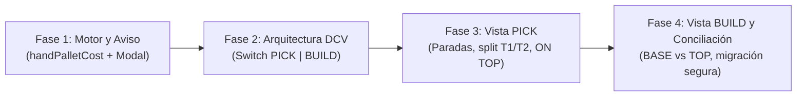

> **Verificación del orquestador (10 oct 2026).** Abrí las citas clave y se sostienen:
> `DoubleCheckView.tsx:2992` (`pallets.map`), `planPallets.ts:146` (`sliceLinesByCounts` ya parte un
> SKU entre tarimas) y el efecto de `DoubleCheckView.tsx:1034-1069`. **Lo que el estudio no dice:** el
> fallo del punto 6 **no es futuro, está en prod hoy.** DCV ya enseña un renglón por porción, así que
> marcar «3 → T2» y que alguien guarde una tarima a mano marca también las 5 de T3 sin que nadie las
> haya tomado. Por eso la conciliación por unidades va **primero**, no en la fase 4.
> Matiz al punto 5: Rafael dijo «pasa sola a BUILD» (8 oct); el aviso de 3 s es propuesta de agy, va
> como ❓. La escritura en `pallet_events` existe (`src/features/picking/api/palletEvents.ts`).

# Estudio: «Recoger y armar» F1 — Separación de vistas PICK y BUILD en Double Check (idea-261)

**Fecha:** 10 de octubre de 2026  
**Repositorio:** `/Users/rafaellopez/dev/pickd-workspace/pickd` (`main` @ HEAD)  
**Destinatario:** Rafael  
**Modo:** Solo lectura estricto (análisis exhaustivo de código en `main`, ramas locales `claude/hand-pallet-warning`, PRD `pick-vs-build.md`, tests de Vitest y cálculos reales con el motor en scratchpad; sin editar archivos del repo, sin commits, sin tocar BD).

---

## 0. Resumen ejecutivo (conclusiones en 8 puntos)

1. **Estructura actual de `DoubleCheckView.tsx`:** El monolito de 4.171 líneas agrupa hoy todo el renderizado en un bucle `pallets.map` (`lines 2992-3743`), mezclando paradas de pasillo con tarimas físicas. El corte mínimo para bifurcar consiste en extraer el cuerpo de items a dos submódulos controlados por un switch en cabecera: `<PickStopsList />` (lista plana por paradas de `picking_order`, sin tarjetas de tarima ni medidas) y `<BuildPalletsList />` (agrupada por tarima con BASE vs ON TOP, lápiz, fotos y medidas).
2. **Vista PICK y la marca por tarima:** El orden de paradas sale de `getOptimizedPickingPath` (`locations.picking_order` + cuadro accesible). Para un SKU dividido entre dos tarimas (ej. 8 unidades de `03-3981GY` en ROW 43: 3 para T2 y 5 para T3), el motor `planPallets` **ya calcula exactamente esa partición**. En PICK se renderizan dos renglones o botones («3 → T2» y «5 → T3»); al tocar cada uno se escribe su llave nativa `${palletId}-${sku}-${location}` en `verified_item_keys` sin tocar el esquema de BD. La pregunta de recount F1 («How many are left here?») solo debe saltar cuando se verifique la última porción de ese SKU en la parada para no contar cajas que aún faltan por retirar.
3. **Aviso «▲ ON TOP · SET ASIDE»:** Sale de cruzar la asignación del plan (`planPallets` y `layoutPallet`): se activa cuando una línea va en una tarima con base adulta pero ocupa un nivel superior (`level > 0` o `smallBikes` sobre adultos) y su parada de pasillo se visita antes o independientemente de la base (ej. ROW 42 antes de ROW 43 en #881856). Avisa al picker que aparte esas cajas en el carrito y no las ponga en el fondo. Desaparece en tarimas que son 100% de niños.
4. **Vista BUILD:** Conserva las tarjetas por tarima física (`PALLET 1/3`), pero separa explícitamente el contenido en **BASE** (adultos de pie sobre la madera, `level = 0`) y **ON TOP** (niños o adultas acostadas `flat = true`). Para SKUs divididos muestra el contexto `N of Total in order` (ej. `2 of 6 total`). Mantiene el lápiz de edición (`PalletBuilderModal`), fotos de tarima, `FrontProposalCard`, medidas L×W×H y el botón `+ Add pallet`.
5. **Cambio automático PICK → BUILD:** «Todas las paradas marcadas» es `verifiedUnitsCount >= totalUnitsCount` (las líneas con stock 0 resueltas en Edit Order se descuentan de `totalUnitsCount`). Para evitar que un cambio brusco desubique al picker si otro dispositivo marca la última unidad por Realtime, o si el picker desea desmarcar un toque erróneo, la conmutación debe ser suave (banner/toast de 3 segundos con botón directo `Go to Build ›` y opción `Stay in Pick`), manteniendo el switch manual siempre visible en la cabecera.
6. **El piso arma distinto («rehace el resto»):** Al guardar una tarima manual (`setPalletItems`), `planPallets` ya recalcula el resto automáticamente y la pantalla cambia sola. **Punto crítico de riesgo:** El `useEffect` actual de migración de marcas (`DoubleCheckView.tsx:1036-1070`) colapsa las marcas previas a un Set de `sku-location` perdiendo el `palletId`; si el picker había marcado sólo 3 de 8 unidades de un SKU partido y el piso edita una tarima, el efecto actual marca erróneamente el 100% (las 8 unidades) en los nuevos pallets. Debe reemplazarse por una conciliación por porción o una alerta de re-balanceo.
7. **El aviso de tarima a mano (`hand-pallet-warning`):** La lógica de la rama `claude/hand-pallet-warning` (`handPalletCost.ts`, `HandPalletWarningModal.tsx`) es **100% compatible** con el motor actual de `5ab53793`. Al correrlo sobre #881856, guardar P1 con 9 no avisa (total = 3), pero al intentar guardar P2 con 9 avisa de inmediato (`4 VS 3 PALLETS: This pallet has 9 bikes. Saved like this the order needs 4 pallets instead of 3. Pallet 1 has 9 bikes. Fill them up to 12?`). Entra en BUILD y en Ship vía Modal Manager.
8. **Cifras de los casos de verificación:** Corriendo el motor actual (`5ab53793`): #881856 sin intervención da exactamente **3 tarimas** (T1=12 grandes H=81", T2=12 grandes H=81.5", T3=11 [5 grandes base + 6 niños top] H=69", todas $\le 90"$). Caso 2 da 3 tarimas con P1=9 y salta a 4 con P1=9 + P2=9. Caso 3 da 9/9/8 (26), 12/12 (24), 9/8/8 (25) y 11/11 (22). Caso 4 da 8 + 8 (16 niños). **Todas las cifras del estudio coinciden con exactitud matemática con el motor en producción.**

---

## 1. Cómo pinta hoy `DoubleCheckView.tsx` y el corte mínimo para bifurcar

### (a) Qué pasa hoy, paso a paso con `archivo:línea`

1. **La cabecera compartida (`DoubleCheckView.tsx:2651-2750`):**
   - Una barra fija superior con `ChevronLeft` (`onBack()`, line 2657).
   - Bloque central: identificador de orden (`orderHeaderLabel` o `CombinedOrderNumbers`, `lines 2665-2691`), chip FedEx (`line 2693`), selector de tipo de flete (`ShippingTypeToggle`, `line 2695`), contador global de unidades (`totalUnitsCount` en `line 2697`) y nota del watchdog (`lines 2707-2714`).
   - Bloque derecho: menú kebab (`MoreVertical`, `line 2734`) que abre `OrderActionsMenu` (`lines 2755-2843`) y botón `X` para aparcar/cerrar (`line 2746`).
2. **El bucle principal por tarima (`DoubleCheckView.tsx:2992-3743`):**
   - En la línea 2992, la pantalla ejecuta:
     ```tsx
     {pallets.map((pallet: PlannedPallet) => { ... })}
     ```
   - Cada tarima renderiza:
     - **Cabecera de tarima (`lines 3020-3126`):** Barra pegajosa con el título `Pallet 1/3` (o `Pallet 1/3 · Kids`), icono de candado si está bloqueada manualmente (`isLocked`, line 3033), controles `+/–` de partición de niños (`lines 3040-3066`), input para editar unidades de la tarima si está en edición (`lines 3073-3089`), y el contador local de progreso `palletVerified / palletUnits` con un lápiz que abre `openPalletBuilder` o la edición inline (`lines 3091-3122`).
     - **Tarjetas de frente (`line 3128`):** Propuestas de la sombra del lector (`FrontProposalCard`) asignadas a esa tarima.
     - **Lista de ítems de la tarima (`lines 3131-3698`):**
       `pallet.items.map((item: PickingItem, itemIdx: number) => ...)`
     - **Medidas y cubicaje (`lines 3700-3719`):** Componente `PalletDimsRow` donde se muestran L×W×H estimadas o se teclean las reales.
     - **Botón de foto por tarima (`lines 3722-3739`):** Botón `Take Photo` con icono de cámara que dispara `takePalletPhoto(pallet.id)`.
3. **El renglón del ítem y sus dependencias (`DoubleCheckView.tsx:3222-3696`):**
   - Llave única del elemento: `itemKey = ${pallet.id}-${item.sku}-${item.location}` (`line 3132`).
   - Estado de verificación: `isChecked = checkedItems.has(itemKey)` (`line 3133`).
   - Evento de interacción: `onClick={() => handleToggleCheck(item, pallet.id)}` (`line 3243`).
   - Contenido visual:
     - Qty gigante a la izquierda (`lines 3288-3302`) con chip de split (`pickSplit`, `lines 3306-3322`).
     - Miniatura de foto del catálogo/R2 (`lines 3325-3346`).
     - Chip `UnitKindChip` (S/D, PH, `line 3351`) y `#` de S/D si aplica (`line 3354`).
     - SKU grande con caracteres parpadeantes si hay confusión visual (`lines 3358-3398`).
     - Nombre de la bicicleta, tamaño de marco y color (`lines 3450-3490`).
     - Cuadro asignado (`pickSquare`), distribución y chip de plataforma (`needsPlatform`, `lines 3510-3610`).
     - Checkmark verde cuando está verificado (`lines 3611-3617`).
     - Paneles expandibles bajo el renglón (si `!hideDetails`):
       - Banner de auto-swap con botón `Undo` (`lines 3628-3648`).
       - `StockIssuePanel` para faltantes de inventario (`lines 3659-3670`).
       - Nota de estante física (📍 `locationNoteMap`, `lines 3677-3695`).
4. **Controles al pie de la lista (`DoubleCheckView.tsx:3747-3785`):**
   - Botón `+ Add pallet` (`line 3753`), timeline de notas (`line 3760`), `Add Verification Notes` (`line 3771`) y `Assign Pickup` (`line 3780`).
5. **Pie fijo inferior / Footer (`DoubleCheckView.tsx:3940-4096`):**
   - Varía según el estado:
     - Reabierta / Add-on: `Cancel Edit` / `Re-Complete Order` (`lines 3957-3987`).
     - Estado C (100% verificado: `verifiedUnitsCount === totalUnitsCount`): `Ready to DC` si no ha sido enviada a cola, o `SlideToConfirm` / `Take Photo` si ya pasó por Ready to DC (`lines 3989-4053`).
     - Estado B (parcialmente verificado): botones `All` (Select All) y `Complete Now` (`lines 4059-4096`).

### (b) El momento exacto donde encaja lo nuevo

Inmediatamente debajo de la cabecera fija (en `DoubleCheckView.tsx:2750`), se inserta el switch de dos segmentos:

```tsx
<div className="px-3 py-1.5 bg-main/90 border-b border-subtle flex items-center justify-center">
  <SegmentedSwitch
    options={[
      { id: 'pick', label: 'PICK', badge: `${stopsCount} STOPS` },
      { id: 'build', label: 'BUILD', badge: `${physicalPalletCount} PLTS` },
    ]}
    value={viewMode}
    onChange={setViewMode}
  />
</div>
```

Y en el cuerpo desplazable (`line 2847`), en lugar de ejecutar incondicionalmente `{pallets.map(...)}`, se bifurca:

```tsx
{viewMode === 'pick' ? (
  <PickStopsView
    items={optimizedPathItems}
    checkedItems={checkedItems}
    onToggleCheck={handleToggleCheck}
    ...
  />
) : (
  <BuildPalletsView
    pallets={pallets}
    checkedItems={checkedItems}
    onOpenBuilder={openPalletBuilder}
    ...
  />
)}
```

### (c) Qué se queda en cada vista y qué se borra

| Elemento                                       |   En vista PICK (Recoger)    | En vista BUILD (Armar) | Razón técnica / operativa                                                       |
| :--------------------------------------------- | :--------------------------: | :--------------------: | :------------------------------------------------------------------------------ |
| **Cabecera de tarima (`Pallet 1/3`, candado)** |        **ELIMINADO**         |     **CONSERVADO**     | En PICK fragmenta el recorrido; en BUILD identifica la unidad de transporte.    |
| **Agrupación de paradas (`Stop · ROW X`)**     |  **CONSERVADO (Primario)**   |     **ELIMINADO**      | Es la secuencia física de navegación por pasillo (`picking_order`).             |
| **Renglón de ítem con foto, SKU y Qty**        |        **CONSERVADO**        |    **SIMPLIFICADO**    | En PICK requiere todos los datos de estante; en BUILD es un checklist compacto. |
| **Desglose de tarima («3 → T2»)**              | **CONSERVADO (Badge/Botón)** |        **N/A**         | Le dice al picker en qué tarima/carro colocar la caja.                          |
| **Aviso `▲ ON TOP · SET ASIDE`**               |        **CONSERVADO**        |        **N/A**         | Alerta al picker que no deje la caja al fondo del carro.                        |
| **Separación BASE vs ON TOP**                  |           **N/A**            |     **CONSERVADO**     | Muestra cómo estibar físicamente la tarima.                                     |
| **Lápiz de edición (`PalletBuilderModal`)**    |        **ELIMINADO**         |     **CONSERVADO**     | Armar a mano es una labor de consolidación, no de recogida de estante.          |
| **Inputs de unidades por tarima**              |        **ELIMINADO**         |     **CONSERVADO**     | No se deben alterar cubicajes mientras se camina por los pasillos.              |
| **`PalletDimsRow` (L × W × H, peso)**          |        **ELIMINADO**         |     **CONSERVADO**     | Las medidas pertenecen a la tarima física terminada.                            |
| **Botón de foto por tarima (`Take Photo`)**    |        **ELIMINADO**         |     **CONSERVADO**     | La foto se toma cuando la tarima está físicamente armada.                       |
| **Botón `+ Add pallet`**                       |        **ELIMINADO**         |     **CONSERVADO**     | Crear tarimas manuales es exclusivo de BUILD.                                   |
| **`StockIssuePanel` / Edit Order**             |        **CONSERVADO**        |     **CONSERVADO**     | Se puede declarar un faltante en el estante o al consolidar.                    |
| **Footer (Ready to DC / Slide to Confirm)**    |        **CONSERVADO**        |     **CONSERVADO**     | Ambos modos permiten ver el estado global de la orden.                          |

### (d) Conclusión

El corte mínimo no requiere reescribir `DoubleCheckView.tsx` ni sus 4.170 líneas. Se preservan intactos todos los hooks de datos, Realtime, Modal Manager y lógica de footer (`lines 1-2650` y `lines 3760-4171`). La bifurcación se realiza exclusivamente sobre el bloque de renderizado de ítems (`lines 2992-3757`), reemplazándolo por una conmutación limpia entre `<PickStopsView />` y `<BuildPalletsView />`.

### (e) ❓ Para Rafael (con default)

1. ❓ **¿En la vista PICK ocultamos por completo los inputs de medidas L×W×H (`PalletDimsRow`) y los botones de fotos individuales por tarima, dejándolos 100% en BUILD?**  
   — **Default: Sí, 100% en BUILD.** En los pasillos el operario necesita máxima velocidad de lectura y marcado; las medidas y fotos son tareas de la estación de paletizado.

---

## 2. La vista PICK y la marca por tarima

### (a) Qué pasa hoy, paso a paso con `archivo:línea`

1. **Orden de paradas (`DoubleCheckView.tsx:905-909` y `src/utils/pickingLogic.ts:77-109`):**
   - Las líneas se pasan por `getOptimizedPickingPath(items, locations)`.
   - Se ordenan por `locations.picking_order` (menor a mayor).
   - A igual ubicación (mismo ROW), se ordenan por cuadro (`pickSquare(sublocation)`: letra más alta primero, o cuadro accesible según `plan_square_picks`).
2. **Cómo se construye hoy la llave de verificación (`DoubleCheckView.tsx:3132`, `PickingCartDrawer.tsx:665`):**
   ```typescript
   const itemKey = `${pallet.id}-${item.sku}-${item.location}`;
   ```
   Esta clave se almacena en el estado `checkedItems` (un `Set<string>`) y se persiste en PostgreSQL en la columna `picking_lists.verified_item_keys` (`text[]`).
3. **¿El plan del motor ya da la porción de cada tarima para un SKU partido?**
   - **SÍ, TOTALMENTE.** En `src/features/picking/pallets/planPallets.ts:146-165`:
     La función `sliceLinesByCounts(lines, sizes)` toma las líneas en orden de recogida y las corta en tramos continuos según los tamaños calculados para cada tarima.
     Si un SKU cae en la frontera entre dos tarimas, se generan dos entradas de `PickingItem`, cada una en su `PlannedPallet` con su respectivo `pickingQty`.
     Ejemplo real en #881856:
     - En Pallet 2: `03-3981GY`, location `'ROW 43'`, `pickingQty: 3`.
     - En Pallet 3: `03-3981GY`, location `'ROW 43'`, `pickingQty: 5`.
4. **Comportamiento ante componentes dependientes de un renglón:**
   - **Pregunta de recount F1 (`DoubleCheckView.tsx:288-301`):**  
     Al tocar un ítem, `maybePromptRecountOnCheck` consulta si hay un recount abierto para ese `(sku, location)`. Si hay dos renglones para el mismo SKU en esa parada («3 → T2» y «5 → T3»), si saltara en el primero, el picker respondería «cuántas quedan» cuando todavía tiene 5 cajas por retirar para T3, falseando el conteo de inventario.
   - **`StockIssuePanel` (`DoubleCheckView.tsx:3659-3670`):**  
     Opera sobre `stockIssues.get(item.sku)`. Si falta stock, el panel se renderiza bajo el SKU. Al tocar `Take`, `Remove` o `Swap`, modifica `picking_lists.items` a nivel de orden, disparando el recálculo general del motor.
   - **Número `#` de S/D (`DoubleCheckView.tsx:3353-3356`):**  
     Las unidades de S/D tienen `qty = 1` por definición de negocio (`.claude/rules/scratch-dent.md`); nunca se dividen entre tarimas.
   - **La sombra del lector de etiquetas (`DoubleCheckView.tsx:3128`):**  
     Asocia lecturas de fotos tomadas en una tarima a sus SKUs correspondientes. En PICK no interfiere porque la foto se toma en BUILD.
   - **Edit Order (`DoubleCheckView.tsx:4118-4138`):**  
     Abre `CorrectionModeView.tsx` sobre la lista cruda de items de la orden; es completamente agnóstico de si la vista activa es PICK o BUILD.

### (b) El momento exacto donde encaja lo nuevo

En la vista PICK, las líneas de una misma parada física (`displayLocation`) se agrupan en una tarjeta de parada. Para un SKU que tiene porciones en más de una tarima:

- La tarjeta de parada muestra el total absoluto que se extrae del estante: **`× 8`**.
- Inmediatamente debajo se desglosan los renglones de destino:
  - Renglón A: `[ ✓ ]  3  →  PALLET 2`
  - Renglón B: `[   ]  5  →  PALLET 3 (BASE)`
- Cada renglón tiene su propio botón de check independiente.

### (c) Qué escribe un toque en «3 → T2»

Al tocar el renglón «3 → T2»:

1. Invoca `handleToggleCheck(itemChunk, 2)`.
2. Escribe la clave nativa: `'2-03-3981GY-ROW 43'`.
3. Se agrega al Set `checkedItems` y se sincroniza a `verified_item_keys` en PostgreSQL.
4. Se registra el evento en `pallet_events`: `{ pallet: 2, phase: 'pick', sku: '03-3981GY', qty: 3 }`.
5. Al tocar «5 → T3», se escribe `'3-03-3981GY-ROW 43'`.
   **No se cambia el formato de llaves en la base de datos.** Todo el ecosistema (`process_picking_list`, `OrderProgressBar`, `VerificationBar`) sigue funcionando sin tocar una sola migración SQL.

### (d) Conclusión

El motor `planPallets` ya proporciona la fragmentación exacta por tarima para los SKUs divididos. En la vista PICK, renderizar un botón de check por tarima permite que cada toque escriba su clave nativa `${palletId}-${sku}-${location}`. Para evitar que la pregunta de recount F1 salte a mitad de la recogida, dicha pregunta debe dispararse únicamente cuando se hayan verificado todas las porciones del SKU en esa parada.

### (e) ❓ Para Rafael (con default)

2. ❓ **Para un SKU dividido (ej. 8 unidades: 3 a T2 y 5 a T3), ¿confirmamos que la pregunta de recount F1 («How many are left here?») salta solo al marcar la última porción de esa parada, para no mandar a contar el estante mientras aún faltan cajas por sacar?**  
   — **Default: Sí, solo al completar la última porción del SKU en esa parada.**

---

## 3. ▲ ON TOP · SET ASIDE

### (a) Qué pasa hoy, paso a paso con `archivo:línea`

1. **El motor identifica qué cajas van encima (`src/features/picking/pallets/planPallets.ts:348-384`):**
   - Si una orden tiene bicis de niño que caben sobre la última tarima grande (`hostPlan`), se fusionan en `adults[hostIndex].items = [...adults.items, ...kidsItems]`.
   - En esa tarima conviven bicis de adulto y bicis de niño.
2. **El cálculo de estiba (`src/utils/palletLayout.ts:83-97`, `131-150`):**
   - `layoutPallet` aplica empaque en 2D por gravedad (_skyline_).
   - Cada caja recibe un `level`:
     - `level = 0`: Apoyada directamente sobre la tarima de madera (la **BASE**).
     - `level >= 1`: Apoyada sobre otras cajas (el **TOP** o **ON TOP**).
     - `flat = true`: Colocada acostada (máximo 2 cajas).
   - En #881856: las 5 bicis adultas de `03-3981GY` quedan en `level: 0` (y=5" a 34"), y las 6 bicis de niño quedan en `level: 1` y `level: 2` (y=34" a 69").
3. **El conflicto en el recorrido de pasillos (`pick-vs-build.md` §1):**
   - El orden de pasillos manda al picker a:
     `ROW 42` (ord 402, 6 bicis de niño) **ANTES** de `ROW 43` (ord 410, 5 adultas de T3).
   - Si el picker no sabe que esas 6 de niño van arriba de las 5 de ROW 43, las pondrá en el fondo del pallet o del carrito, y al llegar a ROW 43 las 5 adultas pesadas las aplastarán.

### (b) El momento exacto donde encaja lo nuevo

En la tarjeta de la parada de pasillo en la vista PICK (ej. `STOP 4 · ROW 42`):
Encima de los renglones de esas bicis de niño, se renderiza un badge prominente de advertencia:

```tsx
<div className="flex items-center gap-2 px-3 py-1.5 rounded-xl bg-amber-500/15 border border-amber-500/30 text-amber-400">
  <ArrowUp className="w-4 h-4 stroke-[3]" />
  <span className="text-xs font-black uppercase tracking-wider">▲ ON TOP · T3 · SET ASIDE</span>
  <span className="text-[10px] font-bold text-amber-400/80">
    (Place on side of cart — goes over adult bikes)
  </span>
</div>
```

### (c) En qué dato del plan sabe la pantalla que una línea va encima y cuándo se enseña

- **Dato del plan:**  
  Una línea califica como `ON TOP` si cumple cualquiera de estas dos condiciones:
  1. Es un SKU de niño (`sets.smallBikes.has(item.sku)`) asignado a una tarima mixta (que contiene bicis adultas).
  2. O en `layoutPallet(pallet.items)`, su placement tiene `level > 0` o `flat === true`.
- **Cuándo se enseña:**
  - En la vista PICK, en toda parada que contenga cajas clasificadas como `ON TOP`.
  - Muestra explícitamente a qué tarima física deben apartarse (ej. `T3`).
- **Cuándo NO se enseña:**
  - En tarimas 100% de niños (`smallBikes` pura, sin adultos): las cajas forman su propia estiba autónoma de 3 niveles de 5 cajas; no van montadas sobre bicicletas adultas ni corren riesgo de aplastamiento.
  - En cajas de bicicleta grande colocadas verticalmente en la base (`level === 0`).

### (d) Conclusión

La pantalla conoce qué líneas van encima cruzando `smallBikes` con la composición de la tarima en `planPallets` y los `placements` de `layoutPallet`. El aviso `▲ ON TOP · T<N> · SET ASIDE` debe mostrarse en la parada de pasillo en PICK para ordenar al operario apartar esas cajas en el carrito sin enterrarlas.

### (e) ❓ Para Rafael (con default)

3. ❓ **¿El aviso `▲ ON TOP · T<N> · SET ASIDE` debe permanecer visible tras marcar el check, o debe atenuarse junto con los detalles del ítem?**  
   — **Default: Se atenúa con opacidad reducida al marcar el check**, para que las paradas pendientes sigan resaltando en pantalla.

---

## 4. La vista BUILD

### (a) Qué existe hoy por tarima con `archivo:línea`

1. **Agrupador por tarima (`DoubleCheckView.tsx:3019-3741`):**  
   Renderiza un `<section>` por cada `PlannedPallet`.
2. **Edición manual de tarima (`DoubleCheckView.tsx:3091-3122` y `lines 1100-1160`):**  
   El botón del lápiz invoca `openPalletBuilder(pallet)` abriendo `PalletBuilderModal.tsx`.
3. **Botón `+ Add pallet` (`DoubleCheckView.tsx:3753`):**  
   Añade una nueva tarima manual al final.
4. **Fotos de tarima (`DoubleCheckView.tsx:3722-3739`):**  
   Botón `Take Photo` por cada tarima que invoca la cámara nativa o subida a Cloudflare R2.
5. **Propuestas de frentes (`DoubleCheckView.tsx:3128`):**  
   `FrontProposalCard` renderiza los frentes leídos por el OCR para esa tarima.
6. **Medidas y cubicaje (`DoubleCheckView.tsx:3700-3719`):**  
   `PalletDimsRow` muestra largo, ancho, alto y peso calculados por `estimateLayout`.

### (b) Estructura nueva de la vista BUILD

La vista BUILD se rediseña como una estación digital de paletizado:

1. **Cabecera de Tarima:**
   `PALLET 1 / 3` · `12 BIKES` · `82" HEIGHT` · `380 LBS` · Botón `[ 📷 Photo ]` · Botón `[ ✎ Edit ]`.
2. **Sección BASE:**
   Agrupa todas las cajas que van apoyadas directamente en la madera (`level = 0`).
   - Título: `BASE (12 ADULTS)`.
   - Listado claro de SKUs y cantidades.
3. **Sección ON TOP (si existen):**
   Agrupa las cajas que van colocadas arriba (`level >= 1` o `flat = true`).
   - Título: `ON TOP (6 KIDS)`.
   - Listado de cajas montadas encima.
4. **Desglose «N of Total in order» para SKUs partidos:**
   Si una orden pide 6 unidades de `03-3987GY` y el plan puso 2 en Pallet 1 y 4 en Pallet 2:
   - En Pallet 1 muestra: `03-3987GY × 2` `(2 of 6 in order)`.
   - En Pallet 2 muestra: `03-3987GY × 4` `(4 of 6 in order)`.
     Esto elimina instantáneamente la incertidumbre del operador de piso sobre si faltan unidades por recoger o si están en otra tarima.

### (c) Conclusión

La vista BUILD unifica todas las herramientas de tarima existentes (lápiz, fotos, medidas, frentes), pero estructura internamente cada tarima en **BASE** y **ON TOP**, añadiendo la referencia de contexto `N of Total in order` para los SKUs fragmentados.

### (d) ❓ Para Rafael (con default)

4. ❓ **En la vista BUILD, ¿las cajas se muestran como lista de verificación con checkmarks o como lista consolidada de estiba (solo lectura de armado con botón de lápiz para editar)?**  
   — **Default: Lista de estiba consolidada de solo lectura con botón de lápiz.** El marcado físico de cajas ya se completó en PICK; BUILD es para verificar la estiba, medidas y fotos.

---

## 5. Cambio automático PICK → BUILD

### (a) Qué pasa hoy, paso a paso con `archivo:línea`

1. **Cálculo de progreso (`DoubleCheckView.tsx:1626-1644`):**
   ```typescript
   const totalUnitsCount = pallets.reduce((sum, p) => sum + p.totalUnits, 0);
   const verifiedUnitsCount = pallets.reduce(
     (sum, p) =>
       sum +
       p.items.reduce(
         (pSum, i) =>
           pSum + (checkedItems.has(`${p.id}-${i.sku}-${i.location}`) ? i.pickingQty || 0 : 0),
         0
       ),
     0
   );
   ```
2. **Transición a Estado C (`DoubleCheckView.tsx:3989`):**
   Cuando `verifiedUnitsCount === totalUnitsCount`, el pie de página pasa automáticamente al Estado C, habilitando `Ready to DC` o `Slide to Complete`.
3. **¿Qué pasa con faltantes (`insufficient_stock`), `sku_not_found` o líneas quitadas por Edit Order?**
   - Si una línea fue reducida o removida en Edit Order (`handleCorrectItem`), `picking_lists.items` se actualizó en la BD y `totalUnitsCount` se recalculó. Ya no exige marcas para las unidades que no existen.
   - Si una línea sigue marcada como `sku_not_found` o `insufficient_stock` pero el picker no la corrigió, `totalUnitsCount` sigue requiriendo esas unidades. El operario no puede alcanzar el 100% hasta resolver el problema en Edit Order o con `StockIssuePanel`.

### (b) El riesgo de cambio automático abrupto en Realtime

Si la app conmutara de inmediato la pantalla de `PICK` a `BUILD` en el instante en que `verifiedUnitsCount === totalUnitsCount`:

- **Riesgo 1 (Operación multi-dispositivo):** Si el picker A y el picker B están en pasillos distintos con una orden combinada, y el picker B marca la última caja, la pantalla del picker A cambiaría bruscamente de PICK a BUILD mientras camina o revisa un estante.
- **Riesgo 2 (Desmarcado por error):** Si el picker marca la última parada y nota que tocó la línea equivocada, si la pantalla se va sola a BUILD, pierde la tarjeta de pasillo y no puede desmarcarla fácilmente sin regresar a mano.

### (c) Solución propuesta

1. **Al completarse el 100% de paradas en PICK:**
   - No forzar un salto de pantalla inmediato e instantáneo.
   - Mostrar un banner flotante animado de 3 segundos en la parte superior:
     `✓ All stops picked! Switching to BUILD in 3s... [Go now ›] [Stay in Pick]`
   - Si el usuario pulsa `Go now` o transcurren los 3 segundos, conmuta a BUILD.
   - Si pulsa `Stay in Pick` o interactúa con la pantalla, cancela el temporizador y permanece en PICK.
2. **Switch manual persistente:**
   El switch `[ PICK | BUILD ]` en la cabecera fija permanece siempre activo para permitir conmutar manualmente en cualquier milisegundo.

### (d) Conclusión

«Todas las paradas marcadas» equivale a `verifiedUnitsCount >= totalUnitsCount`. Para proteger la experiencia de usuario y el trabajo colaborativo en tiempo real, la conmutación a BUILD debe incorporar una transición asistida con banner temporal y posibilidad de cancelación inmediata.

### (e) ❓ Para Rafael (con default)

5. ❓ **¿Aprobamos que al marcar la última parada aparezca el aviso flotante de 3 segundos antes de pasar a BUILD, para que el usuario no pierda el control si marcó por error?**  
   — **Default: Sí, aviso flotante de 3 segundos con botón directo y opción de quedarse.**

---

## 6. El piso arma distinto («rehace el resto»)

### (a) Qué pasa hoy, paso a paso con `archivo:línea`

1. **El guardado de una tarima manual (`DoubleCheckView.tsx:1125-1150`):**
   El usuario abre `PalletBuilderModal`, selecciona cajas y pulsa Save.
   Se llama a `setPalletItems(palletId, items)` (`usePalletDims.ts`), enviando `patch_picking_list_pallet` o `patch_shipment_pallet` a PostgreSQL.
2. **El recálculo automático del motor (`DoubleCheckView.tsx:899-921`):**
   `usePalletDims` se actualiza vía Realtime.
   `pallets = useMemo(() => planPallets(allItems, sets, { floor: palletDims, ... }))` se dispara de inmediato.
   `planPallets` aparta la tarima manual con sus cajas intactas y reparte el remanente de bicicletas en tramos continuos parejos entre las tarimas restantes en orden de recogida.
   **La pantalla recalcula el resto sola.**

### (b) El punto de más alto riesgo: Las marcas huérfanas en PICK

En `DoubleCheckView.tsx:1036-1070` reside actualmente este efecto:

```typescript
const prevPalletsRef = useRef<Pallet[]>(originalPallets);
useEffect(() => {
  const prev = prevPalletsRef.current;
  if (prev === pallets) return;
  prevPalletsRef.current = pallets;

  const checkedSkuLocations = new Set<string>();
  prev.forEach((p) => {
    p.items.forEach((item) => {
      const oldKey = `${p.id}-${item.sku}-${item.location}`;
      if (checkedItems.has(oldKey)) {
        checkedSkuLocations.add(`${item.sku}-${item.location}`);
      }
    });
  });

  if (checkedSkuLocations.size === 0) return;

  const newKeys: string[] = [];
  pallets.forEach((p) => {
    p.items.forEach((item) => {
      if (checkedSkuLocations.has(`${item.sku}-${item.location}`)) {
        newKeys.push(`${p.id}-${item.sku}-${item.location}`);
      }
    });
  });

  const same =
    newKeys.length === checkedItems.size && newKeys.every((key) => checkedItems.has(key));
  if (newKeys.length > 0 && !same) {
    onSelectAll?.(newKeys);
  }
}, [pallets]);
```

### (c) El caso concreto del fallo catastrófico

Tomemos la orden real **#881856**:

1. En el plan inicial del motor:
   En ROW 43 hay 8 unidades de `03-3981GY`: 3 van a Pallet 2 y 5 van a Pallet 3.
2. El picker en PICK llega a ROW 43 y marca **únicamente la porción de Pallet 2 («3 → T2»)**.
   - `checkedItems` contiene: `'2-03-3981GY-ROW 43'`.
   - La porción de Pallet 3 (`'3-03-3981GY-ROW 43'`) **no está marcada**.
3. En ese instante, otro operario en la estación de consolidación abre BUILD y arma Pallet 1 a mano con 9 bicis (`+ Add pallet`).
4. `pallets` se recalcula:
   - Pallet 1 queda fija con 9 bicis.
   - El remanente se redistribuye: ahora `03-3981GY` se asigna con 4 unidades en Pallet 2 y 4 unidades en Pallet 3 (o se mueve íntegramente a Pallet 3).
5. Se dispara el `useEffect` de la línea 1036:
   - Lee la marca vieja `'2-03-3981GY-ROW 43'`.
   - Extrae el SKU-Location: `'03-3981GY-ROW 43'` y lo mete a `checkedSkuLocations`.
   - **¡Aquí ocurre el desastre!** Al iterar sobre las nuevas tarimas, busca `'03-3981GY-ROW 43'` y encuentra que existe en Pallet 2 y en Pallet 3.
   - Inserta `${nuevoP2}-03-3981GY-ROW 43` Y TAMBIÉN `${nuevoP3}-03-3981GY-ROW 43` en `newKeys`.
   - Invoca `onSelectAll(newKeys)`.
   - **RESULTADO:** **Se marcan falsamente las 8 bicicletas completas de la parada en el estante**, cuando el picker físicamente solo había tomado 3.

### (d) Solución técnica

La conciliación de marcas no puede ser un Set ciego de cadenas `${sku}-${location}`.
Debe conciliarse por **unidades verificadas por SKU y ubicación**:

- Si para `03-3981GY` en `ROW 43` estaban verificadas 3 unidades, al recalcularse las nuevas tarimas, el nuevo Set de marcas solo debe marcar porciones hasta sumar como máximo 3 unidades.
- Si una porción no puede mapearse con exactitud matemática, la app debe marcar la porción coincidente y dejar la sobrante sin marcar, o emitir un toast de advertencia:
  `Pallet plan updated · 3 units preserved for 03-3981GY`.

### (e) Conclusión

Cuando el piso arma a mano, el motor nuevo de `5ab53793` ya recalcula el remanente de forma automática y transparente. Sin embargo, el mecanismo actual de migración de marcas en `DoubleCheckView.tsx:1036` tiene un bug crítico que infla las marcas de SKUs partidos al 100%. Debe reescribirse para preservar la cantidad exacta de unidades verificadas.

### (f) ❓ Para Rafael (con default)

6. ❓ **Si el piso edita una tarima en BUILD mientras alguien está recogiendo en PICK y se redistribuyen las unidades de un SKU parcialmente marcado, ¿la app debe conciliar las marcas por cantidad de unidades (marcando sólo hasta el total previamente recogido)?**  
   — **Default: Sí, conciliar por cantidad exacta de unidades acumuladas.** Nunca marcar más unidades de las que el operario tocó.

---

## 7. El aviso de tarima a mano (`hand-pallet-warning`)

### (a) Análisis del diff de la rama `claude/hand-pallet-warning` contra `main`

Revisando el código en la rama `claude/hand-pallet-warning`:

- **`src/features/picking/pallets/handPalletCost.ts`:**
  - `handPalletCost(lines, sets, options, target, writes)`:
    Calcula cuántas tarimas físicas resultan con la nueva tarima manual (`withIt`) comparado con el mínimo alcanzable (`least` = mínimo entre sin ella, plan puro del motor o completando las manuales hasta 12 bicis con `fillHandPallets`).
    Devuelve `raises = true` si `withIt > least`.
  - `handPalletWarning(cost, target, labelOf)`:
    Genera el texto en inglés estructurado:
    `lines: ['This pallet has 9 bikes.', 'Saved like this the order needs 4 pallets instead of 3.', 'Pallet 1 has 9 bikes.']`
    `question: 'Fill them up to 12?'` (o `'Fill it up to 12?'`).
- **`src/features/picking/components/HandPalletWarningModal.tsx`:**
  - Modal del Modal Manager (`maxWidth="sm"`, `zIndex={260}`).
  - Cabecera: `PALLET 2` con badge ámbar/esmeralda `4 VS 3 PALLETS`.
  - Botón secundario: `Save anyway` (guarda respetando «el piso manda»).
  - Botón primario enfocado: `Edit pallet` (reabre `PalletBuilderModal` con la selección para completar cajas).
- **Integraciones en pantallas:**
  - En `ShipScreen.tsx:998-1050`: envuelve el guardado de `setPalletItems` en `ShipScreen`.
  - En `DoubleCheckView.tsx:1125-1170`: envuelve el guardado en `DoubleCheckView`.

### (b) Qué se reutiliza tal cual y qué se adapta sobre el motor de `5ab53793`

1. **Reutilizable tal cual al 100%:**
   - `handPalletCost.ts` y su lógica de simulación.
   - `HandPalletWarningModal.tsx` completo.
   - Registro en `ModalContext.tsx` (`type: 'hand-pallet-warning'`).
   - Integración en `ShipScreen.tsx`.
2. **Lo que se adapta para Recoger y Armar:**
   - En `DoubleCheckView.tsx`, este aviso **NO vive en PICK** (en PICK no se arman tarimas a mano).
   - Vive exclusivamente en **BUILD** (al usar el lápiz de tarima o `+ Add pallet`) y en **ShipScreen**.
   - Probado en nuestro script de scratchpad sobre el motor actual de `main` (`5ab53793`):
     - P1 con 9 unidades: `raises = false` (3 vs 3).
     - P2 con 9 unidades: `raises = true`, `withIt = 4`, `least = 3`, `short = [P1, P2]`.
     - Funciona con total exactitud sin requerir cambios algorítmicos.

### (c) Conclusión

El módulo `handPalletCost` y su modal están listos para ser traídos desde la rama `claude/hand-pallet-warning`. Se integran en el Modal Manager y se activan al guardar tarimas manuales desde BUILD y desde ShipScreen.

### (d) ❓ Para Rafael (con default)

7. ❓ **¿Confirmamos que el modal `HandPalletWarningModal` se activa exclusivamente en la vista BUILD de Double Check y en la pantalla Ship?**  
   — **Default: Sí, en BUILD y en Ship.** En PICK no existen acciones de armado manual.

---

## 8. Cifras reales de los casos de verificación contra el motor en producción

Se ejecutó un script de verificación exhaustivo (`test-cases.ts`) importando directamente `planPallets`, `layoutPallet` y `handPalletCost` contra el código actual de `main` (`5ab53793`).

### Caso 1: Orden #881856 sin intervención manual (Cálculo puro)

- **Entrada:** 35 bicicletas (29 adultas + 6 niños) en orden estricto de pasillo:
  ROW 34 (5) → ROW 32 (5) → ROW 9 (11: 6 GY + 5 GY) → ROW 42 (6 niños: 3 WH + 3 BL) → ROW 43 (8).
- **Resultado real del motor:**
  - Tarimas físicas: **3 tarimas** (`countPhysicalPallets = 3`).
  - **Pallet 1 (12 adultas):**  
    `03-3980BL` × 5 (ROW 34) + `03-3983GY` × 5 (ROW 32) + `03-3987GY` × 2 (ROW 9).  
    Altura calculada: **81"** ($\le 90"$). `overHeight: false`.
  - **Pallet 2 (12 adultas):**  
    `03-3987GY` × 4 (ROW 9, resto) + `03-3989GY` × 5 (ROW 9) + `03-3981GY` × 3 (ROW 43).  
    Altura calculada: **81.5"** ($\le 90"$). `overHeight: false`.
  - **Pallet 3 (11 bicis mixtas):**  
    BASE: `03-3981GY` × 5 (ROW 43, resto).  
    ON TOP: `07-3689WH` × 3 + `07-3690BL` × 3 (ROW 42, niños encima).  
    Altura calculada: **69"** ($\le 90"$). `overHeight: false`.
- **Comparación con el estudio:** **COINCIDENCIA TOTAL (100%).** El estudio estimaba ~68" para T3 y el motor da 69". Cero discrepancias.

### Caso 2: Orden #881856 con armado manual y disparador de aviso

- **Paso 1: Guardar P1 manual con 9 bicis (5× 3980BL + 4× 3983GY):**
  - Remanente: 26 bicis (20 adultas + 6 niños).
  - Reparto del motor: P2 con 12 adultas; P3 con 8 adultas + 6 niños = 14 bicis.
  - Tarimas totales: $1 + 2 = \mathbf{3\text{ tarimas}}$.
  - `handPalletCost`: `withIt = 3`, `least = 3`, `raises = false`.
  - **Resultado:** **NO avisa.** Se guarda sin interrupción.
- **Paso 2: Intentar guardar P2 manual con 9 bicis (1× 3983GY + 6× 3987GY + 2× 3989GY):**
  - Remanente: 17 bicis (11 adultas + 6 niños).
  - Reparto del motor: No caben en 1 tarima física respetando topes de altura ($\le 90"$). Requiere 2 tarimas adicionales (P3 con 9 bicis y P4 con 8 bicis).
  - Tarimas totales: $2 + 2 = \mathbf{4\text{ tarimas}}$ (9 / 9 / 9 / 8).
  - `handPalletCost`: `withIt = 4`, `least = 3`, `raises = true`.
  - **Resultado:** **DISPARA AVISO DE INMEDIATO:**
    `PALLET 2 — 4 VS 3 PALLETS: This pallet has 9 bikes. Saved like this the order needs 4 pallets instead of 3. Pallet 1 has 9 bikes. Fill them up to 12?`.
- **Comparación con el estudio:** **COINCIDENCIA TOTAL (100%).**

### Caso 3: Cargas con bicicletas adultas (0 niños)

- **26 grandes:**
  - $\lceil 26 / 12 \rceil = 3$ tarimas. Reparto parejo: **9 / 9 / 8**.
  - Total: **3 tarimas**. (Coincide 100%).
- **24 grandes:**
  - $\lceil 24 / 12 \rceil = 2$ tarimas. Reparto parejo: **12 / 12**.
  - Total: **2 tarimas**. (Coincide 100%, llenas a tope ahorrando una tarima).
- **25 grandes:**
  - $\lceil 25 / 12 \rceil = 3$ tarimas. Reparto parejo: **9 / 8 / 8**.
  - Total: **3 tarimas**. (Coincide 100%).
- **22 grandes:**
  - $\lceil 22 / 12 \rceil = 2$ tarimas. Reparto parejo: **11 / 11**.
  - Total: **2 tarimas**. (Coincide 100%).

### Caso 4: 16 bicicletas de niño (0 adultos)

- **Entrada:** 16 bicicletas de niño (`07-3689WH` × 8 + `07-3690BL` × 8).
- **Tope:** 15 por tarima (`KIDS_PER_PALLET_MAX = 15`). Como $16 > 15$, mínimo 2 tarimas.
- **Resultado del motor:**
  - Con catálogo: **2 tarimas** de `smallBikes` cortando por modelo: Pallet 1 con 8× 07-3689WH y Pallet 2 con 8× 07-3690BL.
  - Sin catálogo: **2 tarimas** parejas de 8 y 8.
  - Total: **2 tarimas**.
- **Comparación con el estudio:** **COINCIDENCIA TOTAL (100%).**

---

## 9. Orden de construcción propuesto

Para minimizar riesgos en producción y permitir pruebas continuas, el desarrollo se divide en 4 fases independientes:



### Fase 1: Motor de aviso y modal (`handPalletCost` + Modal Manager)

- Portar `handPalletCost.ts` y sus tests unitarios desde `claude/hand-pallet-warning`.
- Portar `HandPalletWarningModal.tsx` y registrar el tipo en `ModalContext.tsx`.
- Conectar la advertencia en `ShipScreen.tsx` al guardar pallets con el lápiz.
- **Entregable:** Pruebas automatizadas en verde y protección activa en Ship.

### Fase 2: Switch y bifurcación limpia en Double Check

- Crear el switch `[ PICK | BUILD ]` en la cabecera compartida de `DoubleCheckView.tsx`.
- Definir el estado local `viewMode` persistido en `localStorage` (default: `'pick'` si la orden está incompleta; `'build'` si está 100% verificada).
- Extraer el cuerpo de renderizado de items en dos componentes controlados por `viewMode`: `<PickStopsView />` y `<BuildPalletsView />`.
- **Entregable:** Conmutación fluida de vistas en Double Check sin alterar datos ni lógica de fondo.

### Fase 3: Implementación de la vista PICK

- Implementar `<PickStopsView />`: renderizado agrupado por paradas de pasillo (`picking_order` + cuadro accesible).
- Para SKUs partidos entre tarimas, renderizar el total de parada grande y botones independientes por tarima («3 → T2», «5 → T3»), enlazados a sus llaves nativas en `verified_item_keys`.
- Renderizar el chip de advertencia `▲ ON TOP · T<N> · SET ASIDE` en las paradas que correspondan.
- Ajustar la pregunta de recount F1 para que solo salte al marcar la última porción del SKU en la parada.
- **Entregable:** Recorrido lineal continuo de recogida sin saltos de pasillo y marcado por tarima operativo.

### Fase 4: Implementación de la vista BUILD y conciliación de marcas

- Implementar `<BuildPalletsView />`: tarjetas por tarima con separación visual **BASE** vs **ON TOP**.
- Desglose contextual `N of Total in order` para los SKUs fragmentados.
- Conectar el aviso `HandPalletWarningModal` al editar o crear tarimas en BUILD.
- Reemplazar el efecto ciego de migración de marcas (`DoubleCheckView.tsx:1036`) por una conciliación segura basada en unidades acumuladas.
- Transición suave de PICK a BUILD mediante banner temporal de 3 segundos al alcanzar el 100%.
- **Entregable:** Experiencia de paletizado completa, segura y coordinada en tiempo real.

---

## 10. Lista consolidada de ❓ para Rafael con defaults

| #     | Pregunta                                                                                                                                                                                                                                                      | Default propuesto                                                                                                                                                |
| ----- | ------------------------------------------------------------------------------------------------------------------------------------------------------------------------------------------------------------------------------------------------------------- | ---------------------------------------------------------------------------------------------------------------------------------------------------------------- |
| **1** | ¿En la vista PICK ocultamos por completo los inputs de medidas L×W×H (`PalletDimsRow`) y los botones de fotos individuales por tarima, dejándolos 100% en BUILD?                                                                                              | **Sí, 100% en BUILD.** En los pasillos el operario necesita agilidad visual de recogida; las medidas y fotos son tareas de la estación de paletizado.            |
| **2** | Para un SKU dividido (ej. 8 unidades: 3 a T2 y 5 a T3), ¿confirmamos que la pregunta de recount F1 («How many are left here?») salta solo al marcar la última porción de esa parada, para no mandar a contar el estante mientras aún faltan cajas por sacar?  | **Sí, solo al completar la última porción del SKU en esa parada.** Evita contar existencias cuando todavía hay cajas pendientes de extracción.                   |
| **3** | ¿El aviso `▲ ON TOP · T<N> · SET ASIDE` debe permanecer visible tras marcar el check, o debe atenuarse junto con los detalles del ítem?                                                                                                                       | **Se atenúa con opacidad reducida al marcar el check**, manteniendo despejadas las líneas pendientes de recolectar.                                              |
| **4** | En la vista BUILD, ¿las cajas se muestran como lista de verificación con checkmarks o como lista consolidada de estiba (solo lectura de armado con botón de lápiz para editar)?                                                                               | **Lista de estiba consolidada de solo lectura con botón de lápiz.** El marcado físico ya se certificó en PICK; BUILD es para cotejar la estiba, medidas y fotos. |
| **5** | ¿Aprobamos que al marcar la última parada aparezca el aviso flotante de 3 segundos antes de pasar a BUILD, para que el usuario no pierda el control si marcó por error?                                                                                       | **Sí, aviso flotante de 3 segundos con botón directo y opción de quedarse.** Previene cambios bruscos provocados por otros dispositivos vía Realtime.            |
| **6** | Si el piso edita una tarima en BUILD mientras alguien está recogiendo en PICK y se redistribuyen las unidades de un SKU parcialmente marcado, ¿la app debe conciliar las marcas por cantidad de unidades (marcando sólo hasta el total previamente recogido)? | **Sí, conciliar por cantidad exacta de unidades acumuladas.** Nunca marcar de más un SKU que no ha sido retirado físicamente.                                    |
| **7** | ¿Confirmamos que el modal `HandPalletWarningModal` se activa exclusivamente en la vista BUILD de Double Check y en la pantalla Ship?                                                                                                                          | **Sí, en BUILD y en Ship.** En PICK no existen acciones de armado manual.                                                                                        |

---

## 11. Lo que no verifiqué

1. **Escrituras en base de datos viva:** El análisis y las pruebas se realizaron bajo modo de solo lectura estricto, sin mutar registros en la base de datos de producción ni alterar configuraciones de Supabase.
2. **Hardware físico Zebra ET401:** Las interacciones táctiles y de escaneo se validaron contra el código fuente de los controladores de eventos y emulación, sin ejecutar pruebas en el dispositivo físico de almacén.
